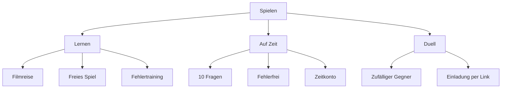

# Vorschlag für Spielmodi Zeitregeln und Highscores

Historischer Konzeptstand. Der Nutzer hat die Umsetzung im Worktree beauftragt; die gültigen implementierten Regeln einschließlich Duellwertung und lokaler Rolloutgrenzen stehen in [Rekordmodi und Zeitranglisten](Rekordmodi-und-Zeitranglisten.md). Die unten genannten Umsetzungspunkte sind durch diesen Auftrag abgelöst; das Spielgefühl bleibt für spätere Nutzertests offen.

Stand: 03.10.2026. Konkreter Entwurf auf Nutzerwunsch, noch nicht umgesetzt. Empfehlung: drei Einstiege **Lernen**, **Auf Zeit** und **Duell**. Unter Auf Zeit stehen drei Solo-Rekordvarianten. Endlosrekord und dynamisches Zeitkonto erhalten eigene Wochen-, Monats-, Jahres- und Allzeitlisten. Die vollständige Integration in Highscores und ein anspruchsvolles Zeitkonto sind Nutzeranforderungen; Namen, Werte und Bedienstruktur sind Vorschläge.

Die ursprünglichen Nutzernachrichten bleiben unverändert erhalten: [Endlosrekord](../KI-Wissen-Wissensquiz/01%20Rohquellen/Endlos-Rekord-Idee-2026-10-03.md), [dynamische Zeit](../KI-Wissen-Wissensquiz/01%20Rohquellen/Dynamische-Zeit-Idee-2026-10-03.md), [Modusgruppen und gewünschter Schwierigkeitsgrad](../KI-Wissen-Wissensquiz/01%20Rohquellen/Modusgruppen-und-Zeitbalance-Idee-2026-10-03.md).

Anschließend vom Nutzer ausdrücklich festgelegt: **Jeden abgeschlossenen Lauf einzeln auflisten.** Die Solo-Ranglisten zeigen damit alle gültigen Ergebnisse, auch mehrere Läufe desselben Spielers. [Ergänzende Nachricht](../KI-Wissen-Wissensquiz/01%20Rohquellen/Alle-Laeufe-Idee-2026-10-03.md), [Klarstellung](../KI-Wissen-Wissensquiz/01%20Rohquellen/Alle-Laeufe-Klarstellung-2026-10-03.md).

## Modusauswahl in zwei Stufen

Die erste Reihe enthält drei Karten. Nach Auswahl erscheinen die Untervarianten auf derselben Seite; die gewählte Variante, die Filter und Losspielen bleiben zusammen sichtbar. Ein Moduswechsel verlangt keinen zusätzlichen Seitenwechsel. Die letzte Auswahl wird wie bisher gespeichert. Vorschlag für die Struktur:

Duell erhält eine eigene Gruppe, weil Gegnerwahl, offene Begegnungen und Wartephasen den Einstieg bestimmen. Seine 30-Sekunden-Fragen machen es weiterhin zu einem Spiel auf Zeit. Auf Zeit führt direkt zu den Solo-Rekorden. Unter Lernen startet standardmäßig Filmreise, unter Auf Zeit zunächst 10 Fragen; danach gilt die zuletzt verwendete Variante. Eine Themenkarte darf die passende Auswahl direkt vorbereiten.

Die Unterkarten erklären die Regeln bereits vor Losspielen: „10 Fragen · 30 Sekunden je Frage“, „30 Sekunden je Frage · Ende beim ersten Fehler“ und „120 Sekunden Start · richtig +15 · falsch −45“. Die ausführliche Erklärung bleibt aufklappbar. Diese Gruppierung ersetzt eine lange erste Reihe mit allen Einzelvarianten. Die bestehenden [Bedienregeln](Hilfe-und-Navigation.md) bleiben bis zur Umsetzung maßgeblich.

## Konkrete Zeiten und Endregeln

| Modus | Vorgeschlagene Zeit | Ende und Fehler |
| --- | --- | --- |
| 10 Fragen | 30 Sekunden pro Frage, zehn Fragen als neuer Standard | Nach zehn Fragen; Fehler und Zeitabläufe zählen null Punkte, das Spiel geht weiter. |
| Fehlerfrei | 30 Sekunden pro Frage, laufend neue Fragen | Erster Fehler, Keine Ahnung oder Zeitablauf beendet den Lauf. |
| Zeitkonto | 120 Sekunden Start und Höchststand; richtig +15 Sekunden, falsch −45 Sekunden; zusätzlich höchstens 30 Sekunden pro Frage | Antwortzeit verbraucht den Vorrat. Fehler sind überlebbar. Ende bei leerem Vorrat. |
| Duell | Bestehend: drei Runden mit je zehn Fragen und 30 Sekunden je Frage | Bestehende Trefferwertung und Matchregeln bleiben der Vorschlag; kein Geschwindigkeitsbonus. |

Die neue Standardrunde mit zehn Fragen ist eine vorgeschlagene Änderung: Bisher haben die ersten Solorunden bis zu fünf, spätere bis zu zehn Fragen. Historische kürzere Runden behalten ihre eigene Fragenzahl und Vergleichskategorie. Ein zu kleiner gefilterter Pool muss vor Start erkennbar sein; verkürzte Runden dürfen nicht in die neue feste Zehnerwertung gelangen. [Bestehende Auswahlregeln](Spielmodi-und-Bekanntheit.md#modi), [Duellvertrag](Asynchrone-Filmduelle.md#ablauf-und-wertung).

In den neuen Solo-Varianten beginnt Zeit erst bei sichtbarer und bedienbarer Frage. Erklärung, Laden und die bewusste Weiter-Aktion verbrauchen keine Zeit. Bei einer unbeantworteten Frage läuft der Timer auch im Hintergrund; Neuladen oder Neustart bricht den Solo-Rekordversuch ab. Bereits gespeicherte Lernereignisse bleiben erhalten. Duelle behalten ihren vorhandenen serverseitigen Start- und Wiederaufnahmevertrag. [Bestehender Zeitvertrag](Lernregeln.md#rekorde-und-zeit).

## Dynamisches Zeitkonto

Empfehlung: ein gemeinsamer Vorrat für den ganzen Lauf. Die zuvor erwogene Verlängerung einer jeweils neu gestarteten Fragenfrist bleibt eine Alternative; die folgende Balance gilt ausschließlich für das gemeinsame Konto.

Während einer Frage wird die tatsächlich verstrichene Antwortzeit vom Vorrat abgezogen. Eine rechtzeitig richtige Antwort gibt anschließend 15 Sekunden hinzu, bis höchstens 120 Sekunden. Eine falsche Antwort oder Keine Ahnung zieht zusätzlich 45 Sekunden ab. Erreicht der Vorrat null, ist der Lauf sofort beendet; eine zu spät abgegebene richtige Antwort kann ihn nicht wiederbeleben.

Die aktuelle Frage läuft höchstens 30 Sekunden und höchstens so lange wie der verbliebene Vorrat. Ein Ablauf der 30-Sekunden-Frist zählt als Fehler und kostet zusätzlich 45 Sekunden, sofern zuvor noch Vorrat übrig war. Der Ablauf des Gesamtvorrats beendet den Lauf einmal; es wird kein weiteres Fehlerereignis erzeugt. Nach einer überlebten Fehlantwort folgt die normale Erklärung und danach eine neue Frage.

Beispiele mit jeweils drei Sekunden Antwortzeit: Eine richtige Antwort kann den Vorrat netto um zwölf Sekunden erhöhen; am Höchststand verfällt der Überschuss. Eine falsche Antwort kostet insgesamt 48 Sekunden. Zwei solche Fehler aus einem vollen Konto lassen noch 24 Sekunden übrig. Vier schnelle Treffer könnten den Verlust eines Fehlers ausgleichen. Diese Beispiele sind Rechenfälle und keine erwarteten Spielerlaufzeiten.

Für die erste Fassung wird direktes Wertungsfeedback empfohlen. Änderungen des sichtbaren Zeitkontos verraten den Treffer ohnehin; eine gesammelte Lösungsanzeige kann diesen Modus nicht vollständig neutral halten. Die eigentlichen Erklärungen dürfen trotzdem freiwillig aufklappbar sein.

## Rechnerische Treffergrenze

Annahme: `p` ist der Anteil tatsächlich richtiger Antworten und `t` die mittlere Antwortdauer in Sekunden über richtige und falsche Antworten. Vor Höchstgrenze und vor Laufende beträgt die erwartete Änderung je Frage:

`15 × p − 45 × (1 − p) − t = 60 × p − 45 − t`.

Zum rechnerischen Halten des Vorrats ist `p = (45 + t) / 60` nötig. Zum durchschnittlichen Verlängern muss die Trefferquote darüber liegen.

| Mittlere Antwortdauer | Trefferquote zum rechnerischen Halten |
| --- | ---: |
| 0 Sekunden, theoretische Untergrenze | 75 % |
| 1 Sekunde | 76,7 % |
| 2 Sekunden | 78,3 % |
| 3 Sekunden | 80 % |
| 5 Sekunden | 83,3 % |
| 6 Sekunden | 85 % |

Bei drei Sekunden und 70 % Treffern verliert das Konto im Mittel sechs Sekunden pro Frage; bei 80 % ist die Änderung null, bei 85 % beträgt sie plus drei Sekunden. Der Höchststand verwirft Zeitgewinne und kann die tatsächliche Durchschnittsbilanz nur verschlechtern. Die Tabelle ist deshalb eine rechnerische Untergrenze, keine Zusage für endlose Läufe. Fehlerfolgen können auch bei hoher Trefferquote einen Lauf beenden.

Wissen und Trefferquote sind verschieden: Wer 50 % der Fragen sicher weiß und bei den übrigen zwischen vier Möglichkeiten gleichmäßig rät, erreicht im Modell 62,5 % Treffer. Selbst ohne Antwortdauer verliert dieser Fall 7,5 Sekunden je Frage; bei drei Sekunden sind es 10,5 Sekunden. Die Annahme ignoriert Ausschlusswissen und unterschiedliche Fragen. Damit entsteht aus halbem Wissen und schnellen Zufallstipps kein systematischer Zeitgewinn.

Diese Werte wurden mit JavaScript nachgerechnet, einschließlich 80 % bei drei Sekunden und des 50-%-Wissensfalls. Es wurden keine realen Spielstände verwendet. Tatsächliche Antwortzeiten, Motivation und Laufdauern sind noch nicht gemessen. Falls sechs oder mehr Sekunden typischer sind, wäre die Variante strenger als ein 80-%-Ziel; dann sollten Bonus und Abzug gemeinsam skaliert werden, während ihr Verhältnis erhalten bleibt.

## Punkte Fragenmix und Lernfortschritt

Empfehlung: alle drei Solo-Rekordvarianten verwenden die vorhandenen Punkte für einen Treffer innerhalb von 30 Sekunden: `100 + 2 × floor((30.000 − vergangene ms) / 1.000)`. Fehler liefern null. Weil auch Zeitkonto höchstens 30 Sekunden je Frage erlaubt, kann die gleiche Geschwindigkeitsbasis verwendet werden; seine Restzeit wird kein zusätzlicher Punktebonus. Die Modi werden trotzdem getrennt verglichen. [Punktevertrag](Lernregeln.md#rekorde-und-zeit).

Für die erste gemeinsame Standardwertung empfiehlt sich ein fester offizieller Fragenpool mit allen drei Bereichen und allen Filmgenres und Filmgruppen, ohne Expertenstufe: je Auswahlblock von zehn Zielen drei leichte, vier mittlere und drei schwere, innerhalb des Blocks gemischt. Bei Endlosläufen folgen weitere Blöcke mit derselben Auswahlregel. Varianten erhalten keine zusätzlichen Lose. Freie Auswahl und Expertenfragen bleiben in eigenen Vergleichskategorien möglich. Ein Schwierigkeitsmultiplikator wird für die erste Fassung nicht empfohlen, weil die feste Mischung die Vergleichbarkeit bereits definiert; er wäre eine getrennte Regelversion.

Innerhalb eines Durchgangs durch den Pool kommt ein Wissensziel höchstens einmal vor. Nach Ausschöpfen wird neu gemischt, möglichst ohne direkte Wiederholung. Kleine Pools, unvollständige Schwierigkeitsblöcke und eigene Importe brauchen ausdrücklich getrennte Kategorien beziehungsweise eine Mindestgröße. Die Serienlänge und die bis zum Laufende tatsächlich gezogene Mischung sind Ergebnisse und dürfen die Endlosrangliste nicht nachträglich in unterschiedlich lange Kategorien aufteilen.

Karriere-XP bleiben eine zusätzlich ausgewiesene Lernbelohnung mit ihren bisherigen Tagesgrenzen und einmaligen Boni. Regulär beendete Läufe sind abgeschlossene Runden; freiwillig oder durch Neustart abgebrochene Versuche erhalten keinen Rekord und keine Abschluss-XP. Geratene richtige Antworten bleiben Treffer für Spielpunkte, behalten aber die bisherige Lern- und Karrierewertung. [Karrierevertrag](Filmkarriere-und-XP.md).

## Vollständige Einbindung in Highscores

Empfehlung: Highscores erhält drei fachliche Einstiege **Rekordspiele**, **Duelle** und **Karriere**. So finden alle zeitgebundenen Solo-Varianten einen erkennbaren Platz, während Duellsiege und globale XP verständlich bleiben. Die bestehende [öffentliche Bestenliste](Bestenliste-und-Gastaktivitaet.md) und der persönliche Rückblick bleiben Grundlagen.

Unter Rekordspiele stehen dieselben drei Varianten wie beim Start: 10 Fragen, Fehlerfrei und Zeitkonto. Dazu kommen Meine Rekorde oder gemeinsame Bestenliste sowie Woche, Monat, Jahr oder Allzeit. Persönliche Rekorde funktionieren für Gäste lokal und offline; gemeinsame Bestenlisten führen registrierte Spieler und können nach dem bisherigen öffentlichen Sichtbarkeitsmodell auch von Gästen gelesen werden. Keine privaten Fragen oder Antwortgeschichten werden öffentlich ausgegeben.

Jeder Zeitraum listet **alle regulär abgeschlossenen Läufe einzeln**, getrennt nach Modus, Auswahlkategorie und Regelversion. Ein Spieler darf mit mehreren Ergebnissen mehrere Rangplätze belegen. Das gilt für die persönliche Liste und die gemeinsame Bestenliste. Die Hauptliste wird weder auf den besten Lauf je Spieler reduziert noch zu einer Punktesumme pro Spieler zusammengefasst.

Eine Ergebniszeile enthält Rang, Name, Laufpunkte, richtige Antworten, gesamte beantwortete Fragen und Abschlussdatum. Bei Fehlerfrei ist die Serienlänge besonders sichtbar; bei Zeitkonto ergänzen Fehlerzahl und reine Antwortdauer die Details. Sortierung nach Laufpunkten absteigend; gleiche Punkte teilen einen Rang, bei Gleichstand steht das früher abgeschlossene Ergebnis zuerst. Auch regulär abgeschlossene Nullpunkteläufe bleiben gelistet. Aktive und abgebrochene Versuche gehören nicht in die Ergebnisrangliste. Derselbe Lauf erscheint je Liste genau einmal; erneutes Laden, Sichern oder Übertragen erzeugt keinen weiteren Eintrag.

Woche meint Montag bis Sonntag, Monat und Jahr die jeweiligen Kalenderzeiträume in Europe/Berlin; Allzeit umfasst alle gültigen Ergebnisse derselben Regelversion. Der Abschlusszeitpunkt ordnet den Lauf ein. Ein Zeitraumwechsel löscht frühere Ergebnisse nicht. Die Ergebnisansicht verlinkt direkt auf den passenden persönlichen Rekord und die passende gemeinsame Liste.

Duell zeigt persönliche Bilanz und Begegnungsergebnisse. Als eigener Vorschlag für eine gemeinsame Duellrangliste: drei Duellpunkte pro Sieg, einer pro Remis, null pro Niederlage, je beendeter Begegnung und Zeitraum. Das sind Punkte über mehrere Matches, getrennt von der Trefferwertung innerhalb der drei Runden und von Solo-Laufpunkten. Für Aufgabe, Fristablauf und nicht zustande gekommene Begegnungen muss eine ausdrückliche Ranglistenregel feststehen; solche Ergebnisse bleiben in der persönlichen Bilanz sichtbar. Eine neue öffentliche Duellwertung ist noch nicht umgesetzt.

Karriere enthält die bisherige globale XP-/Levelwertung und Trainingsstatistiken; der vorhandene gefilterte Spielervergleich bleibt erreichbar. Keine der neuen Listen schreibt historische Werte um oder vermischt unterschiedlich lange alte Rekordrunden mit der festen Zehnerwertung.

## Offene Punkte und Prüfung vor Umsetzung

- Zustimmung zu den vorgeschlagenen drei Gruppen, den Namen und dem gemeinsamen Zeitkonto als dynamischer Variante.
- Spielgefühl der Werte 120 / +15 / −45 mit kurzen Proberunden und tatsächlichen Antwortzeiten prüfen. Für eine spätere Anpassung neue Regelversion verwenden.
- Poolgröße, eigener Import, freier Filter, Mischungsregel und Wiederholung konkret validieren.
- Ranglistenzuordnung bei verspäteter Offline-Übertragung sowie die Sonderfälle der Duellwertung festlegen.
- Auswahl, zusätzliche Timer, variable Rundensnapshots, Sicherung, Lernwertung, Hilfe und alle Highscore-Ansichten gemeinsam umsetzen und mit isolierten Profilen prüfen.

Die Rechnung und Dokumentationslinks wurden geprüft. Die vorgeschlagenen Modi, Auswahlgruppen und Ranglisten sind noch nicht implementiert oder veröffentlicht; es gab keine Anwendungstests dieser neuen Funktionen.
