# Alle 200 Bildpaare

Je Person zwei verschiedene Fotos. Die App wählt pro Begegnung ein Foto und behält es bis einschließlich der Lösung und des Rückblicks. Hier stehen die Namen zur redaktionellen Prüfung ausdrücklich dabei.

Die Vorschaubilder zeigen die unveränderten Dateien. In der App werden die dokumentierten Anzeigeausschnitte verwendet, damit nur das gesuchte Gesicht im Mittelpunkt steht. Die Datierung folgt Commons-Dateititel und -Beschreibung; bekannte Upload-/Aufnahme-Unterschiede sind ausdrücklich korrigiert. Nahe Karrierejahre werden nicht als weit getrennte Lebensphasen ausgegeben.

## Tom Hanks

Bisheriges Foto:

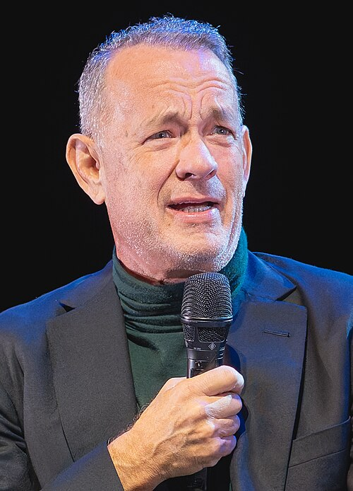

[TomHanksPrincEdw031223 (11 of 41) (cropped).jpg](https://commons.wikimedia.org/wiki/File:TomHanksPrincEdw031223_(11_of_41)_(cropped).jpg) · CC BY 2.0

Ergänzung · Datierung laut Quelle: 1989

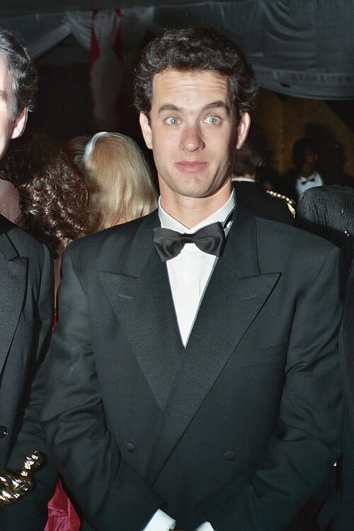

[1989 Tom Hanks.jpg](https://commons.wikimedia.org/wiki/File:1989_Tom_Hanks.jpg) · CC BY 2.0

Anzeigeausschnitt der unveränderten Datei: x=120, y=40, Breite=290, Höhe=380 Pixel.

## Leonardo DiCaprio

Bisheriges Foto:

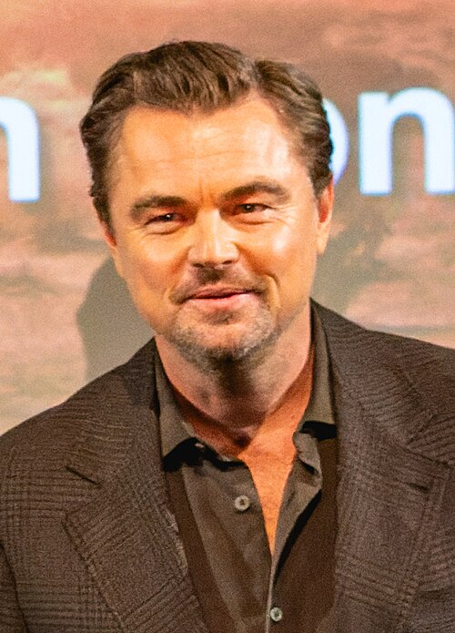

[LeoPTABFI191125-28 (cropped).jpg](https://commons.wikimedia.org/wiki/File:LeoPTABFI191125-28_(cropped).jpg) · CC BY 4.0

Ergänzung · Datierung laut Quelle: 2010

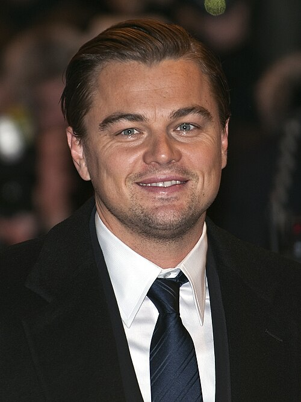

[Leonardo DiCaprio Berlinale 2010 (cropped).jpg](https://commons.wikimedia.org/wiki/File:Leonardo_DiCaprio_Berlinale_2010_(cropped).jpg) · CC BY 3.0

## Brad Pitt

Bisheriges Foto:

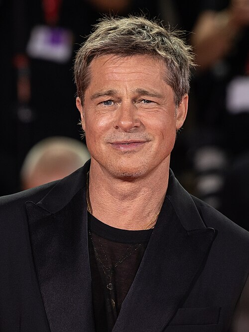

[Brad Pitt-69858.jpg](https://commons.wikimedia.org/wiki/File:Brad_Pitt-69858.jpg) · CC BY-SA 4.0

Ergänzung · Datierung laut Quelle: 2007

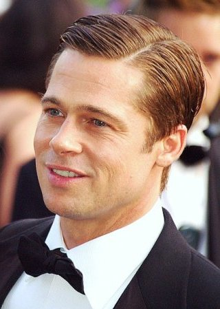

[Brad Pitt Cannes.jpg](https://commons.wikimedia.org/wiki/File:Brad_Pitt_Cannes.jpg) · CC BY-SA 3.0

## Johnny Depp

Bisheriges Foto:

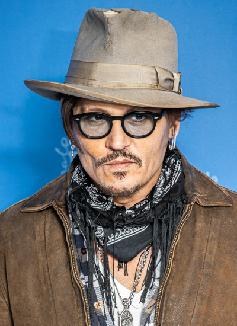

[Johnny_Depp_2020.jpg](https://commons.wikimedia.org/wiki/File:Johnny_Depp_2020.jpg) · CC BY-SA 3.0

Ergänzung · Datierung laut Quelle: 2009

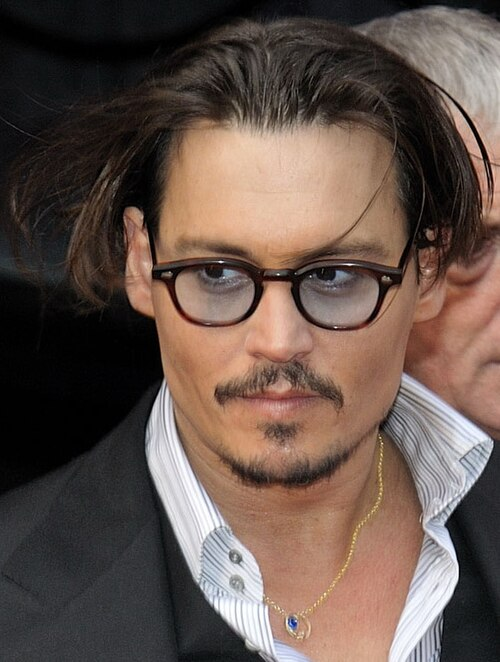

[Johnny Depp (July 2009) 1 (cropped).jpg](https://commons.wikimedia.org/wiki/File:Johnny_Depp_(July_2009)_1_(cropped).jpg) · CC BY-SA 2.0

## Robert De Niro

Bisheriges Foto:

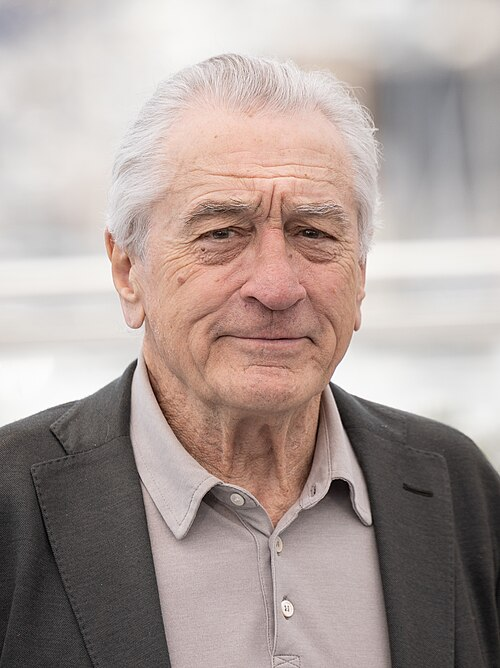

[Robert_de_Niro_Cannes_Film_Festival_(3x4_cropped).jpg](https://commons.wikimedia.org/wiki/File:Robert_de_Niro_Cannes_Film_Festival_(3x4_cropped).jpg) · CC BY-SA 4.0

Ergänzung · Datierung laut Quelle: 1976

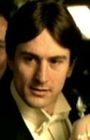

[Robert De Niro (cropped).jpg](https://commons.wikimedia.org/wiki/File:Robert_De_Niro_(cropped).jpg) · Public domain

## Al Pacino

Bisheriges Foto:

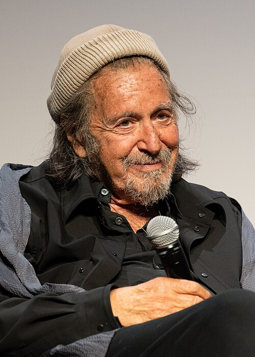

[Al_Pacino_-_Killing_Castro_-_Q&A_-_Tribeca_2026_-_by_@JJxFile-23_(cropped).jpg](https://commons.wikimedia.org/wiki/File:Al_Pacino_-_Killing_Castro_-_Q%26A_-_Tribeca_2026_-_by_@JJxFile-23_(cropped).jpg) · CC BY-SA 4.0

Ergänzung · Datierung laut Quelle: 1977

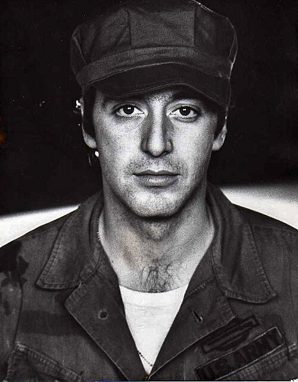

[Al Pacino - Hummel.jpg](https://commons.wikimedia.org/wiki/File:Al_Pacino_-_Hummel.jpg) · Public domain

## Jack Nicholson

Bisheriges Foto:

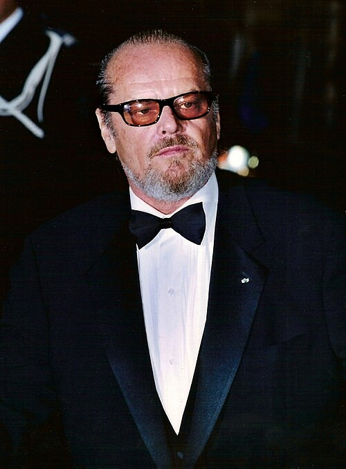

[Jack_Nicholson_2002.jpg](https://commons.wikimedia.org/wiki/File:Jack_Nicholson_2002.jpg) · CC BY-SA 3.0

Ergänzung · Datierung laut Quelle: 1971

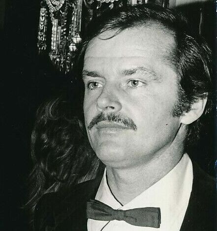

[Jack Nicholson - 1971 Golden Globes (cropped).jpg](https://commons.wikimedia.org/wiki/File:Jack_Nicholson_-_1971_Golden_Globes_(cropped).jpg) · Public domain

## Denzel Washington

Bisheriges Foto:

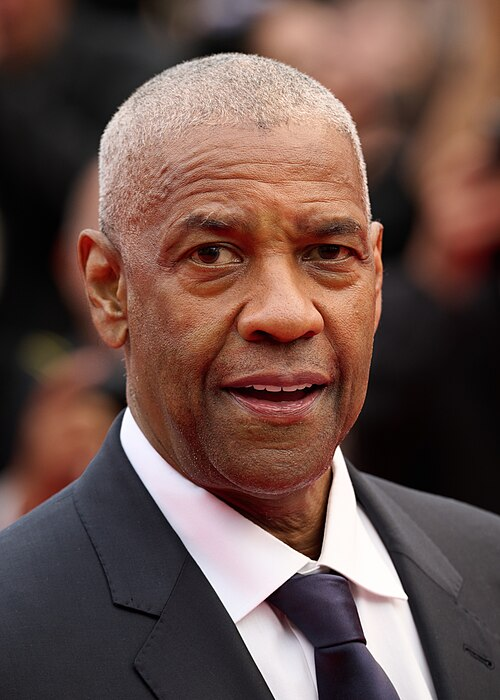

[Denzel Washington at the 2025 Cannes Film Festival.jpg](https://commons.wikimedia.org/wiki/File:Denzel_Washington_at_the_2025_Cannes_Film_Festival.jpg) · CC BY-SA 4.0

Ergänzung · Datierung laut Quelle: 2000

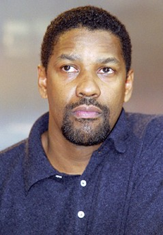

[Denzel Washington cropped.jpg](https://commons.wikimedia.org/wiki/File:Denzel_Washington_cropped.jpg) · CC BY-SA 3.0

## Morgan Freeman

Bisheriges Foto:

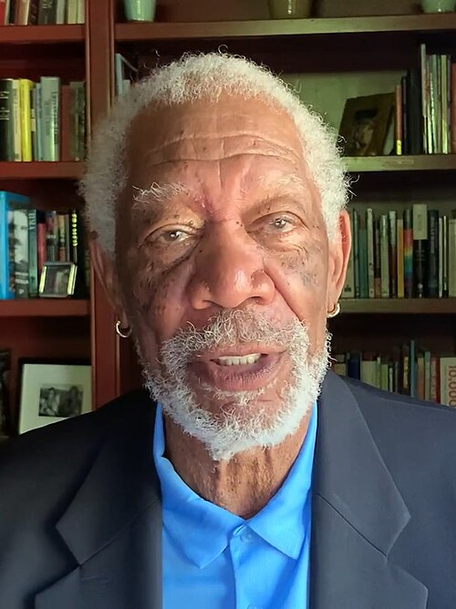

[Morgan Freeman in 2022.jpg](https://commons.wikimedia.org/wiki/File:Morgan_Freeman_in_2022.jpg) · CC BY-SA 3.0

Ergänzung · Datierung laut Quelle: 1990

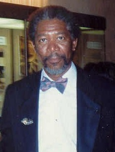

[Morgan Freeman (255277982) (cropped).jpg](https://commons.wikimedia.org/wiki/File:Morgan_Freeman_(255277982)_(cropped).jpg) · CC BY 2.0

## Samuel L. Jackson

Bisheriges Foto:

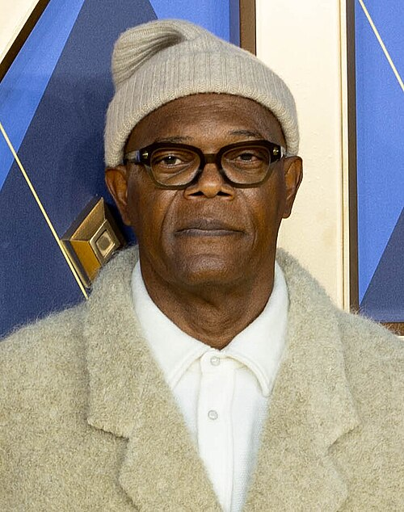

[Samuel_L._Jackson_attending_the_World_premier_of_"Argylle"_in_London_,_January_2024_(cropped2).jpg](https://commons.wikimedia.org/wiki/File:Samuel_L._Jackson_attending_the_World_premier_of_%22Argylle%22_in_London_,_January_2024_(cropped2).jpg) · CC BY-SA 4.0

Ergänzung · Datierung laut Quelle: 2008

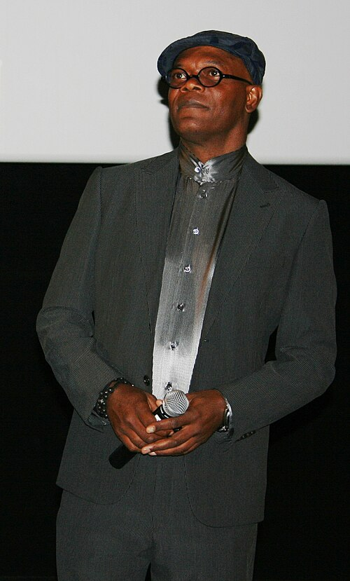

[Samuel-L.-Jackson-Cleaner-2.JPG](https://commons.wikimedia.org/wiki/File:Samuel-L.-Jackson-Cleaner-2.JPG) · CC BY-SA 3.0

Anzeigeausschnitt der unveränderten Datei: x=205, y=25, Breite=220, Höhe=300 Pixel.

## Harrison Ford

Bisheriges Foto:

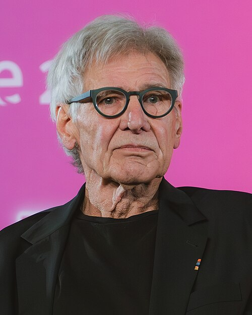

[Harrison Ford - Televerse 2025-03.jpg](https://commons.wikimedia.org/wiki/File:Harrison_Ford_-_Televerse_2025-03.jpg) · CC BY 4.0

Ergänzung · Datierung laut Quelle: 2003

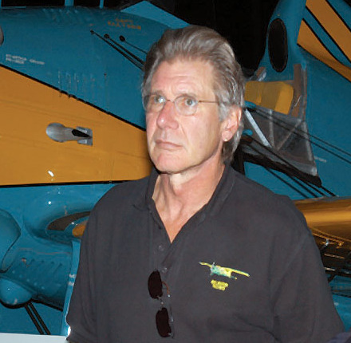

[Actor Harrison Ford touring the Air Force Museum in Dayton, Ohio (cropped).JPG](https://commons.wikimedia.org/wiki/File:Actor_Harrison_Ford_touring_the_Air_Force_Museum_in_Dayton,_Ohio_(cropped).JPG) · Public domain

Anzeigeausschnitt der unveränderten Datei: x=150, y=5, Breite=205, Höhe=275 Pixel.

## Tom Cruise

Bisheriges Foto:

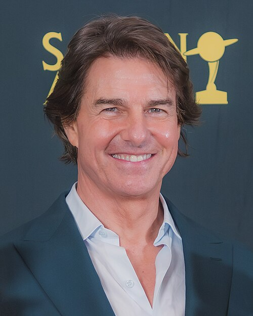

[Tom Cruise at 53rd Saturn Awards 2026-01.jpg](https://commons.wikimedia.org/wiki/File:Tom_Cruise_at_53rd_Saturn_Awards_2026-01.jpg) · CC BY 4.0

Ergänzung · Datierung laut Quelle: 1989

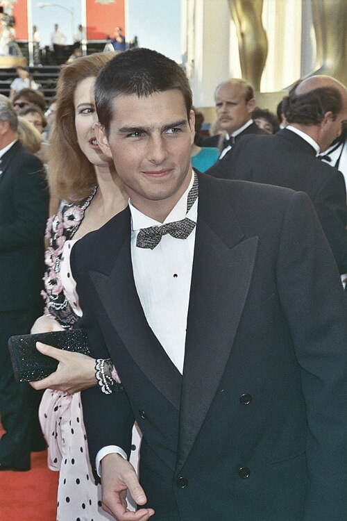

[Tom Cruise (2072038188).jpg](https://commons.wikimedia.org/wiki/File:Tom_Cruise_(2072038188).jpg) · CC BY 2.0

Anzeigeausschnitt der unveränderten Datei: x=130, y=60, Breite=230, Höhe=310 Pixel.

## Keanu Reeves

Bisheriges Foto:

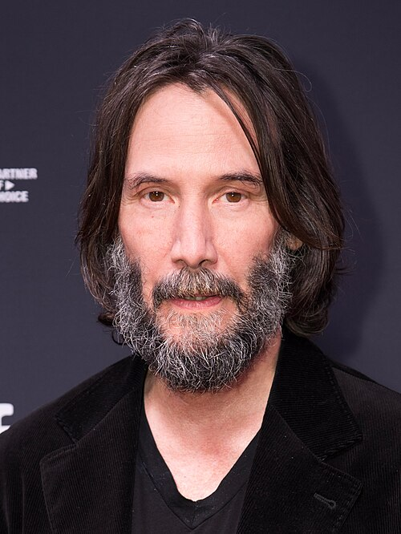

[Keanu Reeves at TIFF 2025 02 (Cropped).jpg](https://commons.wikimedia.org/wiki/File:Keanu_Reeves_at_TIFF_2025_02_(Cropped).jpg) · CC BY-SA 4.0

Ergänzung · Datierung laut Quelle: 2009

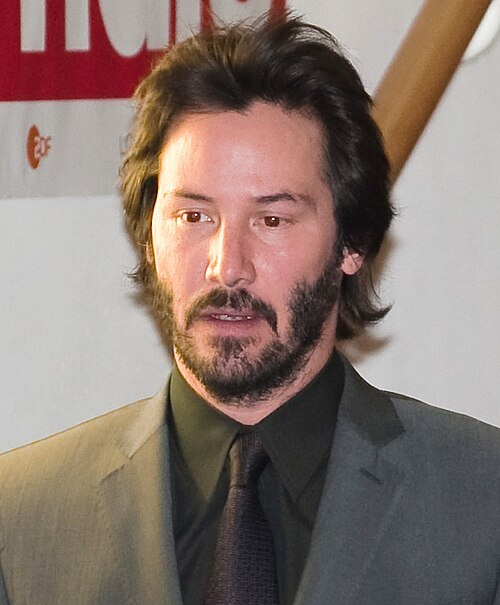

[Keanu Reeves (Berlin Film Festival 2009) (cropped).jpg](https://commons.wikimedia.org/wiki/File:Keanu_Reeves_(Berlin_Film_Festival_2009)_(cropped).jpg) · CC BY 3.0

## Bruce Willis

Bisheriges Foto:

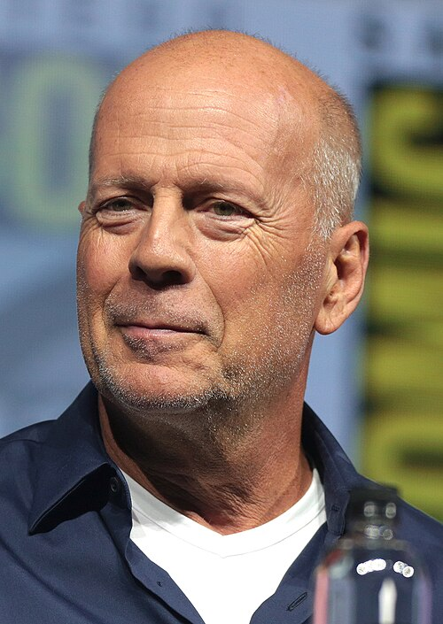

[Bruce_Willis_by_Gage_Skidmore_3.jpg](https://commons.wikimedia.org/wiki/File:Bruce_Willis_by_Gage_Skidmore_3.jpg) · CC BY-SA 3.0

Ergänzung · Datierung laut Quelle: 1985

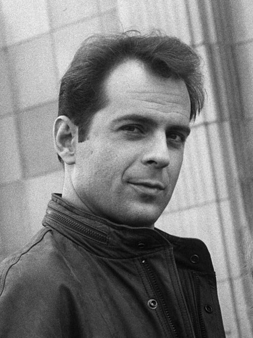

[Bruce Willis "Moonlighting" (1985 ABC press photo).jpg](https://commons.wikimedia.org/wiki/File:Bruce_Willis_%22Moonlighting%22_(1985_ABC_press_photo).jpg) · Public domain

## Arnold Schwarzenegger

Bisheriges Foto:

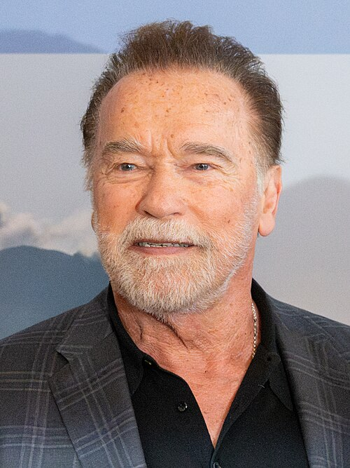

[Arnold Schwarzenegger - Austrian World Summit 2026 BHO-2906.jpg](https://commons.wikimedia.org/wiki/File:Arnold_Schwarzenegger_-_Austrian_World_Summit_2026_BHO-2906.jpg) · CC BY-SA 4.0

Ergänzung · Datierung laut Quelle: 2005

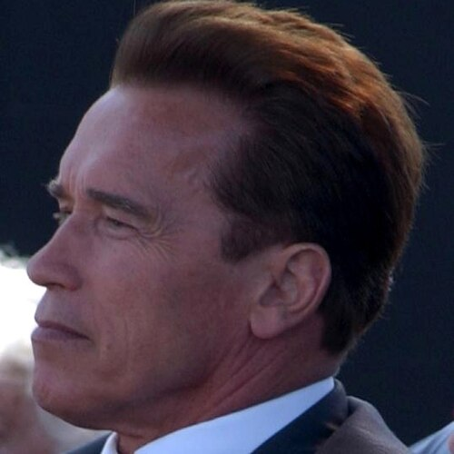

[Arnold Schwarzenegger (square).JPG](https://commons.wikimedia.org/wiki/File:Arnold_Schwarzenegger_(square).JPG) · Public domain

## Sylvester Stallone

Bisheriges Foto:

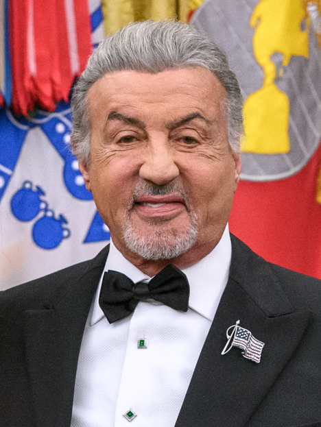

[P20251206DT-0472_(3x4_cropped_on_Stallone_with_moderate_headroom).jpg](https://commons.wikimedia.org/wiki/File:P20251206DT-0472_(3x4_cropped_on_Stallone_with_moderate_headroom).jpg) · Public domain

Ergänzung · Datierung laut Quelle: 1988

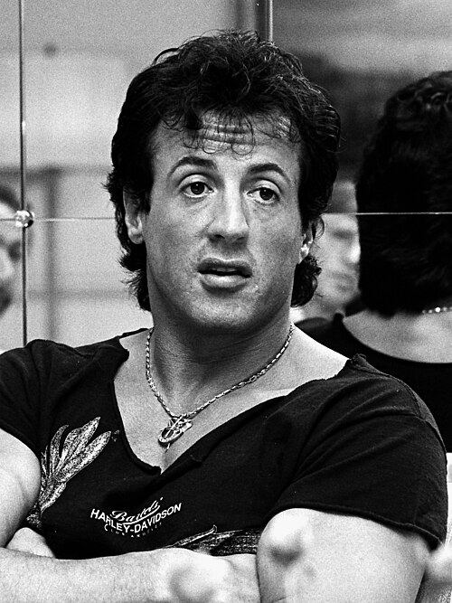

[Sylvester Stallone.jpg](https://commons.wikimedia.org/wiki/File:Sylvester_Stallone.jpg) · CC BY-SA 3.0

## Clint Eastwood

Bisheriges Foto:

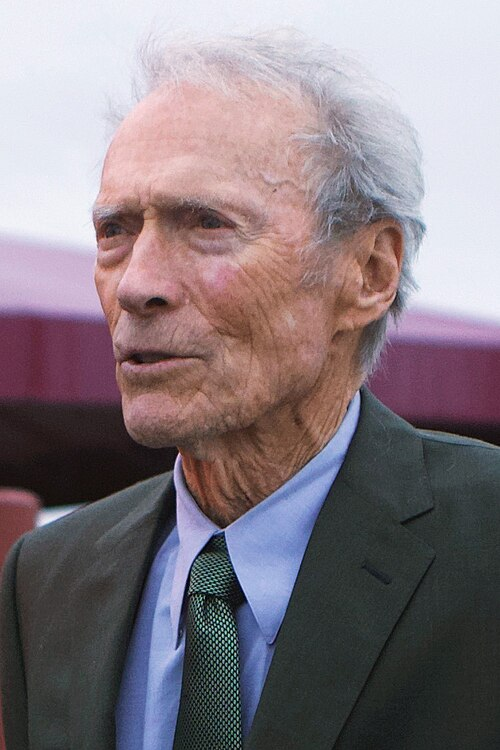

[Clint_Eastwood_visits_MCB_Camp_Pendleton_(1)_(cropped).jpg](https://commons.wikimedia.org/wiki/File:Clint_Eastwood_visits_MCB_Camp_Pendleton_(1)_(cropped).jpg) · Public domain

Ergänzung · Datierung laut Quelle: 1976

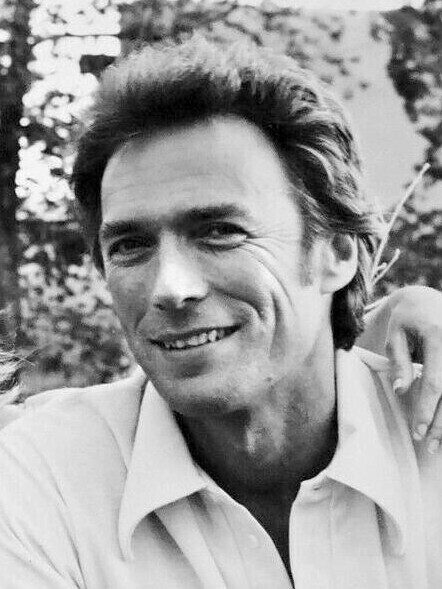

[Clint Eastwood 1976 (cropped).jpg](https://commons.wikimedia.org/wiki/File:Clint_Eastwood_1976_(cropped).jpg) · Public domain

## Anthony Hopkins

Bisheriges Foto:

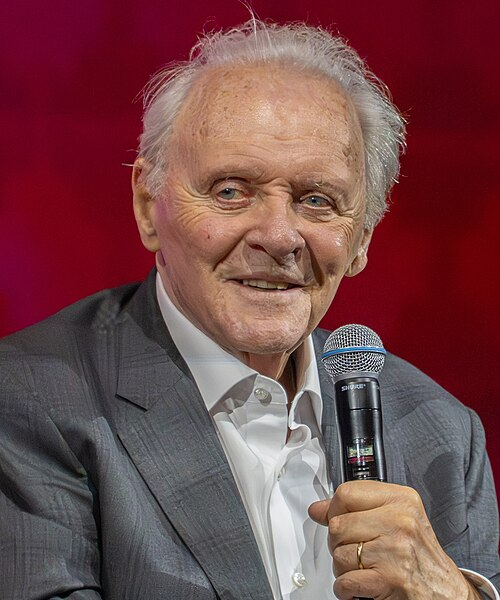

[Anthony_Hopkins_Red_Sea_Festival_2025_Portrait_(cropped).jpg](https://commons.wikimedia.org/wiki/File:Anthony_Hopkins_Red_Sea_Festival_2025_Portrait_(cropped).jpg) · CC BY-SA 4.0

Ergänzung · Datierung laut Quelle: 1996

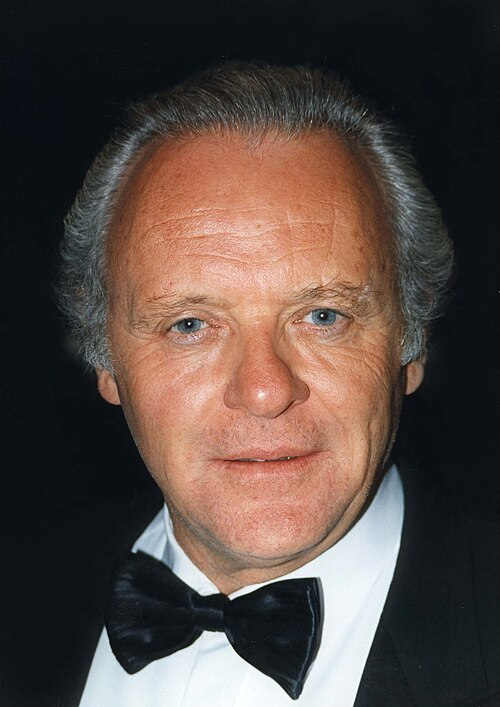

[ANTHONY HOPKINS White house correspondents dinner Wash. D.C. 1996 (5113175432).jpg](https://commons.wikimedia.org/wiki/File:ANTHONY_HOPKINS_White_house_correspondents_dinner_Wash._D.C._1996_(5113175432).jpg) · CC BY-SA 2.0

## Daniel Day-Lewis

Bisheriges Foto:

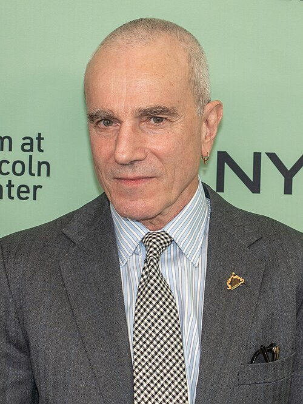

[Daniel_Day-Lewis_Anemone-15_(cropped).jpg](https://commons.wikimedia.org/wiki/File:Daniel_Day-Lewis_Anemone-15_(cropped).jpg) · CC BY-SA 4.0

Ergänzung · Datierung laut Quelle: 1988

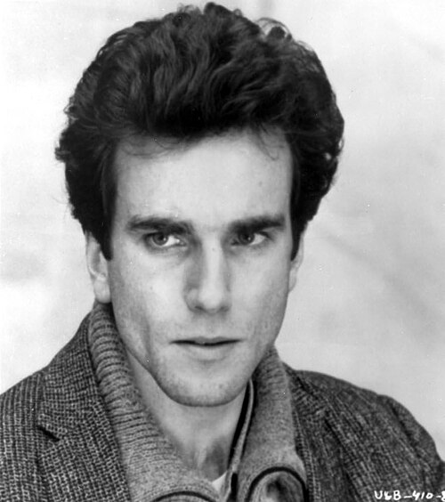

[Daniel Day-Lewis - The Unbearable Lightness of Being.jpg](https://commons.wikimedia.org/wiki/File:Daniel_Day-Lewis_-_The_Unbearable_Lightness_of_Being.jpg) · Public domain

## Gary Oldman

Bisheriges Foto:

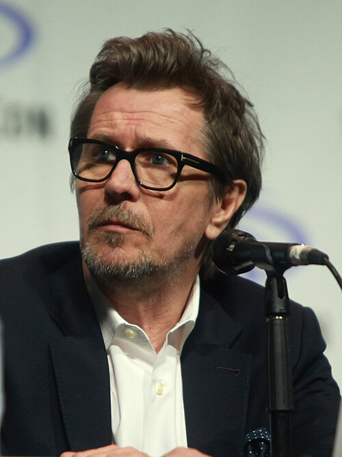

[Gary_Oldman_(13925515511)_(cropped).jpg](https://commons.wikimedia.org/wiki/File:Gary_Oldman_(13925515511)_(cropped).jpg) · CC BY-SA 2.0

Ergänzung · Datierung laut Quelle: 2000

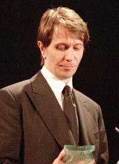

[Gary Oldman 2000 (cropped).jpg](https://commons.wikimedia.org/wiki/File:Gary_Oldman_2000_(cropped).jpg) · Public domain

Anzeigeausschnitt der unveränderten Datei: x=35, y=0, Breite=139, Höhe=180 Pixel.

## Christian Bale

Bisheriges Foto:

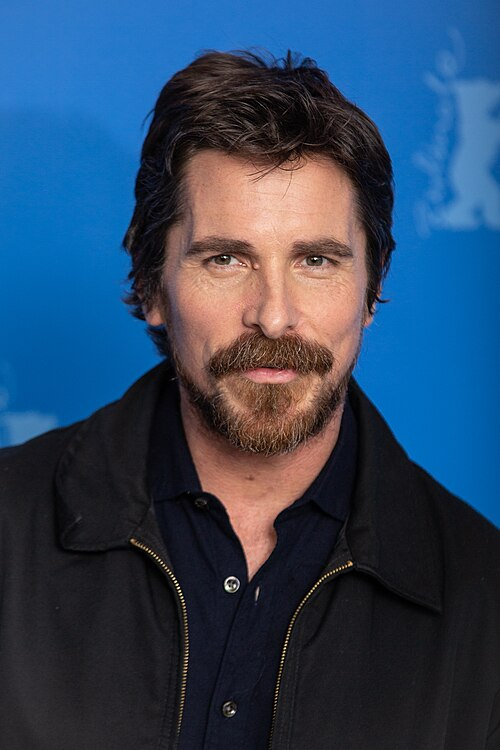

[Christian_Bale-7837.jpg](https://commons.wikimedia.org/wiki/File:Christian_Bale-7837.jpg) · CC BY-SA 4.0

Ergänzung · Datierung laut Quelle: 2009

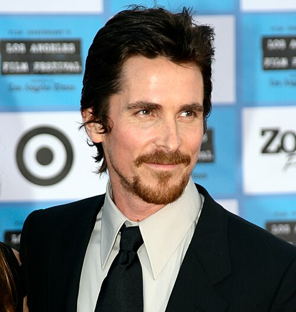

[Christian Bale Premiere of Public Enemies - Los Angeles 2009 (cropped).jpg](https://commons.wikimedia.org/wiki/File:Christian_Bale_Premiere_of_Public_Enemies_-_Los_Angeles_2009_(cropped).jpg) · CC BY 2.0

## Joaquin Phoenix

Bisheriges Foto:

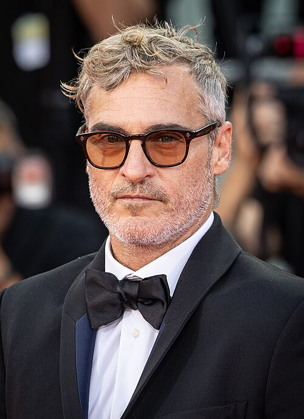

[Joaquin_Phoenix-64908_(cropped).jpg](https://commons.wikimedia.org/wiki/File:Joaquin_Phoenix-64908_(cropped).jpg) · CC BY-SA 4.0

Ergänzung · Datierung laut Quelle: 2013

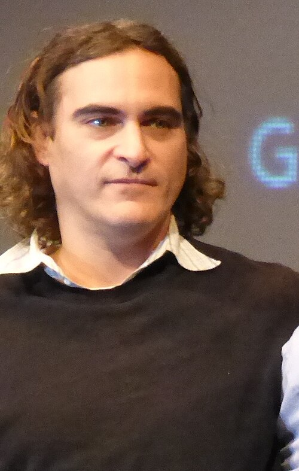

[Joaquin Phoenix NYFF 2013 (cropped).jpg](https://commons.wikimedia.org/wiki/File:Joaquin_Phoenix_NYFF_2013_(cropped).jpg) · CC BY 2.0

## Heath Ledger

Bisheriges Foto:

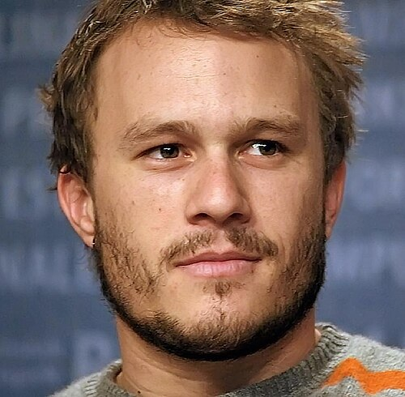

[Heath_Ledger_(2).jpg](https://commons.wikimedia.org/wiki/File:Heath_Ledger_(2).jpg) · CC BY-SA 2.0

Ergänzung · Datierung laut Quelle: 2006

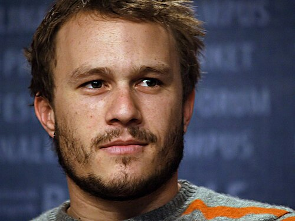

[Heath Ledger-1.jpg](https://commons.wikimedia.org/wiki/File:Heath_Ledger-1.jpg) · CC BY-SA 2.0

## Robin Williams

Bisheriges Foto:

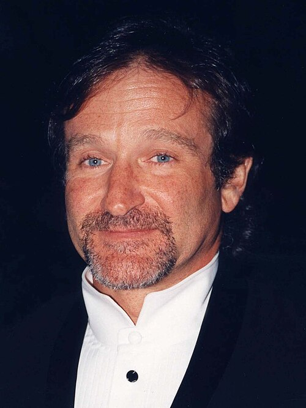

[Robin_Williams_1996_(cropped)_2.jpg](https://commons.wikimedia.org/wiki/File:Robin_Williams_1996_(cropped)_2.jpg) · CC BY-SA 2.0

Ergänzung · Datierung laut Quelle: 1978

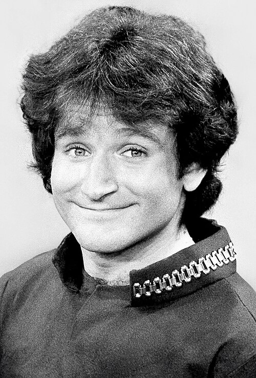

[Robin Williams 1978 (cropped).jpg](https://commons.wikimedia.org/wiki/File:Robin_Williams_1978_(cropped).jpg) · Public domain

## Jim Carrey

Bisheriges Foto:

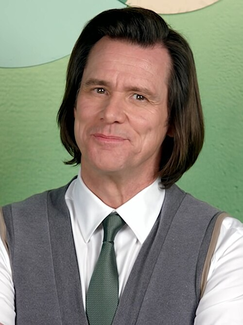

[Jim_Carrey_2020_(cropped2).jpg](https://commons.wikimedia.org/wiki/File:Jim_Carrey_2020_(cropped2).jpg) · CC BY 3.0

Ergänzung · Datierung laut Quelle: 2008

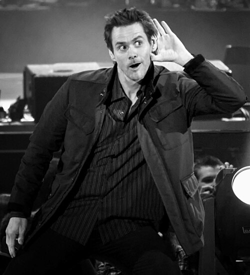

[Jim-Carrey-2008 (cropped).jpg](https://commons.wikimedia.org/wiki/File:Jim-Carrey-2008_(cropped).jpg) · CC BY-SA 2.0

## Will Smith

Bisheriges Foto:

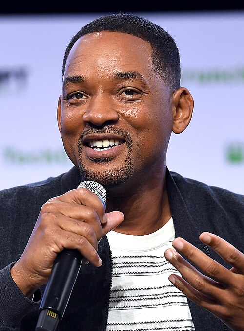

[TechCrunch Disrupt San Francisco 2019 - Day 1 (48834070763) (cropped).jpg](https://commons.wikimedia.org/wiki/File:TechCrunch_Disrupt_San_Francisco_2019_-_Day_1_(48834070763)_(cropped).jpg) · CC BY 2.0

Ergänzung · Datierung laut Quelle: 1999

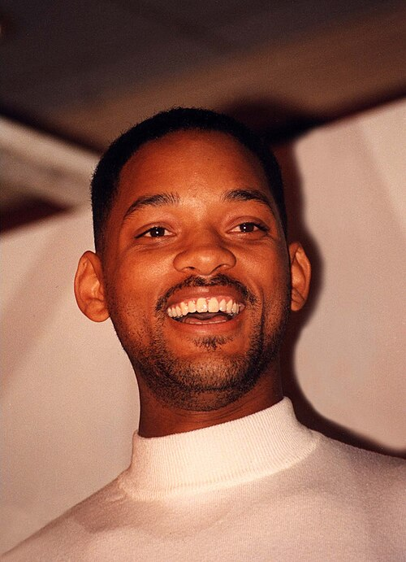

[Will Smith (32335923807).jpg](https://commons.wikimedia.org/wiki/File:Will_Smith_(32335923807).jpg) · CC BY-SA 2.0

## Matt Damon

Bisheriges Foto:

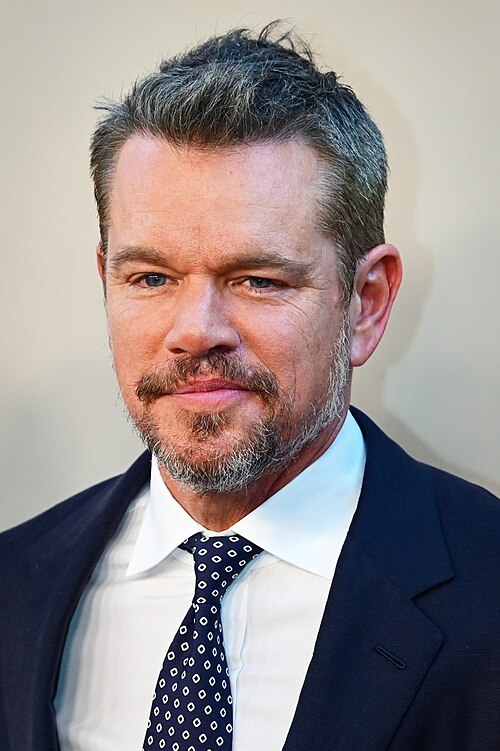

[MattDamon-byPhilipRomano2.jpg](https://commons.wikimedia.org/wiki/File:MattDamon-byPhilipRomano2.jpg) · CC BY-SA 4.0

Ergänzung · Datierung laut Quelle: nicht genau datiert

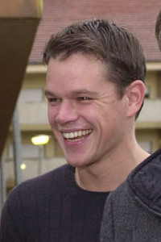

[Matt Damon 2001.jpg](https://commons.wikimedia.org/wiki/File:Matt_Damon_2001.jpg) · Public domain

## Ben Affleck

Bisheriges Foto:

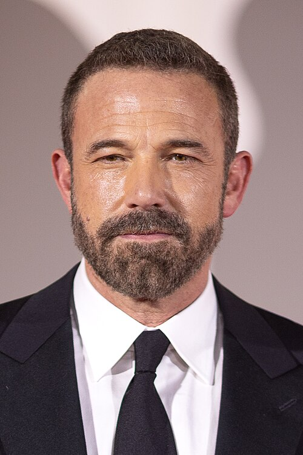

[Ben_Affleck_at_83rd_Venice_International_Film_Festival-1_(cropped).jpg](https://commons.wikimedia.org/wiki/File:Ben_Affleck_at_83rd_Venice_International_Film_Festival-1_(cropped).jpg) · CC BY-SA 4.0

Ergänzung · Datierung laut Quelle: 2012

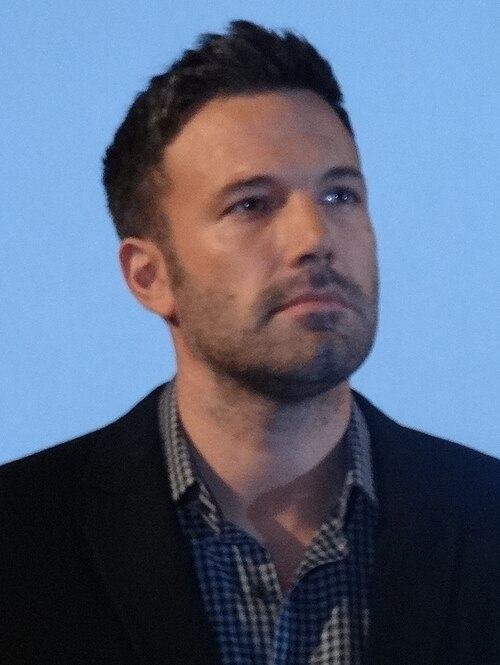

[Argo (2012 film) premiere in Paris Ben Affleck (8092901875) (cropped).jpg](https://commons.wikimedia.org/wiki/File:Argo_(2012_film)_premiere_in_Paris_Ben_Affleck_(8092901875)_(cropped).jpg) · CC BY 2.0

## George Clooney

Bisheriges Foto:

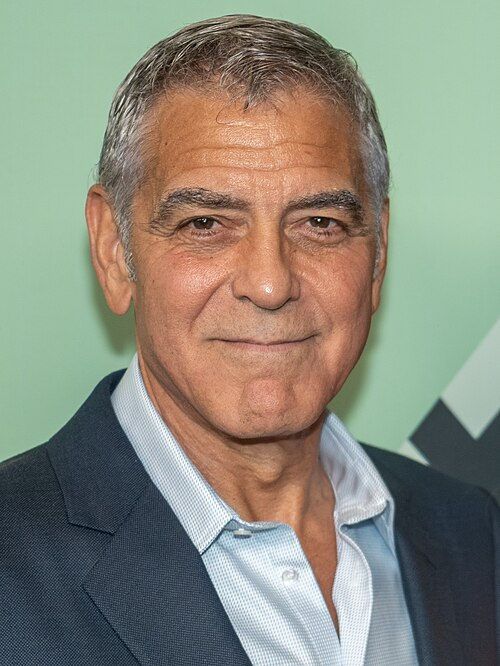

[George_Clooney_Jay_Kelly-19_(cropped).jpg](https://commons.wikimedia.org/wiki/File:George_Clooney_Jay_Kelly-19_(cropped).jpg) · CC BY-SA 4.0

Ergänzung · Datierung laut Quelle: 2009

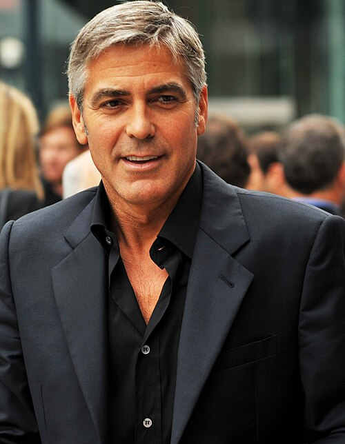

[George Clooney-4 The Men Who Stare at Goats TIFF09 (cropped).jpg](https://commons.wikimedia.org/wiki/File:George_Clooney-4_The_Men_Who_Stare_at_Goats_TIFF09_(cropped).jpg) · CC BY 2.0

## Sean Connery

Bisheriges Foto:

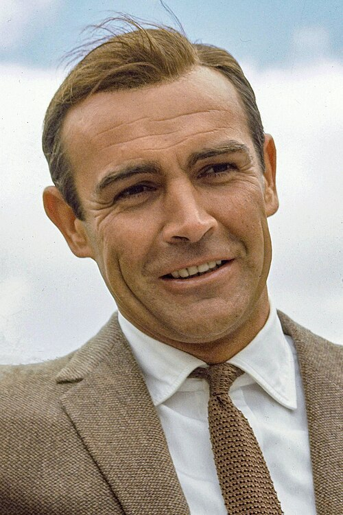

[Sean_Connery_as_James_Bond_at_Switzerland_1964_(two_thirds_crop).jpg](https://commons.wikimedia.org/wiki/File:Sean_Connery_as_James_Bond_at_Switzerland_1964_(two_thirds_crop).jpg) · CC BY-SA 4.0

Ergänzung · Datierung laut Quelle: 1965

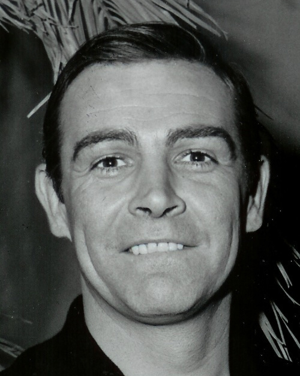

[Sean Connery 1965 (cropped A).jpg](https://commons.wikimedia.org/wiki/File:Sean_Connery_1965_(cropped_A).jpg) · Public domain

## Daniel Craig

Bisheriges Foto:

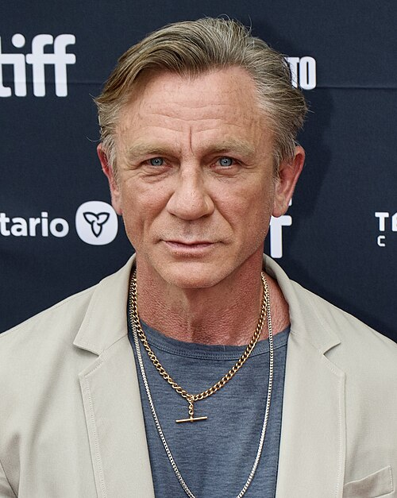

[Daniel_Craig_TIFF_2025_Red_Carpet_(cropped).jpg](https://commons.wikimedia.org/wiki/File:Daniel_Craig_TIFF_2025_Red_Carpet_(cropped).jpg) · CC BY 4.0

Ergänzung · Datierung laut Quelle: 2009

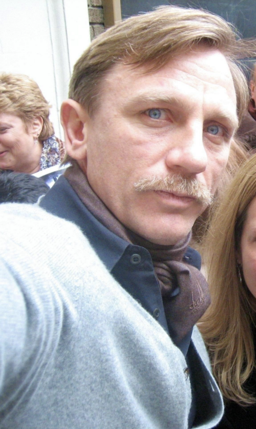

[Daniel Craig in 2009 after A Steady Rain.png](https://commons.wikimedia.org/wiki/File:Daniel_Craig_in_2009_after_A_Steady_Rain.png) · Public domain

## Benedict Cumberbatch

Bisheriges Foto:

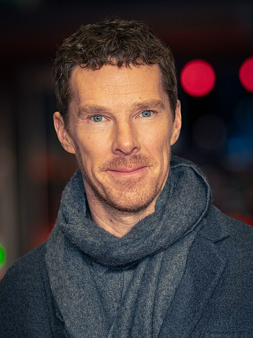

[Benedict_Cumberbatch-67555.jpg](https://commons.wikimedia.org/wiki/File:Benedict_Cumberbatch-67555.jpg) · CC BY-SA 4.0

Ergänzung · Datierung laut Quelle: 2013

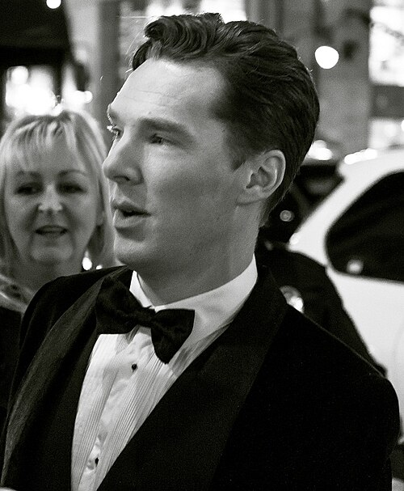

[Benedict Cumberbatch - December 2013 (cropped).jpg](https://commons.wikimedia.org/wiki/File:Benedict_Cumberbatch_-_December_2013_(cropped).jpg) · CC BY 2.0

## Ian McKellen

Bisheriges Foto:

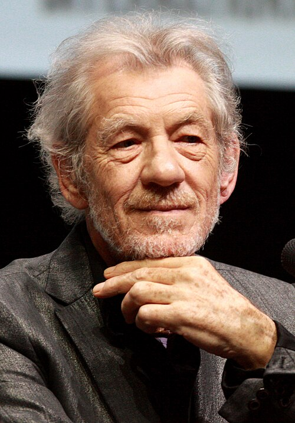

[SDCC13_-_Ian_McKellen.jpg](https://commons.wikimedia.org/wiki/File:SDCC13_-_Ian_McKellen.jpg) · CC BY-SA 2.0

Ergänzung · Datierung laut Quelle: 2003

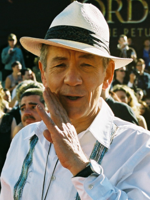

[Ian McKellen 2003 (cropped).jpg](https://commons.wikimedia.org/wiki/File:Ian_McKellen_2003_(cropped).jpg) · CC BY-SA 3.0

## Patrick Stewart

Bisheriges Foto:

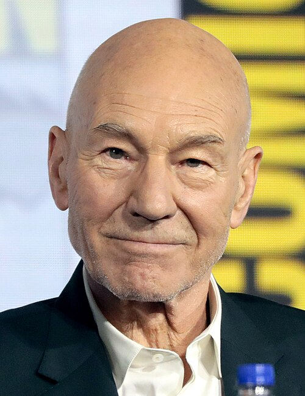

[Patrick_Stewart_by_Gage_Skidmore_2.jpg](https://commons.wikimedia.org/wiki/File:Patrick_Stewart_by_Gage_Skidmore_2.jpg) · CC BY-SA 3.0

Ergänzung · Datierung laut Quelle: 1990

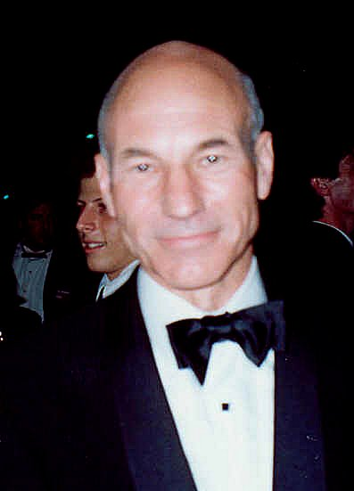

[Alan Light with Patrick Stewart (Stewart crop).jpg](https://commons.wikimedia.org/wiki/File:Alan_Light_with_Patrick_Stewart_(Stewart_crop).jpg) · CC BY 2.0

Beschreibung nennt die 42. Emmy Awards im September 1990; das Metadatum 2006 gehört zum späteren Upload.

## Michael Caine

Bisheriges Foto:

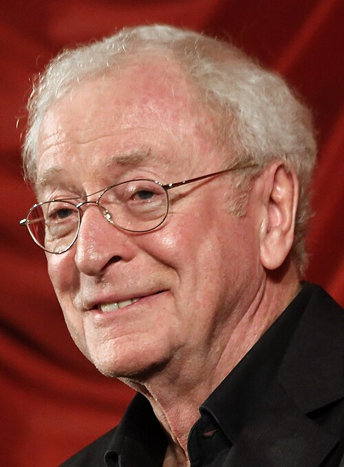

[Michael_Caine_-_Viennale_2012_g_(cropped).jpg](https://commons.wikimedia.org/wiki/File:Michael_Caine_-_Viennale_2012_g_(cropped).jpg) · CC BY-SA 3.0

Ergänzung · Datierung laut Quelle: 1967

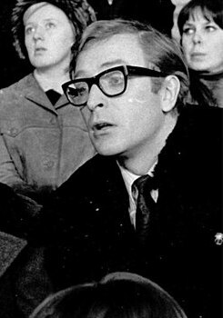

[Michael Caine-1967-Helsinki Cropped.jpg](https://commons.wikimedia.org/wiki/File:Michael_Caine-1967-Helsinki_Cropped.jpg) · Public domain

Anzeigeausschnitt der unveränderten Datei: x=65, y=18, Breite=130, Höhe=198 Pixel.

## Alan Rickman

Bisheriges Foto:

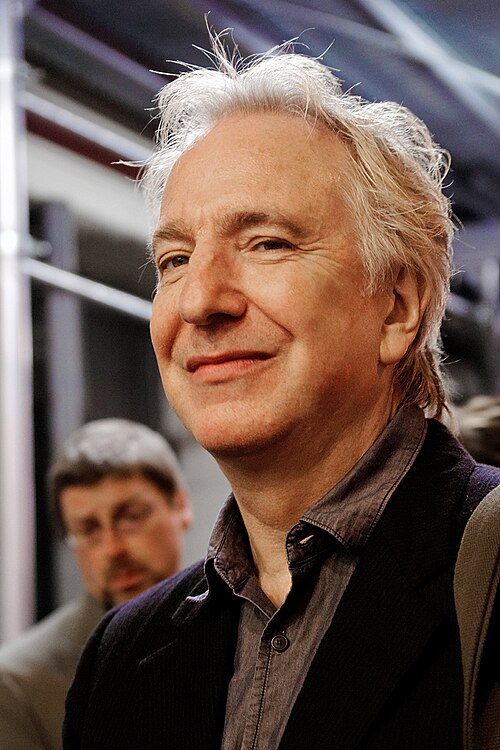

[Alan_Rickman_after_Seminar_(3).jpg](https://commons.wikimedia.org/wiki/File:Alan_Rickman_after_Seminar_(3).jpg) · CC BY 2.0

Ergänzung · Datierung laut Quelle: 2007

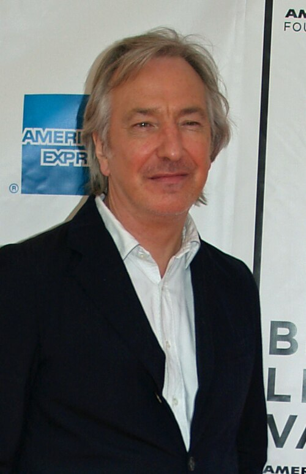

[Alan Rickman by David Shankbone (cropped).jpg](https://commons.wikimedia.org/wiki/File:Alan_Rickman_by_David_Shankbone_(cropped).jpg) · CC BY-SA 3.0

## Christoph Waltz

Bisheriges Foto:

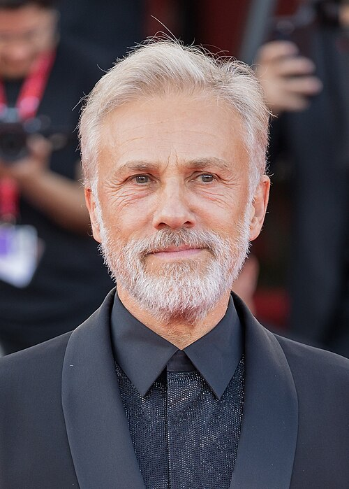

[Christoph Waltz at 82nd Venice International Film Festival-1 (cropped).jpg](https://commons.wikimedia.org/wiki/File:Christoph_Waltz_at_82nd_Venice_International_Film_Festival-1_(cropped).jpg) · CC BY-SA 4.0

Ergänzung · Datierung laut Quelle: 2012

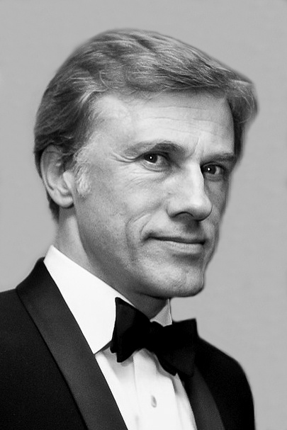

[Christoph Waltz (cropped b&w).jpg](https://commons.wikimedia.org/wiki/File:Christoph_Waltz_(cropped_b%26w).jpg) · CC BY-SA 3.0

## Daniel Brühl

Bisheriges Foto:

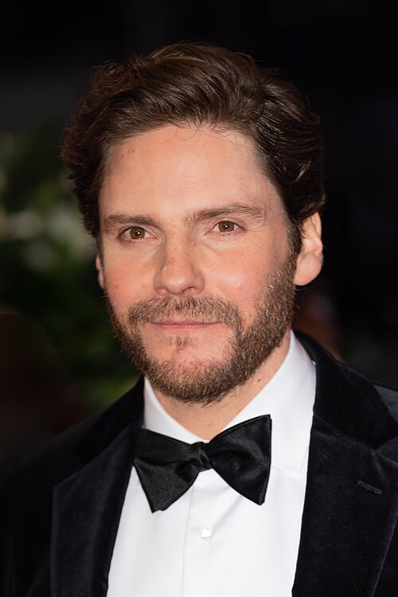

[MJK 68238 Daniel Brühl (Berlinale 2020).jpg](https://commons.wikimedia.org/wiki/File:MJK_68238_Daniel_Br%C3%BChl_(Berlinale_2020).jpg) · CC BY-SA 4.0

Ergänzung · Datierung laut Quelle: 2013

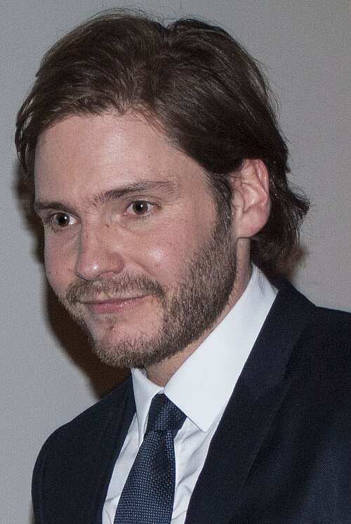

[Daniel Brühl (cropped).jpg](https://commons.wikimedia.org/wiki/File:Daniel_Br%C3%BChl_(cropped).jpg) · CC BY 3.0

## Jürgen Vogel

Bisheriges Foto:

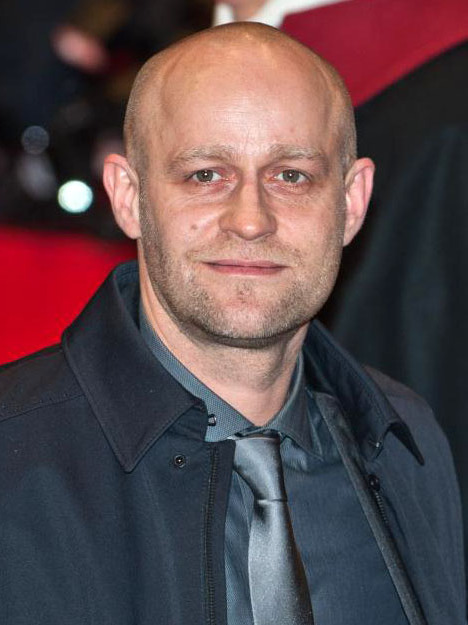

[Jürgen_Vogel_(Berlinale_2012)_(cropped).jpg](https://commons.wikimedia.org/wiki/File:J%C3%BCrgen_Vogel_(Berlinale_2012)_(cropped).jpg) · CC BY 3.0

Ergänzung · Datierung laut Quelle: 2010

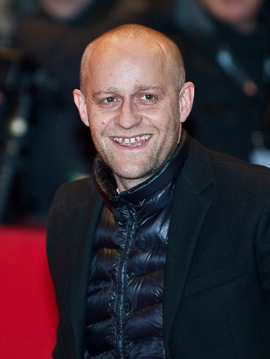

[Jürgen Vogel Berlinale 2010 crop.jpg](https://commons.wikimedia.org/wiki/File:J%C3%BCrgen_Vogel_Berlinale_2010_crop.jpg) · CC BY 3.0

## Moritz Bleibtreu

Bisheriges Foto:

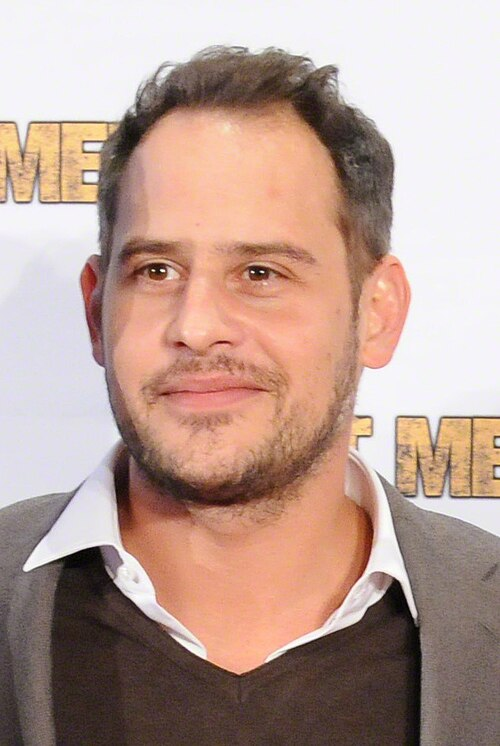

[Nicht-mein-Tag-Darsteller_(cropped).jpg](https://commons.wikimedia.org/wiki/File:Nicht-mein-Tag-Darsteller_(cropped).jpg) · CC BY-SA 3.0

Ergänzung · Datierung laut Quelle: 2010

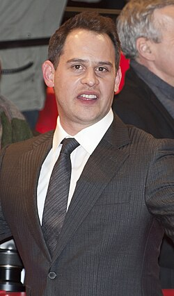

[Moritz Bleibtreu (Berlin Film Festival 2010) cropped.jpg](https://commons.wikimedia.org/wiki/File:Moritz_Bleibtreu_(Berlin_Film_Festival_2010)_cropped.jpg) · CC BY 3.0

Dateititel und Beschreibung nennen die Berlinale 2010; das Metadatum 2011 ist kein Aufnahmejahr.

## Mario Adorf

Bisheriges Foto:

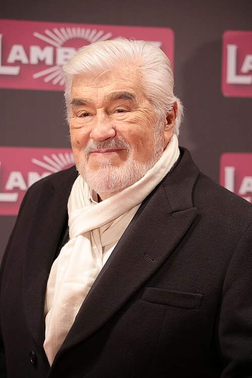

[AV0A1506_Mario_Adorf.jpg](https://commons.wikimedia.org/wiki/File:AV0A1506_Mario_Adorf.jpg) · CC BY-SA 3.0

Ergänzung · Datierung laut Quelle: 1972

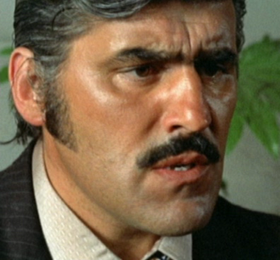

[Mario Adorf la mala ordina.png](https://commons.wikimedia.org/wiki/File:Mario_Adorf_la_mala_ordina.png) · Public domain

## Bruno Ganz

Bisheriges Foto:

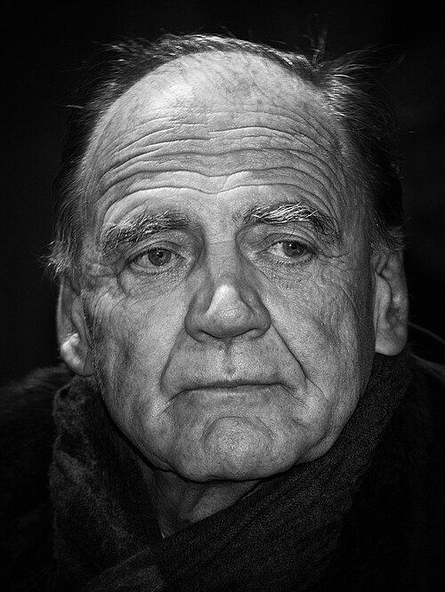

[Bruno_Ganz_2011.jpg](https://commons.wikimedia.org/wiki/File:Bruno_Ganz_2011.jpg) · CC BY-SA 3.0

Ergänzung · Datierung laut Quelle: 2005

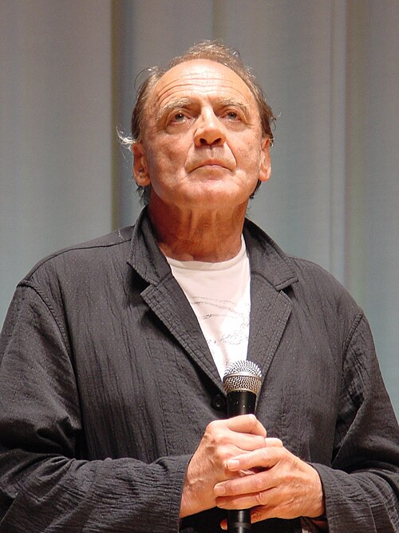

[Bruno Ganz DFF Tokyo 2005 2.jpg](https://commons.wikimedia.org/wiki/File:Bruno_Ganz_DFF_Tokyo_2005_2.jpg) · CC BY-SA 3.0

Anzeigeausschnitt der unveränderten Datei: x=145, y=40, Breite=220, Höhe=290 Pixel.

## Bud Spencer

Bisheriges Foto:

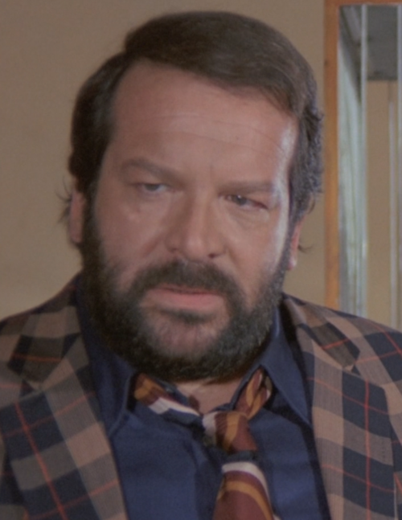

[Bud_Spencer_1974.png](https://commons.wikimedia.org/wiki/File:Bud_Spencer_1974.png) · Public domain

Ergänzung · Datierung laut Quelle: 1973

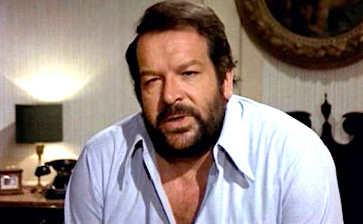

[Bud Spencer 1973.jpg](https://commons.wikimedia.org/wiki/File:Bud_Spencer_1973.jpg) · Public domain

## Terence Hill

Bisheriges Foto:

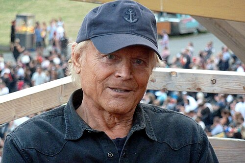

[Terence_Hill_in_Dresden_(20.08.2018).jpg](https://commons.wikimedia.org/wiki/File:Terence_Hill_in_Dresden_(20.08.2018).jpg) · CC BY-SA 4.0

Ergänzung · Datierung laut Quelle: 1974

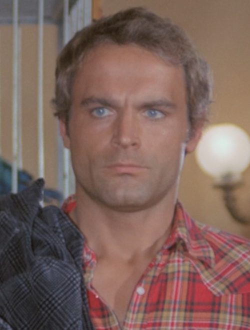

[Terence Hill 1974.png](https://commons.wikimedia.org/wiki/File:Terence_Hill_1974.png) · Public domain

## Jackie Chan

Bisheriges Foto:

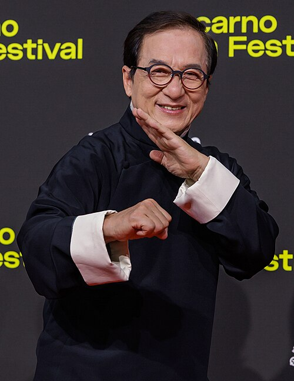

[Jackie Chan.jpg](https://commons.wikimedia.org/wiki/File:Jackie_Chan.jpg) · CC BY-SA 4.0

Ergänzung · Datierung laut Quelle: 2002

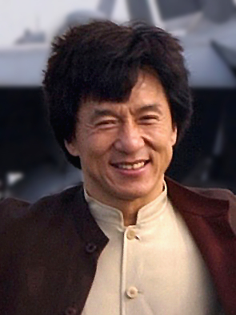

[Jackie Chan 2002-portrait edited.jpg](https://commons.wikimedia.org/wiki/File:Jackie_Chan_2002-portrait_edited.jpg) · Public domain

## Bruce Lee

Bisheriges Foto:

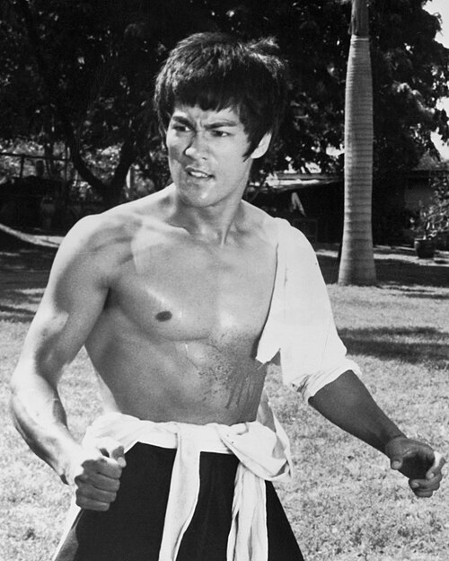

[Bruce_Lee_as_Chen_Zhen_(4x5_cropped).jpg](https://commons.wikimedia.org/wiki/File:Bruce_Lee_as_Chen_Zhen_(4x5_cropped).jpg) · Public domain

Ergänzung · Datierung laut Quelle: 1973

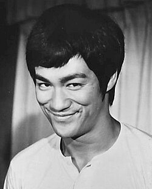

[Bruce Lee 1973 (cropped).jpg](https://commons.wikimedia.org/wiki/File:Bruce_Lee_1973_(cropped).jpg) · Public domain

## Chow Yun-fat

Bisheriges Foto:

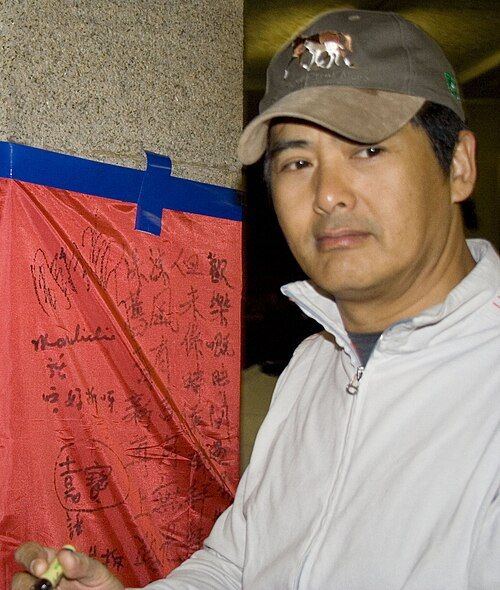

[Chow_Yun_Fat_for_wiki.jpg](https://commons.wikimedia.org/wiki/File:Chow_Yun_Fat_for_wiki.jpg) · CC BY-SA 3.0

Ergänzung · Datierung laut Quelle: 2007

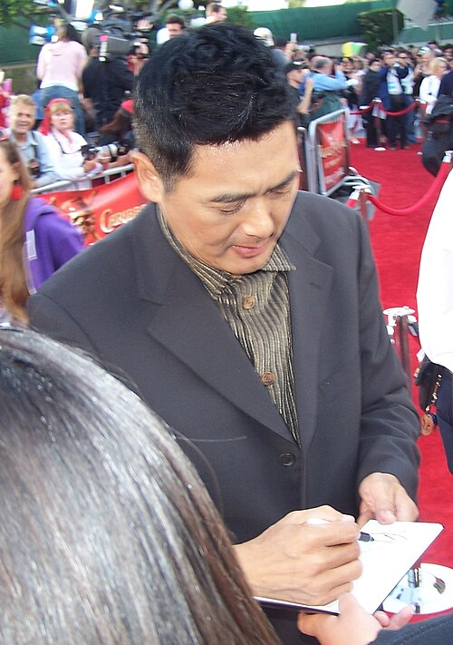

[Chow Yun Fat 2.JPG](https://commons.wikimedia.org/wiki/File:Chow_Yun_Fat_2.JPG) · CC BY-SA 3.0

Anzeigeausschnitt der unveränderten Datei: x=150, y=25, Breite=210, Höhe=300 Pixel.

## Shah Rukh Khan

Bisheriges Foto:

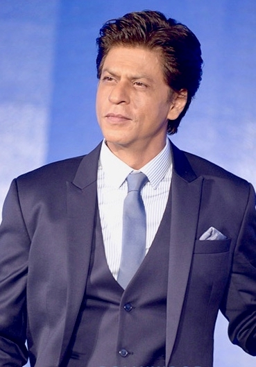

[Shah_Rukh_Khan_graces_the_launch_of_the_new_Santro.jpg](https://commons.wikimedia.org/wiki/File:Shah_Rukh_Khan_graces_the_launch_of_the_new_Santro.jpg) · CC BY 3.0

Ergänzung · Datierung laut Quelle: 2000

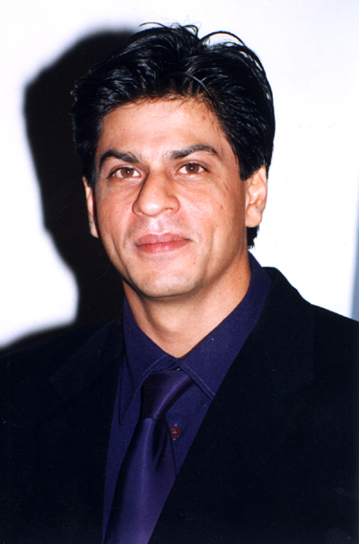

[Shah Rukh Khan 2001.jpg](https://commons.wikimedia.org/wiki/File:Shah_Rukh_Khan_2001.jpg) · CC BY 3.0

## Toshirō Mifune

Bisheriges Foto:

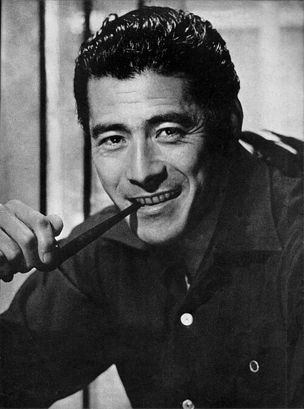

[Toshiro_Mifune_1954_Scan10003_160913.jpg](https://commons.wikimedia.org/wiki/File:Toshiro_Mifune_1954_Scan10003_160913.jpg) · Public domain

Ergänzung · Datierung laut Quelle: 1960er-Jahre

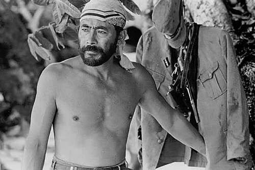

[Toshiro Mifune wearing bandana.jpg](https://commons.wikimedia.org/wiki/File:Toshiro_Mifune_wearing_bandana.jpg) · Public domain

Commons nennt nur die 1960er-Jahre, kein genaues Jahr.

Anzeigeausschnitt der unveränderten Datei: x=120, y=0, Breite=190, Höhe=180 Pixel.

## Omar Sharif

Bisheriges Foto:

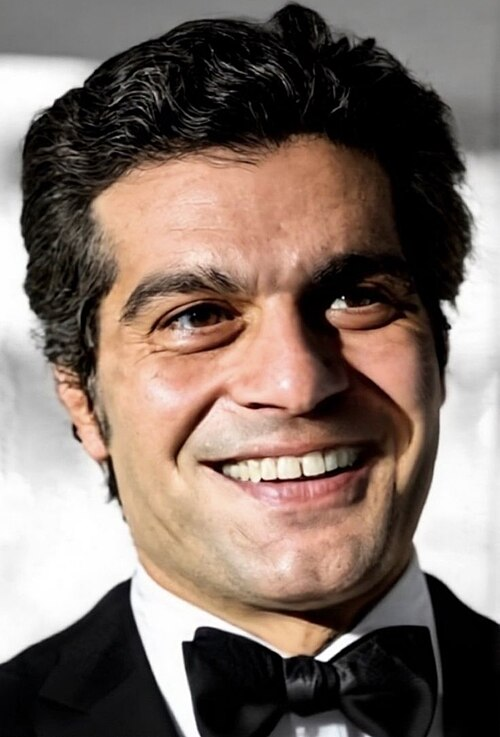

[Omar_Sharif-Cairo.jpg](https://commons.wikimedia.org/wiki/File:Omar_Sharif-Cairo.jpg) · Public domain

Ergänzung · Datierung laut Quelle: 1965

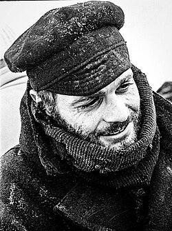

[Omar-Sharif-1965-as Zhivago.jpg](https://commons.wikimedia.org/wiki/File:Omar-Sharif-1965-as_Zhivago.jpg) · Public domain

## Meryl Streep

Bisheriges Foto:

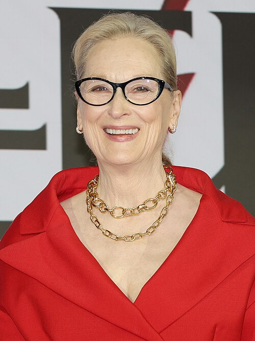

[Meryl Streep- Press conference for the film "The Devil Wears Prada 2" - 55194765350 (cropped1).jpg](https://commons.wikimedia.org/wiki/File:Meryl_Streep-_Press_conference_for_the_film_%22The_Devil_Wears_Prada_2%22_-_55194765350_(cropped1).jpg) · CC BY-SA 4.0

Ergänzung · Datierung laut Quelle: 1989

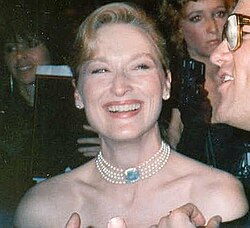

[Meryl Streep 61st Academy Awards (cropped).jpg](https://commons.wikimedia.org/wiki/File:Meryl_Streep_61st_Academy_Awards_(cropped).jpg) · CC BY 2.0

Anzeigeausschnitt der unveränderten Datei: x=15, y=5, Breite=160, Höhe=205 Pixel.

## Julia Roberts

Bisheriges Foto:

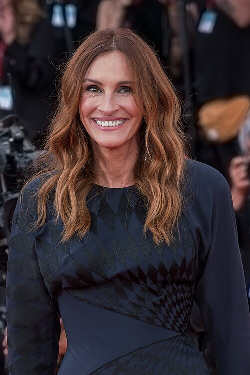

[Julia Roberts 2025.jpg](https://commons.wikimedia.org/wiki/File:Julia_Roberts_2025.jpg) · CC BY-SA 4.0

Ergänzung · Datierung laut Quelle: 2002

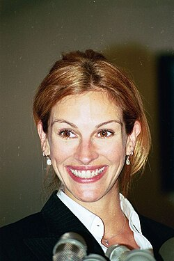

[Julia Roberts 2001.jpg](https://commons.wikimedia.org/wiki/File:Julia_Roberts_2001.jpg) · CC BY-SA 2.0

## Sandra Bullock

Bisheriges Foto:

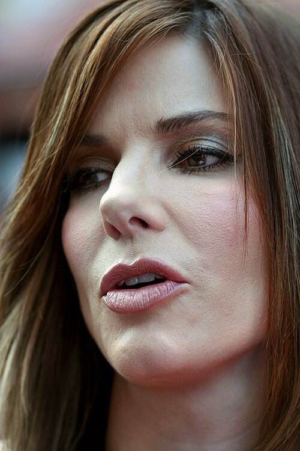

[SandraBullockLakehouse.jpg](https://commons.wikimedia.org/wiki/File:SandraBullockLakehouse.jpg) · CC BY 3.0

Ergänzung · Datierung laut Quelle: 1996

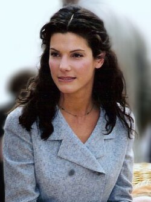

[Sandra Bullock 1996 (cropped).jpg](https://commons.wikimedia.org/wiki/File:Sandra_Bullock_1996_(cropped).jpg) · CC BY-SA 3.0

Anzeigeausschnitt der unveränderten Datei: x=70, y=10, Breite=150, Höhe=200 Pixel.

## Jodie Foster

Bisheriges Foto:

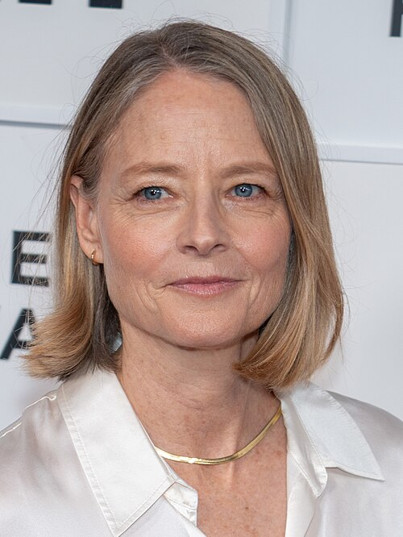

[Jodie Foster Taxi Driver Tribeca Festival 2026-20 (cropped).jpg](https://commons.wikimedia.org/wiki/File:Jodie_Foster_Taxi_Driver_Tribeca_Festival_2026-20_(cropped).jpg) · CC BY-SA 4.0

Ergänzung · Datierung laut Quelle: 1989

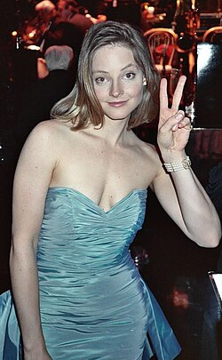

[Jodie Foster (2071232003) (cropped).jpg](https://commons.wikimedia.org/wiki/File:Jodie_Foster_(2071232003)_(cropped).jpg) · CC BY 2.0

Anzeigeausschnitt der unveränderten Datei: x=60, y=5, Breite=150, Höhe=210 Pixel.

## Nicole Kidman

Bisheriges Foto:

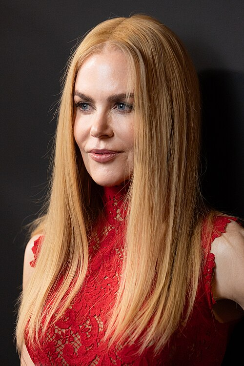

[MKr384262 Nicole Kidman (Women In Motion, Cannes 2025).jpg](https://commons.wikimedia.org/wiki/File:MKr384262_Nicole_Kidman_(Women_In_Motion,_Cannes_2025).jpg) · CC BY-SA 4.0

Ergänzung · Datierung laut Quelle: 2006

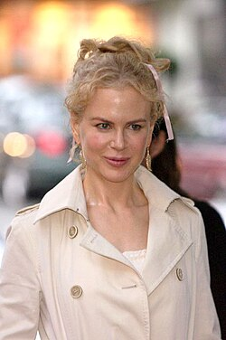

[Nicole Kidman.jpg](https://commons.wikimedia.org/wiki/File:Nicole_Kidman.jpg) · CC BY 2.0

## Cate Blanchett

Bisheriges Foto:

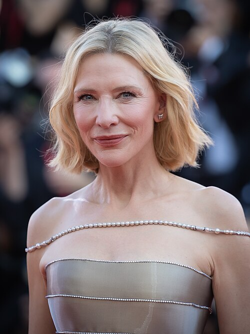

[Cate Blanchett-63298 (cropped 2).jpg](https://commons.wikimedia.org/wiki/File:Cate_Blanchett-63298_(cropped_2).jpg) · CC BY-SA 4.0

Ergänzung · Datierung laut Quelle: 2007

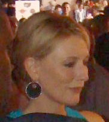

[Cate Blanchett.jpg](https://commons.wikimedia.org/wiki/File:Cate_Blanchett.jpg) · CC BY-SA 2.0

## Kate Winslet

Bisheriges Foto:

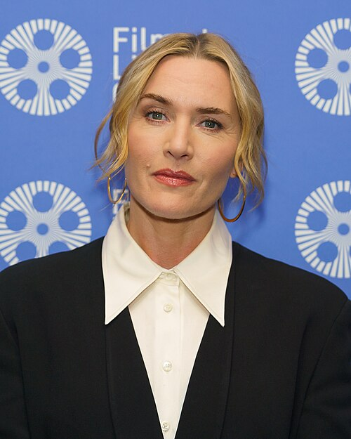

[KateWinslet (cropped).jpg](https://commons.wikimedia.org/wiki/File:KateWinslet_(cropped).jpg) · CC BY-SA 4.0

Ergänzung · Datierung laut Quelle: 2009

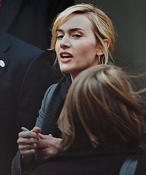

[Kate Winslet Berlinale 2009 (cropped).jpg](https://commons.wikimedia.org/wiki/File:Kate_Winslet_Berlinale_2009_(cropped).jpg) · CC BY-SA 3.0

Anzeigeausschnitt der unveränderten Datei: x=60, y=15, Breite=130, Höhe=155 Pixel.

## Emma Thompson

Bisheriges Foto:

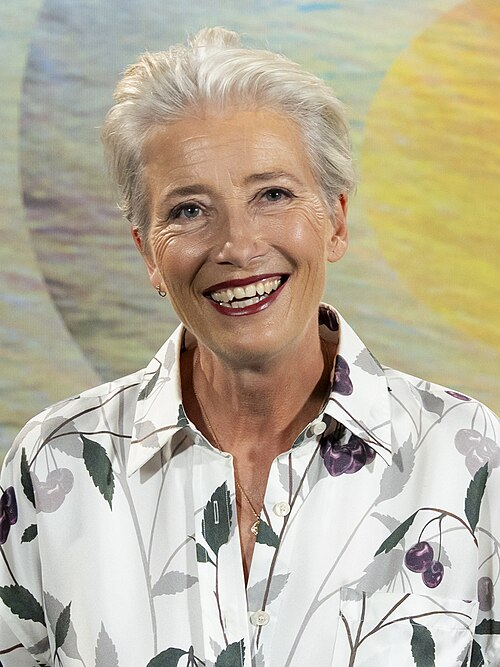

[Emma_Thompson_at_the_78th_Locarno_Film_Festival_photocall_01_(cropped).jpg](https://commons.wikimedia.org/wiki/File:Emma_Thompson_at_the_78th_Locarno_Film_Festival_photocall_01_(cropped).jpg) · CC BY-SA 4.0

Ergänzung · Datierung laut Quelle: 2008

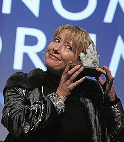

[Emma Thompson (2008).jpg](https://commons.wikimedia.org/wiki/File:Emma_Thompson_(2008).jpg) · CC BY-SA 2.0

Anzeigeausschnitt der unveränderten Datei: x=75, y=48, Breite=135, Höhe=160 Pixel.

## Helen Mirren

Bisheriges Foto:

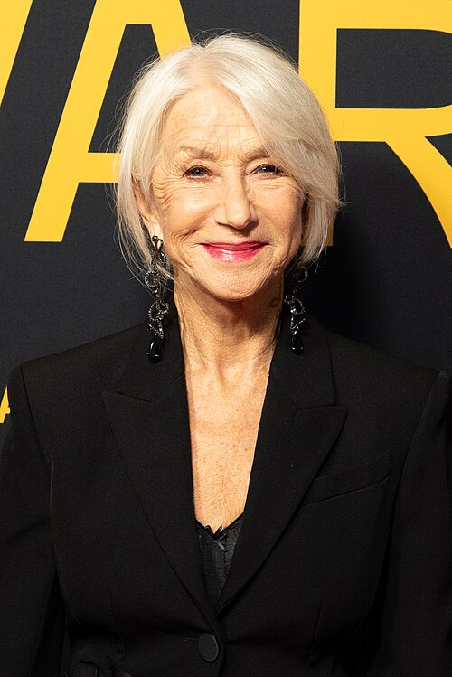

[Helen_Mirren_-_Tribute_Awards_-_TIFF_2026-2.jpg](https://commons.wikimedia.org/wiki/File:Helen_Mirren_-_Tribute_Awards_-_TIFF_2026-2.jpg) · CC BY-SA 4.0

Ergänzung · Datierung laut Quelle: 2007

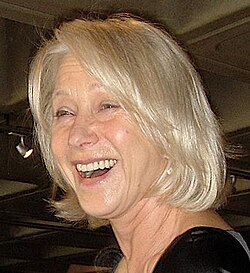

[Helen Mirren (cropped).JPG](https://commons.wikimedia.org/wiki/File:Helen_Mirren_(cropped).JPG) · CC BY-SA 3.0

## Judi Dench

Bisheriges Foto:

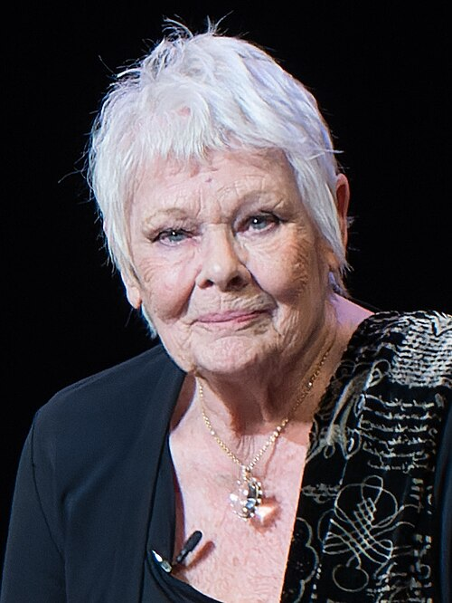

[Judi_Dench_2023.jpg](https://commons.wikimedia.org/wiki/File:Judi_Dench_2023.jpg) · CC BY 2.0

Ergänzung · Datierung laut Quelle: 2007

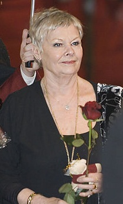

[Flickr - Siebbi - A rose for Dame Judi Dench (cropped).jpg](https://commons.wikimedia.org/wiki/File:Flickr_-_Siebbi_-_A_rose_for_Dame_Judi_Dench_(cropped).jpg) · CC BY-SA 2.0

## Maggie Smith

Bisheriges Foto:

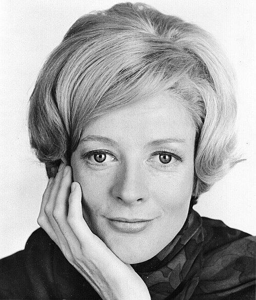

[Maggie_Smith_-_Vintage_(trim).jpg](https://commons.wikimedia.org/wiki/File:Maggie_Smith_-_Vintage_(trim).jpg) · Public domain

Ergänzung · Datierung laut Quelle: 2007

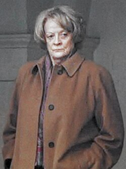

[Dame Maggie Smith (retouched) (cropped).jpg](https://commons.wikimedia.org/wiki/File:Dame_Maggie_Smith_(retouched)_(cropped).jpg) · CC BY-SA 3.0

## Audrey Hepburn

Bisheriges Foto:

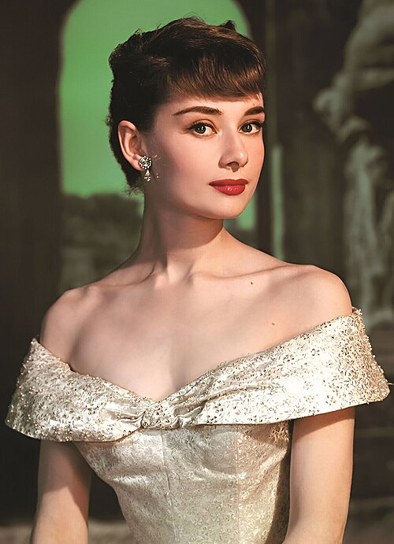

[AudreyKHepburn.jpg](https://commons.wikimedia.org/wiki/File:AudreyKHepburn.jpg) · Public domain

Ergänzung · Datierung laut Quelle: 1961

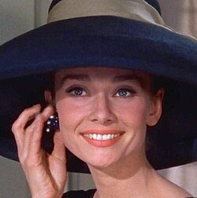

[Audrey Hepburn Tiffany's (cropped).jpg](https://commons.wikimedia.org/wiki/File:Audrey_Hepburn_Tiffany%27s_(cropped).jpg) · Public domain

## Katharine Hepburn

Bisheriges Foto:

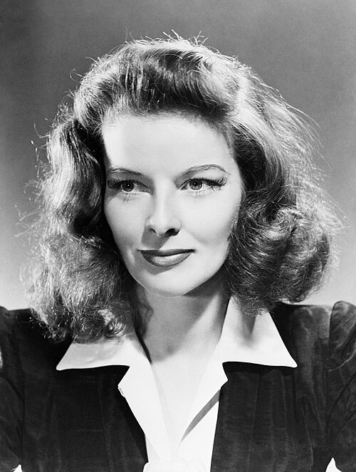

[Katharine_Hepburn_publicity_photograph.jpg](https://commons.wikimedia.org/wiki/File:Katharine_Hepburn_publicity_photograph.jpg) · Public domain

Ergänzung · Datierung laut Quelle: 1958

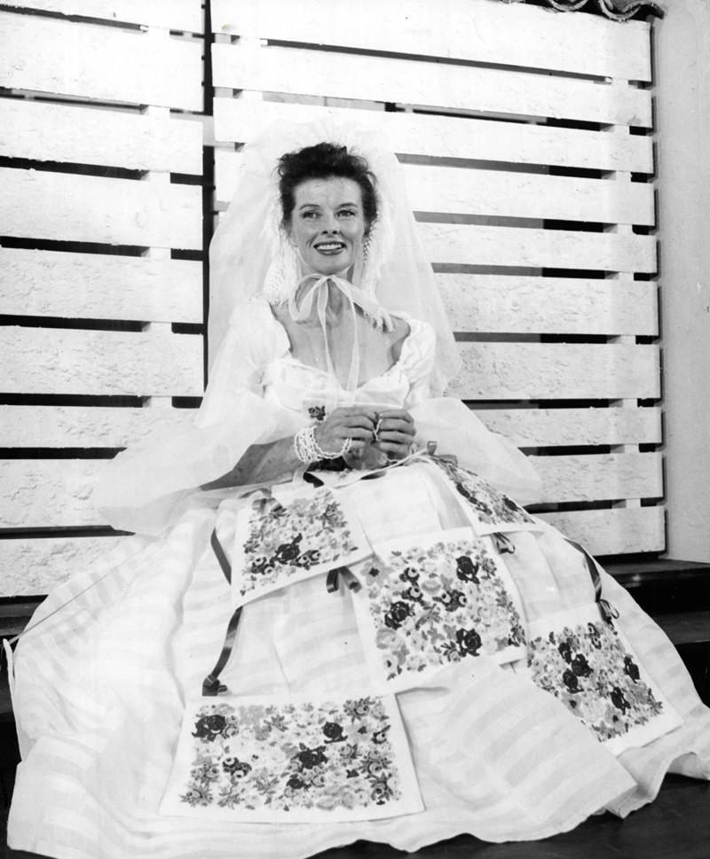

[Katharine Hepburn 1958 Much Ado About Nothing.JPG](https://commons.wikimedia.org/wiki/File:Katharine_Hepburn_1958_Much_Ado_About_Nothing.JPG) · Public domain

Anzeigeausschnitt der unveränderten Datei: x=246, y=122, Breite=301, Höhe=416 Pixel.

## Elizabeth Taylor

Bisheriges Foto:

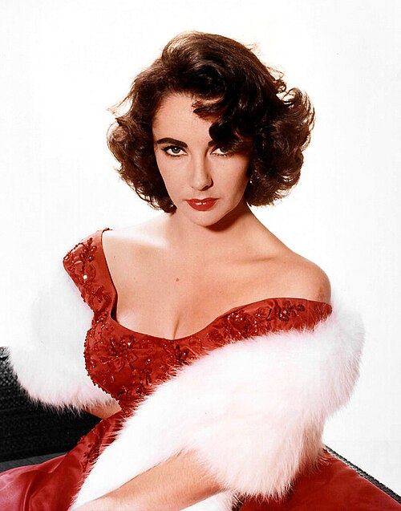

[Taylor,_Elizabeth_posed.jpg](https://commons.wikimedia.org/wiki/File:Taylor,_Elizabeth_posed.jpg) · Public domain

Ergänzung · Datierung laut Quelle: 1963

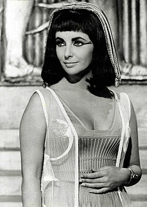

[Elizabeth Taylor Cleopatra 1963.JPG](https://commons.wikimedia.org/wiki/File:Elizabeth_Taylor_Cleopatra_1963.JPG) · Public domain

## Marilyn Monroe

Bisheriges Foto:

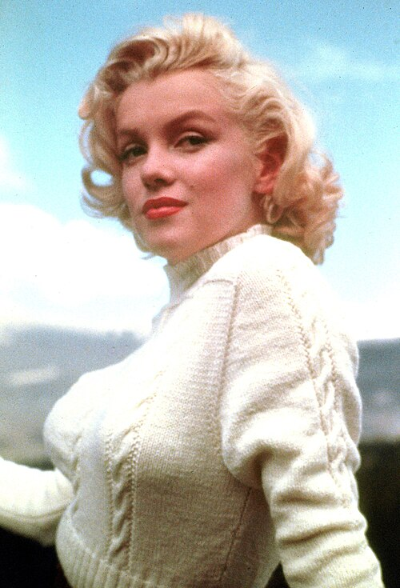

[Monroecirca1953.jpg](https://commons.wikimedia.org/wiki/File:Monroecirca1953.jpg) · Public domain

Ergänzung · Datierung laut Quelle: 1961

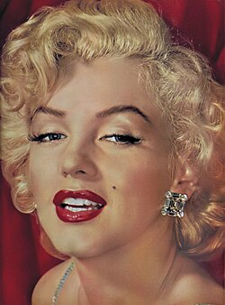

[Marilyn Monroe (1961).jpg](https://commons.wikimedia.org/wiki/File:Marilyn_Monroe_(1961).jpg) · Public domain

## Grace Kelly

Bisheriges Foto:

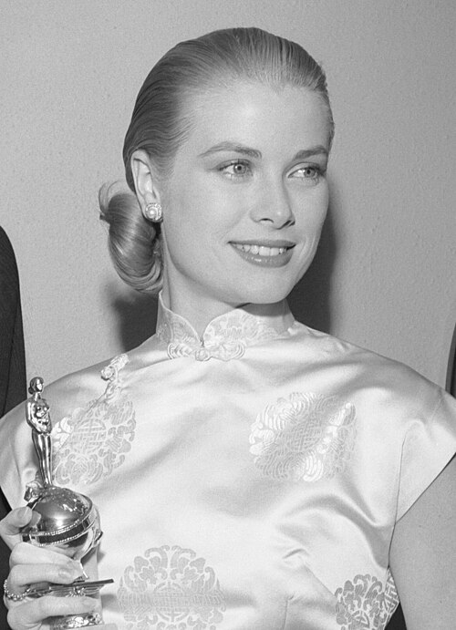

[Grace_Kelly_1956_(cropped).jpg](https://commons.wikimedia.org/wiki/File:Grace_Kelly_1956_(cropped).jpg) · CC BY 4.0

Ergänzung · Datierung laut Quelle: 1954

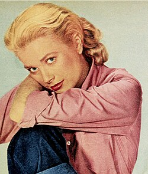

[Grace Kelly 1954 (cropped).jpg](https://commons.wikimedia.org/wiki/File:Grace_Kelly_1954_(cropped).jpg) · Public domain

## Sophia Loren

Bisheriges Foto:

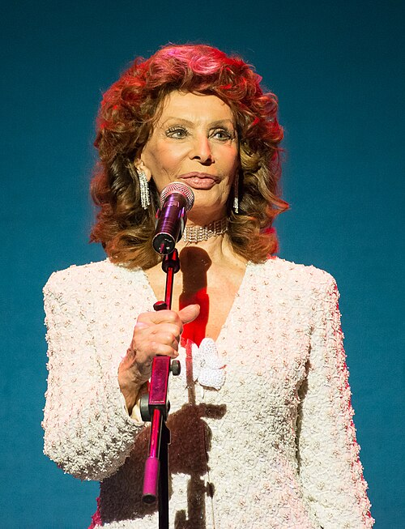

[Gala_de_Închidere_TIFF_2016_(27490660976)_(cropped).jpg](https://commons.wikimedia.org/wiki/File:Gala_de_%C3%8Enchidere_TIFF_2016_(27490660976)_(cropped).jpg) · CC BY 2.0

Ergänzung · Datierung laut Quelle: 1957

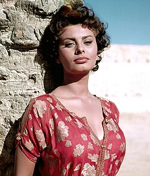

[Sophia Loren (1957) (cropped) (cropped).jpg](https://commons.wikimedia.org/wiki/File:Sophia_Loren_(1957)_(cropped)_(cropped).jpg) · Public domain

Anzeigeausschnitt der unveränderten Datei: x=78, y=0, Breite=130, Höhe=170 Pixel.

## Ingrid Bergman

Bisheriges Foto:

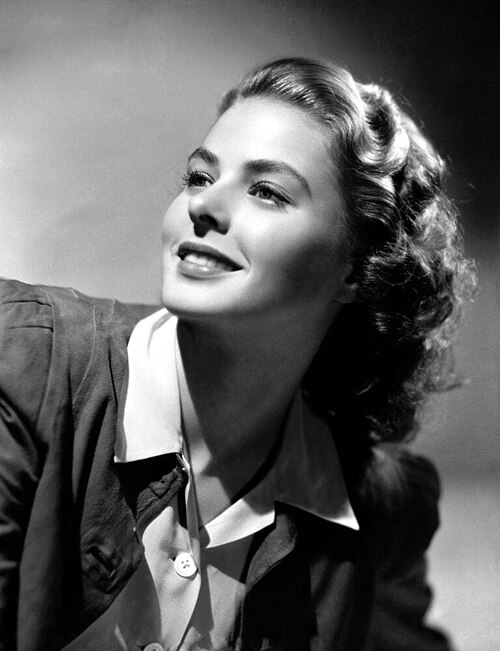

[Ingrid_Bergman_by_Whitey_Schafer_1940.jpg](https://commons.wikimedia.org/wiki/File:Ingrid_Bergman_by_Whitey_Schafer_1940.jpg) · Public domain

Ergänzung · Datierung laut Quelle: 1944

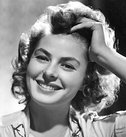

[Ingrid Bergman - Gaslight 44 (cropped).jpg](https://commons.wikimedia.org/wiki/File:Ingrid_Bergman_-_Gaslight_44_(cropped).jpg) · Public domain

## Bette Davis

Bisheriges Foto:

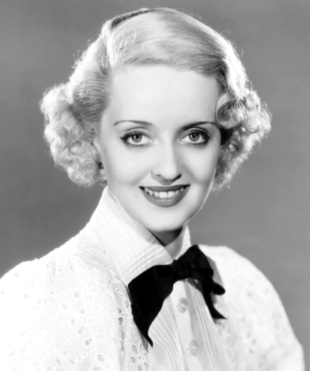

[BetteDavis1935.jpg](https://commons.wikimedia.org/wiki/File:BetteDavis1935.jpg) · Public domain

Ergänzung · Datierung laut Quelle: 1950

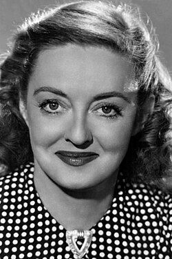

[Bette Davis - portrait (cropped).jpg](https://commons.wikimedia.org/wiki/File:Bette_Davis_-_portrait_(cropped).jpg) · Public domain

## Diane Keaton

Bisheriges Foto:

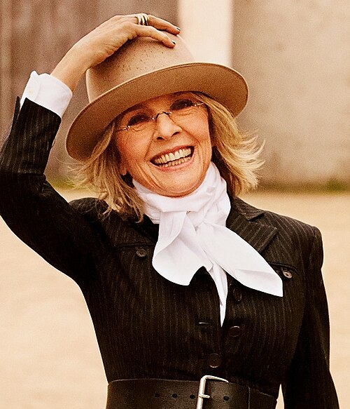

[Diane_Keaton_2012-1_(cropped)_(cropped).jpg](https://commons.wikimedia.org/wiki/File:Diane_Keaton_2012-1_(cropped)_(cropped).jpg) · CC BY-SA 3.0

Ergänzung · Datierung laut Quelle: 1977

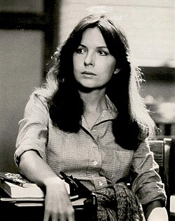

[Diane Keaton press photo (1977).jpg](https://commons.wikimedia.org/wiki/File:Diane_Keaton_press_photo_(1977).jpg) · Public domain

## Susan Sarandon

Bisheriges Foto:

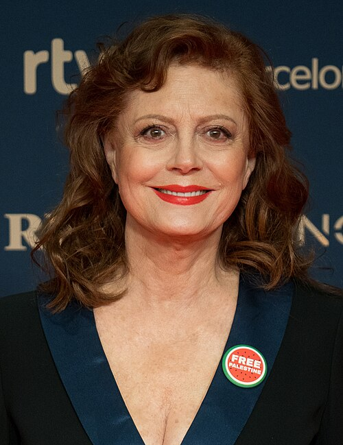

[Premios_Goya_2026_-_Susan_Sarandon_(cropped).jpg](https://commons.wikimedia.org/wiki/File:Premios_Goya_2026_-_Susan_Sarandon_(cropped).jpg) · CC BY-SA 4.0

Ergänzung · Datierung laut Quelle: 2005

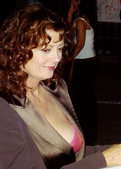

[Susan Sarandon 2005.jpg](https://commons.wikimedia.org/wiki/File:Susan_Sarandon_2005.jpg) · CC BY 2.0

## Sigourney Weaver

Bisheriges Foto:

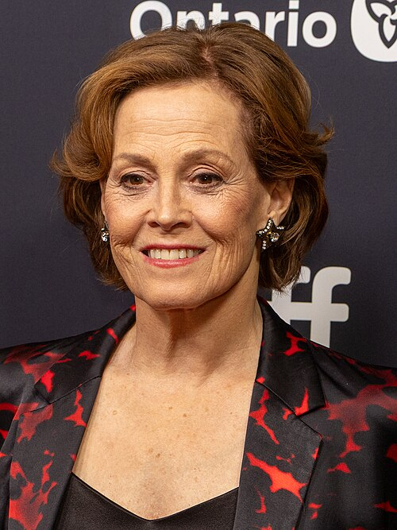

[Sigourney_Weaver_at_the_2025_Toronto_International_Film_Festival_(cropped).jpg](https://commons.wikimedia.org/wiki/File:Sigourney_Weaver_at_the_2025_Toronto_International_Film_Festival_(cropped).jpg) · CC BY 4.0

Ergänzung · Datierung laut Quelle: 1985

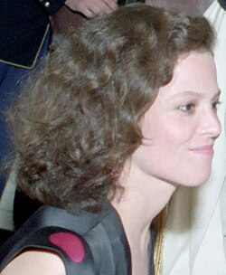

[Nancy Reagan and Sigourney Weaver in the State Dining Room during the State Dinner for King Fahd of Saudi Arabia - DPLA - daaf6f29365dd812275af3e1dc87e7e4 (cropped) (cropped).jpg](https://commons.wikimedia.org/wiki/File:Nancy_Reagan_and_Sigourney_Weaver_in_the_State_Dining_Room_during_the_State_Dinner_for_King_Fahd_of_Saudi_Arabia_-_DPLA_-_daaf6f29365dd812275af3e1dc87e7e4_(cropped)_(cropped).jpg) · Public domain

## Jamie Lee Curtis

Bisheriges Foto:

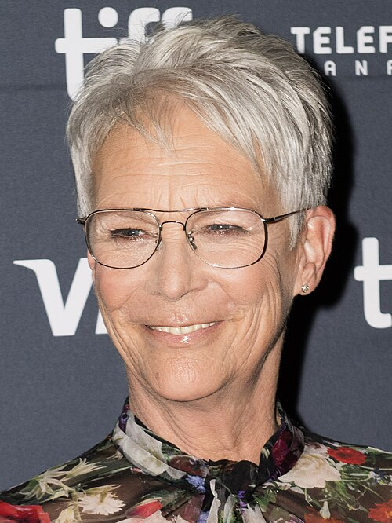

[2025_Jamie_Lee_Curtis_(cropped).jpg](https://commons.wikimedia.org/wiki/File:2025_Jamie_Lee_Curtis_(cropped).jpg) · CC BY-SA 4.0

Ergänzung · Datierung laut Quelle: 1989

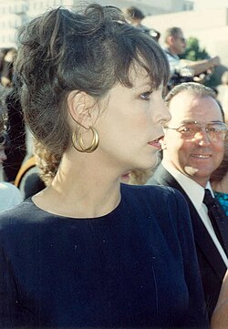

[Jamie Lee Curtis (255131928).jpg](https://commons.wikimedia.org/wiki/File:Jamie_Lee_Curtis_(255131928).jpg) · CC BY 2.0

Anzeigeausschnitt der unveränderten Datei: x=56, y=0, Breite=160, Höhe=190 Pixel.

## Michelle Pfeiffer

Bisheriges Foto:

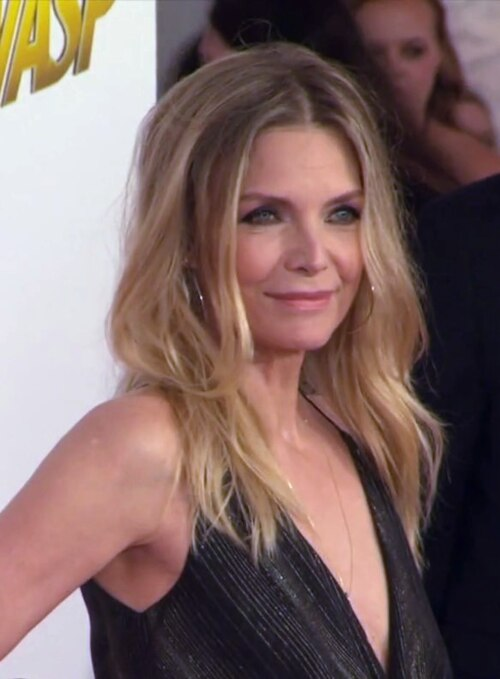

[Michelle_Pfeiffer_Ant-Man_&_The_Wasp_premiere.jpg](https://commons.wikimedia.org/wiki/File:Michelle_Pfeiffer_Ant-Man_%26_The_Wasp_premiere.jpg) · CC BY 3.0

Ergänzung · Datierung laut Quelle: 1994

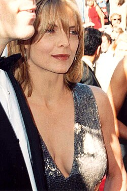

[Michelle Pfeiffer 1994.jpg](https://commons.wikimedia.org/wiki/File:Michelle_Pfeiffer_1994.jpg) · CC BY 2.0

Anzeigeausschnitt der unveränderten Datei: x=70, y=0, Breite=108, Höhe=183 Pixel.

## Julianne Moore

Bisheriges Foto:

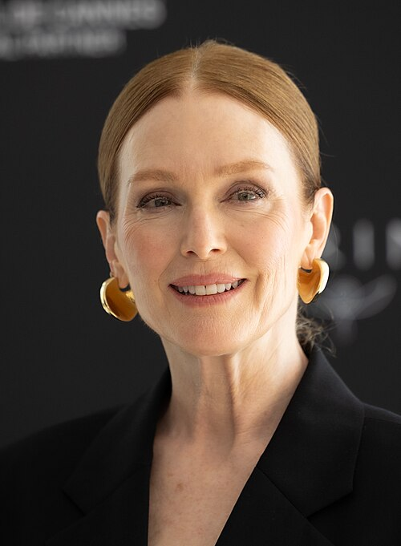

[Julianne_Moore_at_the_2026_Cannes_Film_Festival-65472_(cropped).jpg](https://commons.wikimedia.org/wiki/File:Julianne_Moore_at_the_2026_Cannes_Film_Festival-65472_(cropped).jpg) · CC BY-SA 4.0

Ergänzung · Datierung laut Quelle: 2009

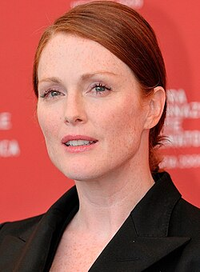

[Julianne Moore - 66ème Festival de Venise (cropped).jpg](https://commons.wikimedia.org/wiki/File:Julianne_Moore_-_66%C3%A8me_Festival_de_Venise_(cropped).jpg) · CC BY-SA 3.0

## Natalie Portman

Bisheriges Foto:

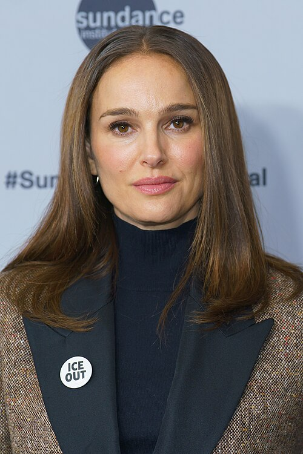

[NataliePortman.jpg](https://commons.wikimedia.org/wiki/File:NataliePortman.jpg) · CC BY 4.0

Ergänzung · Datierung laut Quelle: 2019

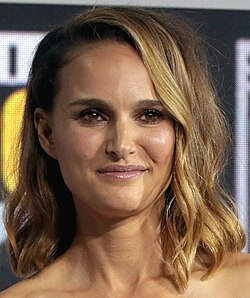

[Natalie Portman (48470988352) (cropped) (cropped).jpg](https://commons.wikimedia.org/wiki/File:Natalie_Portman_(48470988352)_(cropped)_(cropped).jpg) · CC BY-SA 2.0

## Angelina Jolie

Bisheriges Foto:

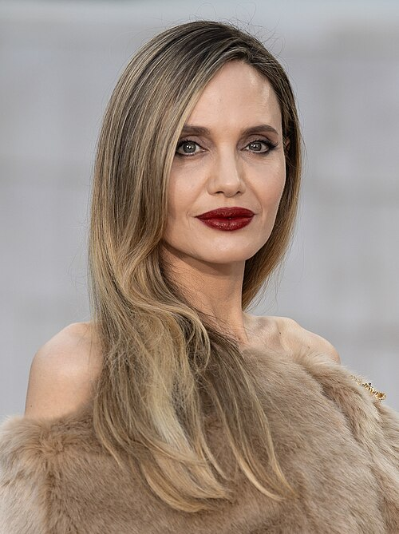

[Angelina_Jolie-643531_(cropped).jpg](https://commons.wikimedia.org/wiki/File:Angelina_Jolie-643531_(cropped).jpg) · CC BY-SA 4.0

Ergänzung · Datierung laut Quelle: 2010

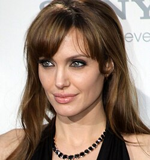

[Angelina-Jolie cropped (squared-trim).jpg](https://commons.wikimedia.org/wiki/File:Angelina-Jolie_cropped_(squared-trim).jpg) · CC BY-SA 3.0

Beschreibung nennt die Salt-Premiere 2010 in Berlin; das Metadatum 2011 ist kein Aufnahmejahr.

## Charlize Theron

Bisheriges Foto:

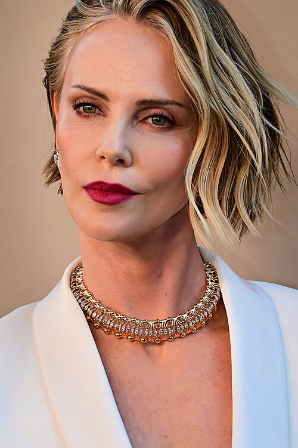

[CharlizeTheron-byPhilipRomano2.jpg](https://commons.wikimedia.org/wiki/File:CharlizeTheron-byPhilipRomano2.jpg) · CC BY-SA 4.0

Ergänzung · Datierung laut Quelle: 2018

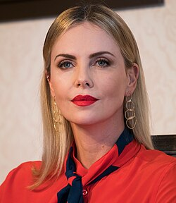

[Charlize-theron-IMG 6045x (cropped).jpg](https://commons.wikimedia.org/wiki/File:Charlize-theron-IMG_6045x_(cropped).jpg) · CC BY-SA 4.0

## Halle Berry

Bisheriges Foto:

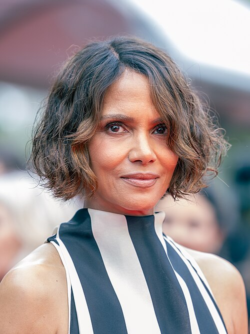

[Halle_Berry-1910.jpg](https://commons.wikimedia.org/wiki/File:Halle_Berry-1910.jpg) · CC BY-SA 4.0

Ergänzung · Datierung laut Quelle: 2006

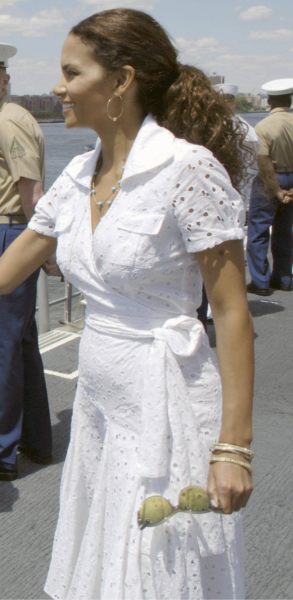

[Halle Berry - USS Kearsarge 1.jpg](https://commons.wikimedia.org/wiki/File:Halle_Berry_-_USS_Kearsarge_1.jpg) · Public domain

Anzeigeausschnitt der unveränderten Datei: x=175, y=0, Breite=670, Höhe=860 Pixel.

## Reese Witherspoon

Bisheriges Foto:

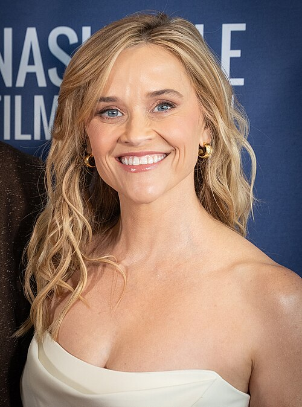

[Reese_Witherspoon_at_Nashville_Film_Festival_2026_(cropped_head_room).jpg](https://commons.wikimedia.org/wiki/File:Reese_Witherspoon_at_Nashville_Film_Festival_2026_(cropped_head_room).jpg) · CC BY-SA 4.0

Ergänzung · Datierung laut Quelle: 2011

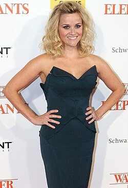

[REESE WITHERSPOON (5693547300) (cropped).jpg](https://commons.wikimedia.org/wiki/File:REESE_WITHERSPOON_(5693547300)_(cropped).jpg) · CC BY-SA 2.0

Anzeigeausschnitt der unveränderten Datei: x=64, y=0, Breite=140, Höhe=175 Pixel.

## Jennifer Lawrence

Bisheriges Foto:

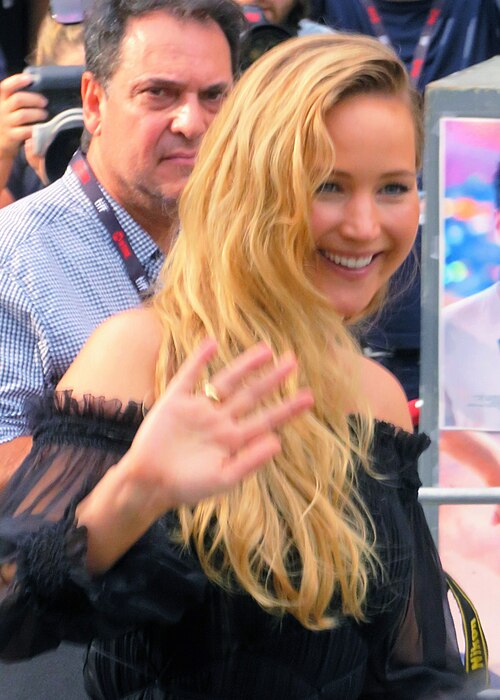

[Causeway_02_(52359107768)_(cropped).jpg](https://commons.wikimedia.org/wiki/File:Causeway_02_(52359107768)_(cropped).jpg) · CC BY-SA 2.0

Ergänzung · Datierung laut Quelle: 2018

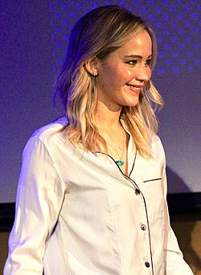

[Jennifer Lawrence Tulane University 2018 (01) (cropped).jpg](https://commons.wikimedia.org/wiki/File:Jennifer_Lawrence_Tulane_University_2018_(01)_(cropped).jpg) · CC BY 2.0

## Emma Stone

Bisheriges Foto:

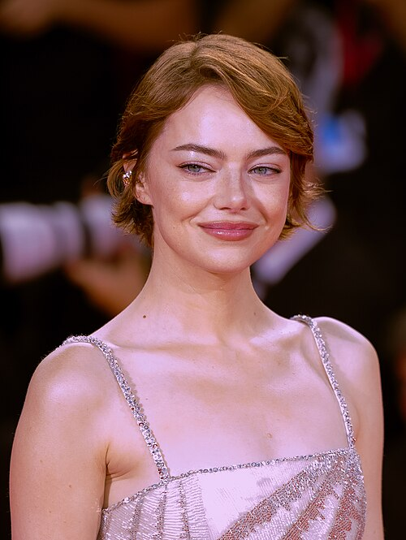

[Emma_Stone_at_the_2025_Venice_Film_Festival-6313_(cropped).jpg](https://commons.wikimedia.org/wiki/File:Emma_Stone_at_the_2025_Venice_Film_Festival-6313_(cropped).jpg) · CC BY-SA 4.0

Ergänzung · Datierung laut Quelle: 2016

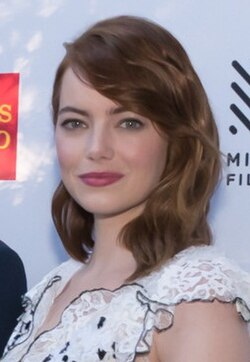

[Emma Stone (30116702391) (cropped 2).jpg](https://commons.wikimedia.org/wiki/File:Emma_Stone_(30116702391)_(cropped_2).jpg) · CC BY-SA 2.0

## Scarlett Johansson

Bisheriges Foto:

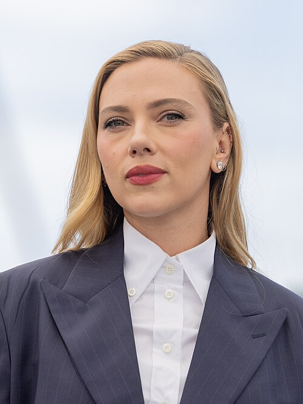

[Scarlett Johansson-8588.jpg](https://commons.wikimedia.org/wiki/File:Scarlett_Johansson-8588.jpg) · CC BY-SA 4.0

Ergänzung · Datierung laut Quelle: 2017

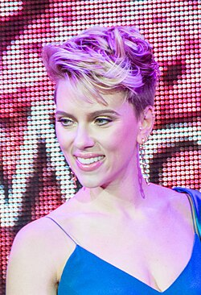

[Ghost In The Shell World Premiere Red Carpet - Scarlett Johansson (cropped).jpg](https://commons.wikimedia.org/wiki/File:Ghost_In_The_Shell_World_Premiere_Red_Carpet_-_Scarlett_Johansson_(cropped).jpg) · CC BY 2.0

## Margot Robbie

Bisheriges Foto:

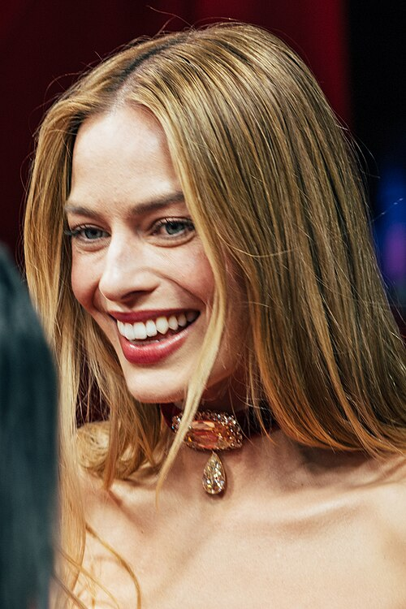

[Margot_Robbie_Wuthering_Heights_premiere_(cropped).jpg](https://commons.wikimedia.org/wiki/File:Margot_Robbie_Wuthering_Heights_premiere_(cropped).jpg) · CC0

Ergänzung · Datierung laut Quelle: 2016

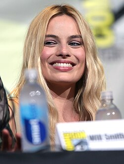

[Margot Robbie (27983770104) (cropped).jpg](https://commons.wikimedia.org/wiki/File:Margot_Robbie_(27983770104)_(cropped).jpg) · CC BY-SA 2.0

Anzeigeausschnitt der unveränderten Datei: x=30, y=0, Breite=185, Höhe=238 Pixel.

## Anne Hathaway

Bisheriges Foto:

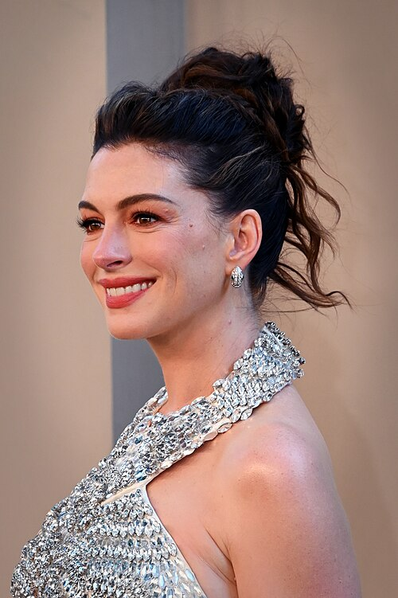

[AnneHathaway-byPhilipRomano-Crop.jpg](https://commons.wikimedia.org/wiki/File:AnneHathaway-byPhilipRomano-Crop.jpg) · CC BY-SA 4.0

Ergänzung · Datierung laut Quelle: 2018

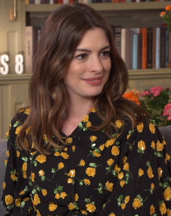

[Anne Hathaway (cropped) (cropped).png](https://commons.wikimedia.org/wiki/File:Anne_Hathaway_(cropped)_(cropped).png) · CC BY 3.0

## Amy Adams

Bisheriges Foto:

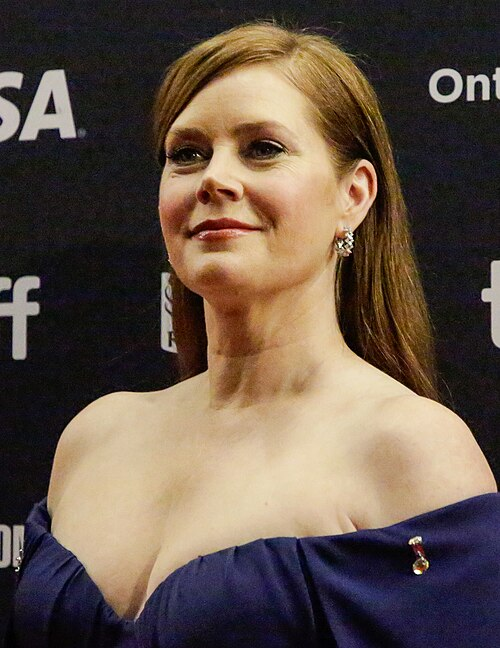

[Amy_Adams_at_the_2024_Toronto_International_Film_Festival._03_(cropped).jpg](https://commons.wikimedia.org/wiki/File:Amy_Adams_at_the_2024_Toronto_International_Film_Festival._03_(cropped).jpg) · CC BY-SA 4.0

Ergänzung · Datierung laut Quelle: 2009

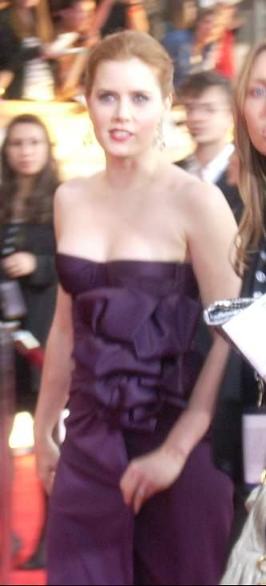

[Amy Adams at the 2009 SAG Awards (cropped).jpg](https://commons.wikimedia.org/wiki/File:Amy_Adams_at_the_2009_SAG_Awards_(cropped).jpg) · CC BY-SA 2.0

Anzeigeausschnitt der unveränderten Datei: x=91, y=27, Breite=140, Höhe=211 Pixel.

## Jessica Chastain

Bisheriges Foto:

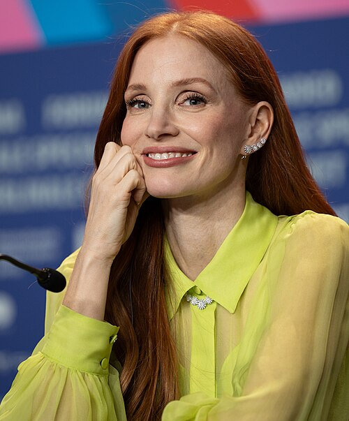

[Jessica_Chastain-64631_(cropped).jpg](https://commons.wikimedia.org/wiki/File:Jessica_Chastain-64631_(cropped).jpg) · CC BY-SA 4.0

Ergänzung · Datierung laut Quelle: 2012

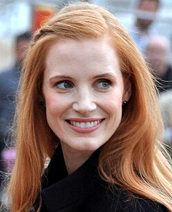

[Jessica Chastain Cannes 2012 (Cropped).jpg](https://commons.wikimedia.org/wiki/File:Jessica_Chastain_Cannes_2012_(Cropped).jpg) · CC BY-SA 3.0

## Frances McDormand

Bisheriges Foto:

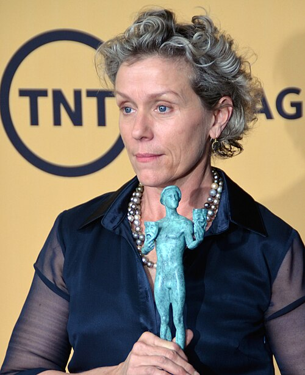

[Frances_McDormand_2015_(cropped).jpg](https://commons.wikimedia.org/wiki/File:Frances_McDormand_2015_(cropped).jpg) · CC BY-SA 2.0

Ergänzung · Datierung laut Quelle: 2007

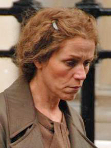

[Frances McDormand 2.jpg](https://commons.wikimedia.org/wiki/File:Frances_McDormand_2.jpg) · CC BY 2.0

## Viola Davis

Bisheriges Foto:

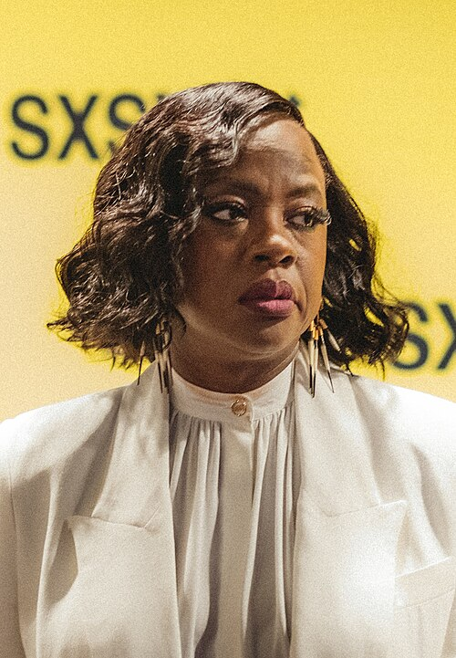

[Viola_Davis_at_the_Air_Premiere_at_SXSW_(cropped).jpg](https://commons.wikimedia.org/wiki/File:Viola_Davis_at_the_Air_Premiere_at_SXSW_(cropped).jpg) · CC BY-SA 4.0

Ergänzung · Datierung laut Quelle: 2009

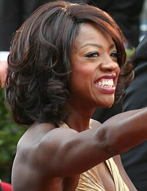

[Viola Davis 2009 Academy Awards (cropped).jpg](https://commons.wikimedia.org/wiki/File:Viola_Davis_2009_Academy_Awards_(cropped).jpg) · CC BY 3.0

## Angela Bassett

Bisheriges Foto:

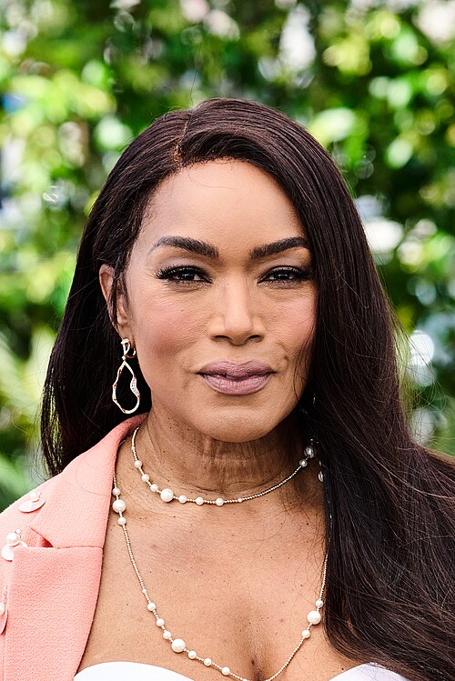

[Angela_Basset_at_the_2025_Cannes_Film_Festival_04_(cropped).jpg](https://commons.wikimedia.org/wiki/File:Angela_Basset_at_the_2025_Cannes_Film_Festival_04_(cropped).jpg) · CC BY-SA 4.0

Ergänzung · Datierung laut Quelle: 2002

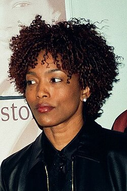

[Angela Bassett 2002 (cropped).jpg](https://commons.wikimedia.org/wiki/File:Angela_Bassett_2002_(cropped).jpg) · CC BY-SA 2.0

## Whoopi Goldberg

Bisheriges Foto:

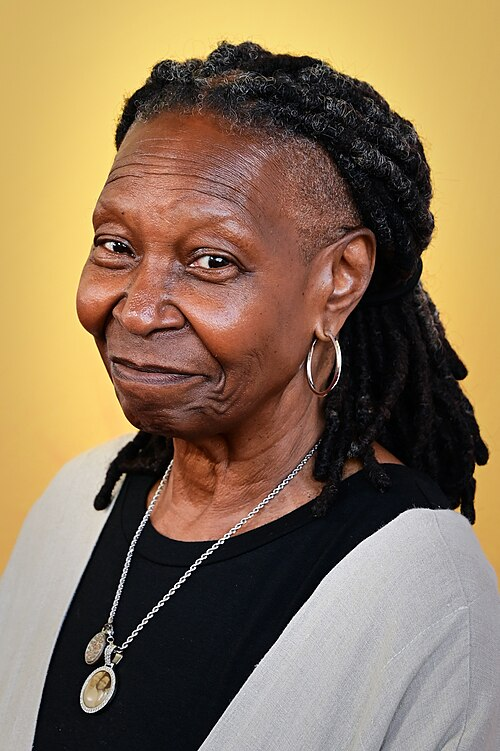

[WhoopiGoldberg-byPhilipRomano2.jpg](https://commons.wikimedia.org/wiki/File:WhoopiGoldberg-byPhilipRomano2.jpg) · CC BY-SA 4.0

Ergänzung · Datierung laut Quelle: 1992

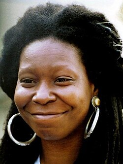

[Whoopi Goldberg Cannes 1992.jpg](https://commons.wikimedia.org/wiki/File:Whoopi_Goldberg_Cannes_1992.jpg) · CC BY-SA 3.0

## Drew Barrymore

Bisheriges Foto:

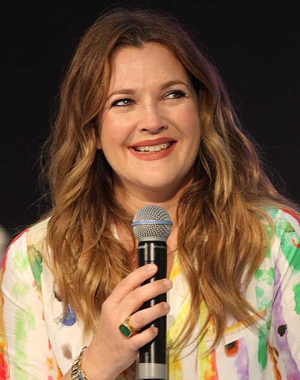

[Drew_Barrymore_in_2019_(cropped).jpg](https://commons.wikimedia.org/wiki/File:Drew_Barrymore_in_2019_(cropped).jpg) · CC BY-SA 2.0

Ergänzung · Datierung laut Quelle: 2009

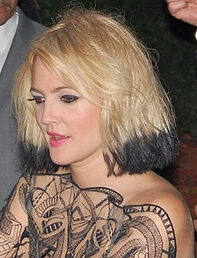

[Drew Barrymore Whip it TIFF09 (cropped).jpg](https://commons.wikimedia.org/wiki/File:Drew_Barrymore_Whip_it_TIFF09_(cropped).jpg) · CC BY 2.0

## Winona Ryder

Bisheriges Foto:

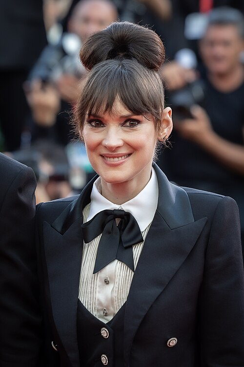

[Winona_Ryder-63849.jpg](https://commons.wikimedia.org/wiki/File:Winona_Ryder-63849.jpg) · CC BY-SA 4.0

Ergänzung · Datierung laut Quelle: 2009

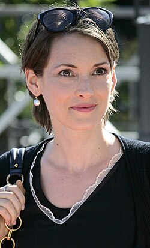

[Winona Ryder (cropped).jpg](https://commons.wikimedia.org/wiki/File:Winona_Ryder_(cropped).jpg) · CC BY-SA 2.0

## Penélope Cruz

Bisheriges Foto:

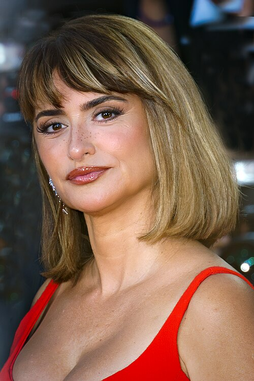

[Penelope Cruz Venice Film Festival.jpg](https://commons.wikimedia.org/wiki/File:Penelope_Cruz_Venice_Film_Festival.jpg) · CC BY-SA 4.0

Ergänzung · Datierung laut Quelle: 2009

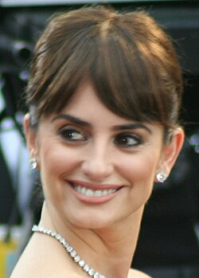

[Penélope Cruz 2009 (cropped).jpg](https://commons.wikimedia.org/wiki/File:Pen%C3%A9lope_Cruz_2009_(cropped).jpg) · CC BY 3.0

## Salma Hayek

Bisheriges Foto:

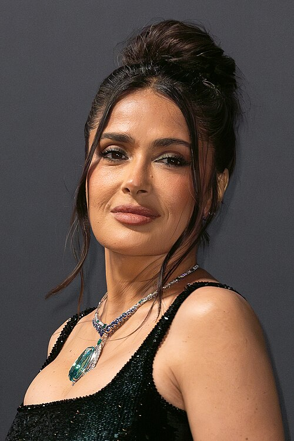

[MKr383631_Salma_Hayek_(Women_In_Motion,_Cannes_2025)_crop.jpg](https://commons.wikimedia.org/wiki/File:MKr383631_Salma_Hayek_(Women_In_Motion,_Cannes_2025)_crop.jpg) · CC BY-SA 4.0

Ergänzung · Datierung laut Quelle: 2005

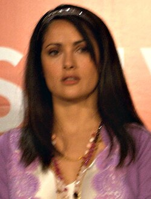

[Salma-Hayek-Cannes-cropped.jpg](https://commons.wikimedia.org/wiki/File:Salma-Hayek-Cannes-cropped.jpg) · CC BY 2.0

## Michelle Yeoh

Bisheriges Foto:

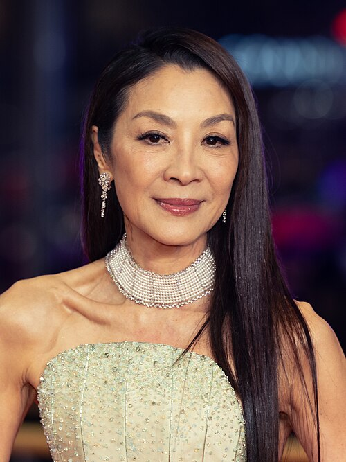

[Michelle Yeoh-2268.jpg](https://commons.wikimedia.org/wiki/File:Michelle_Yeoh-2268.jpg) · CC BY-SA 4.0

Ergänzung · Datierung laut Quelle: 2007

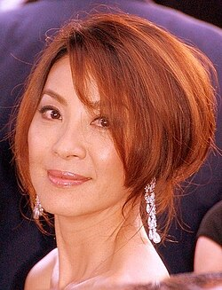

[Michelle Yeoh Cannes.jpg](https://commons.wikimedia.org/wiki/File:Michelle_Yeoh_Cannes.jpg) · CC BY-SA 3.0

## Gong Li

Bisheriges Foto:

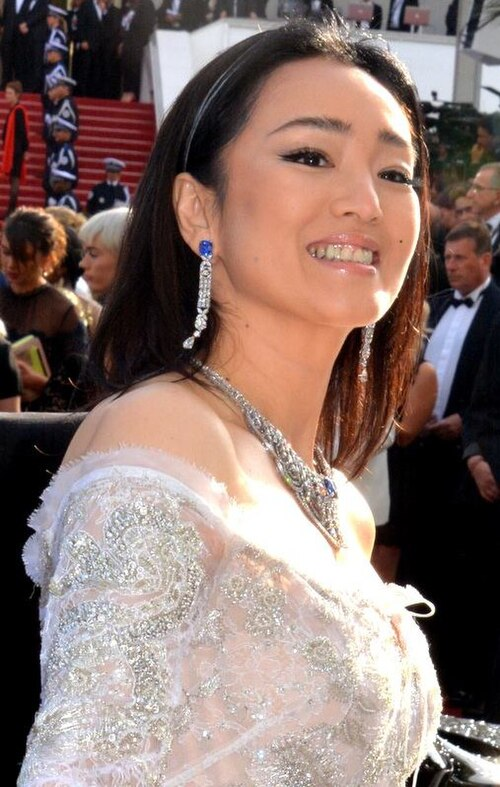

[Gong_Li_Cannes_2016.jpg](https://commons.wikimedia.org/wiki/File:Gong_Li_Cannes_2016.jpg) · CC BY-SA 3.0

Ergänzung · Datierung laut Quelle: 1998

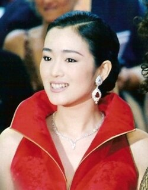

[Gong Li Andie MacDowell 1998 (cropped).jpg](https://commons.wikimedia.org/wiki/File:Gong_Li_Andie_MacDowell_1998_(cropped).jpg) · CC BY-SA 3.0

## Franka Potente

Bisheriges Foto:

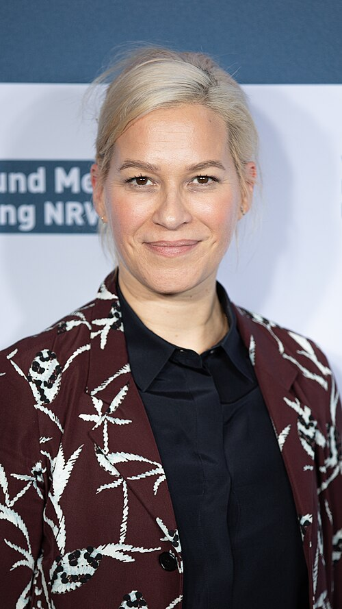

[MJK 335110 Franka Potente (NRW-Empfang, Berlinale 2019).jpg](https://commons.wikimedia.org/wiki/File:MJK_335110_Franka_Potente_(NRW-Empfang,_Berlinale_2019).jpg) · CC BY-SA 4.0

Ergänzung · Datierung laut Quelle: 2005

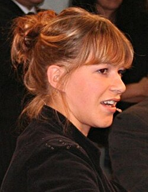

[Franka Potente Frankfurt-CN.jpg](https://commons.wikimedia.org/wiki/File:Franka_Potente_Frankfurt-CN.jpg) · CC BY-SA 3.0

## Diane Kruger

Bisheriges Foto:

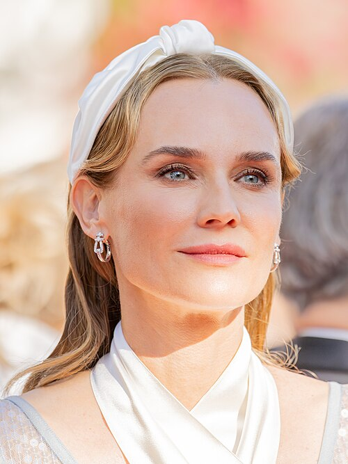

[MKr378435_Diane_Kruger_(Amrum,_Cannes_2025).jpg](https://commons.wikimedia.org/wiki/File:MKr378435_Diane_Kruger_(Amrum,_Cannes_2025).jpg) · CC BY-SA 4.0

Ergänzung · Datierung laut Quelle: 2010

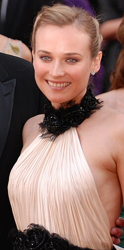

[Diane Kruger @ 2010 Academy Awards (cropped) (cropped).jpg](https://commons.wikimedia.org/wiki/File:Diane_Kruger_@_2010_Academy_Awards_(cropped)_(cropped).jpg) · Public domain

## Romy Schneider

Bisheriges Foto:

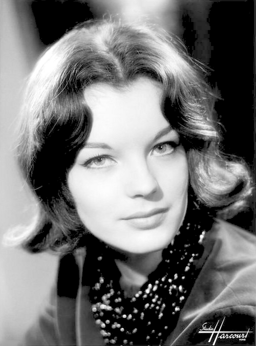

[RomySchneider-StudioHarcourt-1960.png](https://commons.wikimedia.org/wiki/File:RomySchneider-StudioHarcourt-1960.png) · Public domain

Ergänzung · Datierung laut Quelle: 1973

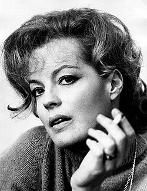

[Romy Schneider 1973.jpg](https://commons.wikimedia.org/wiki/File:Romy_Schneider_1973.jpg) · Public domain

## Kevin Costner

Bisheriges Foto:

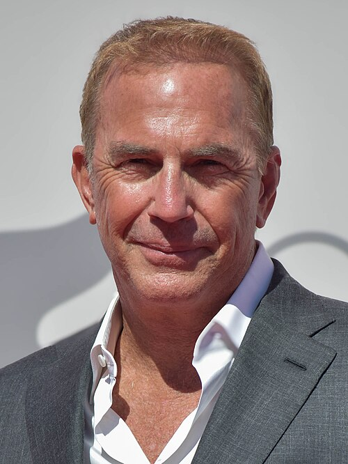

[Kevin_Costner_at_81st_Venice_Film_Festival_(cropped).jpg](https://commons.wikimedia.org/wiki/File:Kevin_Costner_at_81st_Venice_Film_Festival_(cropped).jpg) · CC BY-SA 4.0

Ergänzung · Datierung laut Quelle: 2003

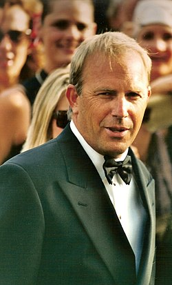

[Kevin Costner 2003.jpg](https://commons.wikimedia.org/wiki/File:Kevin_Costner_2003.jpg) · CC BY-SA 3.0

## Russell Crowe

Bisheriges Foto:

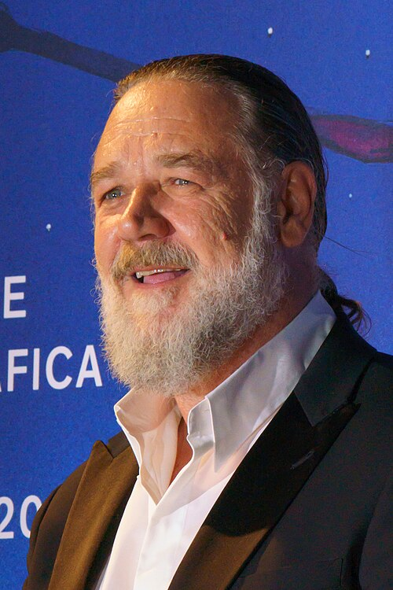

[Russell_Crowe_Venice_2026.jpg](https://commons.wikimedia.org/wiki/File:Russell_Crowe_Venice_2026.jpg) · CC BY-SA 4.0

Ergänzung · Datierung laut Quelle: 1997

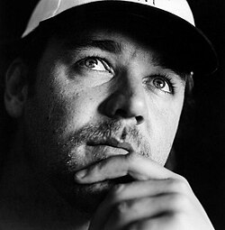

[Russell Crowe, Auckland (1997). by Jane Ussher.jpg](https://commons.wikimedia.org/wiki/File:Russell_Crowe,_Auckland_(1997)._by_Jane_Ussher.jpg) · CC BY-SA 4.0

## Hugh Jackman

Bisheriges Foto:

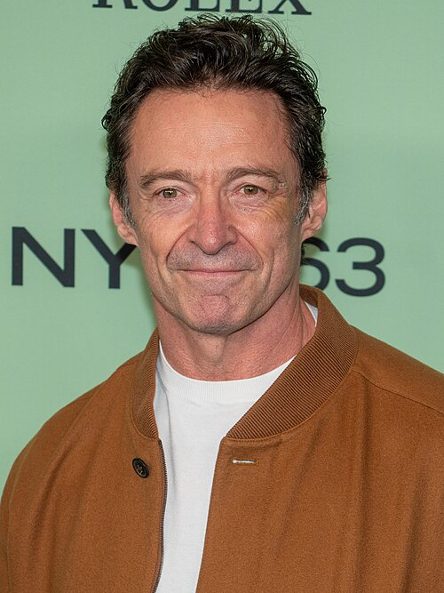

[Hugh_Jackman_Is_This_Thing_On-68_(cropped).jpg](https://commons.wikimedia.org/wiki/File:Hugh_Jackman_Is_This_Thing_On-68_(cropped).jpg) · CC BY-SA 4.0

Ergänzung · Datierung laut Quelle: 2006

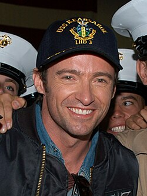

[Hugh Jackman navy.jpg](https://commons.wikimedia.org/wiki/File:Hugh_Jackman_navy.jpg) · Public domain

Anzeigeausschnitt der unveränderten Datei: x=60, y=25, Breite=141, Höhe=201 Pixel.

## Ryan Gosling

Bisheriges Foto:

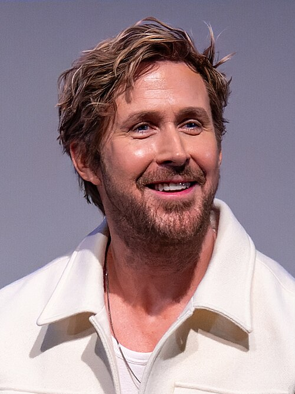

[GoslingBFI081223_(22_of_30)_(53388157347)_(cropped).jpg](https://commons.wikimedia.org/wiki/File:GoslingBFI081223_(22_of_30)_(53388157347)_(cropped).jpg) · CC BY 2.0

Ergänzung · Datierung laut Quelle: 2015

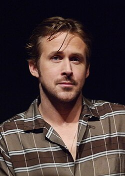

[Ryan Gosling (16437257783) (cropped).jpg](https://commons.wikimedia.org/wiki/File:Ryan_Gosling_(16437257783)_(cropped).jpg) · CC BY 2.0

## Robert Downey Jr.

Bisheriges Foto:

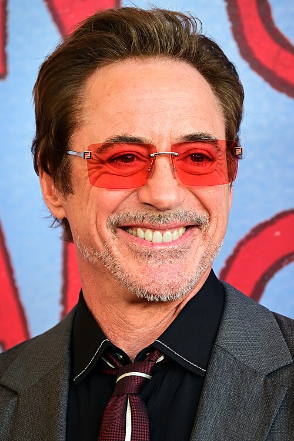

[RobertDowneyJr-byPhilipRomano7_(cropped).jpg](https://commons.wikimedia.org/wiki/File:RobertDowneyJr-byPhilipRomano7_(cropped).jpg) · CC BY-SA 4.0

Ergänzung · Datierung laut Quelle: 2008

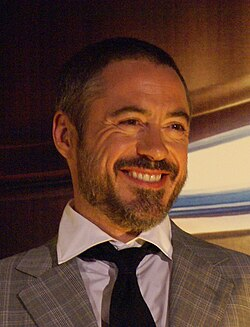

[Robert Downey jr cropped 2008.jpg](https://commons.wikimedia.org/wiki/File:Robert_Downey_jr_cropped_2008.jpg) · CC BY-SA 2.0

## Edward Norton

Bisheriges Foto:

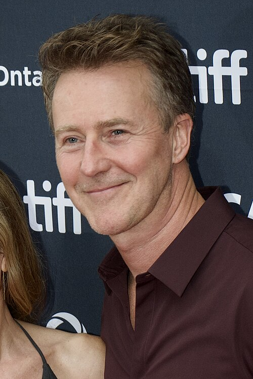

[Ed_Norton_and_Shauna_Robertson_TIFF_2025_(cropped).jpg](https://commons.wikimedia.org/wiki/File:Ed_Norton_and_Shauna_Robertson_TIFF_2025_(cropped).jpg) · CC BY 4.0

Ergänzung · Datierung laut Quelle: 2010

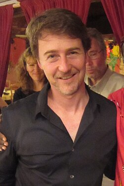

[Edward Norton in Kenya (cropped).jpg](https://commons.wikimedia.org/wiki/File:Edward_Norton_in_Kenya_(cropped).jpg) · CC BY 2.0

## Nicolas Cage

Bisheriges Foto:

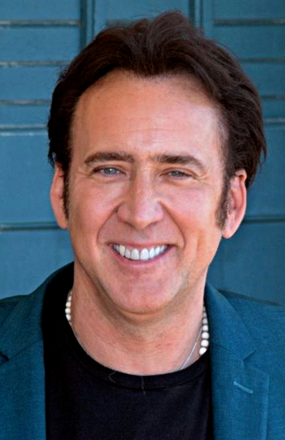

[Nicolas_Cage_Deauville_2013.jpg](https://commons.wikimedia.org/wiki/File:Nicolas_Cage_Deauville_2013.jpg) · CC BY-SA 3.0

Ergänzung · Datierung laut Quelle: 2011

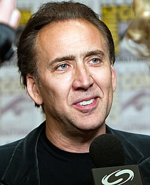

[Nicolas Cage Comic-Con 2011 (cropped).jpg](https://commons.wikimedia.org/wiki/File:Nicolas_Cage_Comic-Con_2011_(cropped).jpg) · CC BY-SA 2.0

## Steve Martin

Bisheriges Foto:

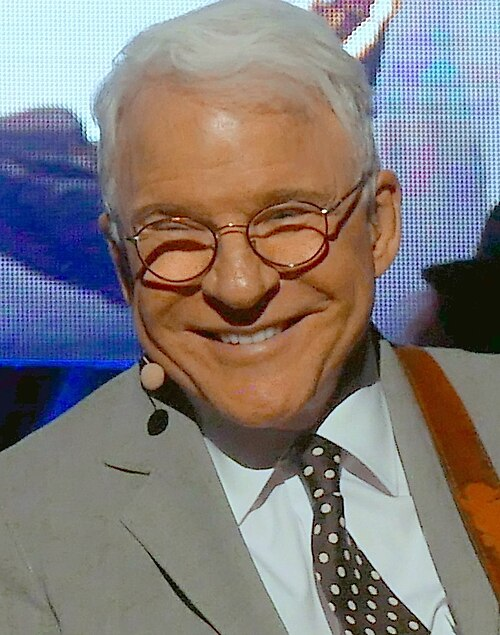

[Steve_Martin,_2017-08-11_(cropped).jpg](https://commons.wikimedia.org/wiki/File:Steve_Martin,_2017-08-11_(cropped).jpg) · CC BY-SA 4.0

Ergänzung · Datierung laut Quelle: 1981

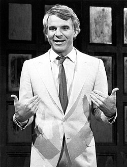

[Steve Martin "Best Show Ever" (1981 NBC press photo).jpg](https://commons.wikimedia.org/wiki/File:Steve_Martin_%22Best_Show_Ever%22_(1981_NBC_press_photo).jpg) · Public domain

Anzeigeausschnitt der unveränderten Datei: x=60, y=3, Breite=120, Höhe=155 Pixel.

## Jeff Bridges

Bisheriges Foto:

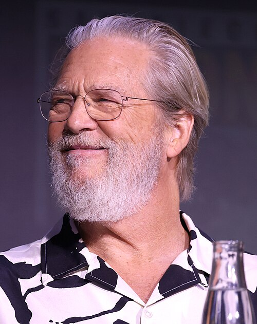

[Jeff_Bridges_by_Gage_Skidmore_4.jpg](https://commons.wikimedia.org/wiki/File:Jeff_Bridges_by_Gage_Skidmore_4.jpg) · CC BY-SA 3.0

Ergänzung · Datierung laut Quelle: 2000

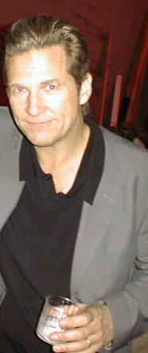

[Jeff Bridges.jpg](https://commons.wikimedia.org/wiki/File:Jeff_Bridges.jpg) · CC BY-SA 2.0

## Dustin Hoffman

Bisheriges Foto:

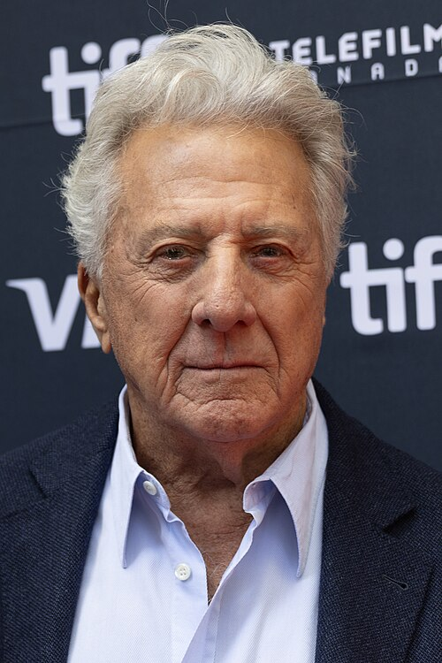

[Dustin_Hoffman_at_the_2025_Toronto_International_Film_Festival._02_(cropped).jpg](https://commons.wikimedia.org/wiki/File:Dustin_Hoffman_at_the_2025_Toronto_International_Film_Festival._02_(cropped).jpg) · CC BY-SA 4.0

Ergänzung · Datierung laut Quelle: 1968

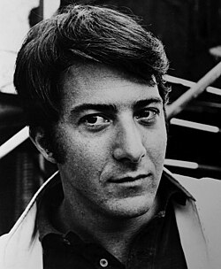

[Dustin Hoffman - 1968 (cropped).jpg](https://commons.wikimedia.org/wiki/File:Dustin_Hoffman_-_1968_(cropped).jpg) · Public domain

## Antonio Banderas

Bisheriges Foto:

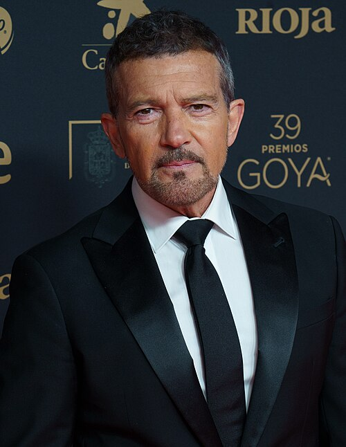

[Goyas_2025_-_Antonio_Banderas_(cropped).jpg](https://commons.wikimedia.org/wiki/File:Goyas_2025_-_Antonio_Banderas_(cropped).jpg) · CC BY-SA 4.0

Ergänzung · Datierung laut Quelle: 2000

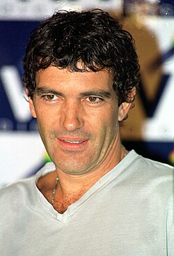

[Antonio Banderas-2000.jpg](https://commons.wikimedia.org/wiki/File:Antonio_Banderas-2000.jpg) · CC BY-SA 4.0

## Ulrich Tukur

Bisheriges Foto:

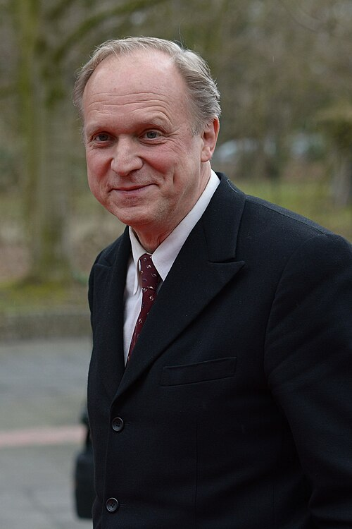

[Grimmepreis_2015_027.jpg](https://commons.wikimedia.org/wiki/File:Grimmepreis_2015_027.jpg) · CC BY-SA 3.0

Ergänzung · Datierung laut Quelle: 2009

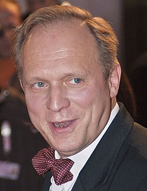

[Ulrich Tukur (Berlin Film Festival 2009) (cropped).jpg](https://commons.wikimedia.org/wiki/File:Ulrich_Tukur_(Berlin_Film_Festival_2009)_(cropped).jpg) · CC BY 3.0

## Armin Mueller-Stahl

Bisheriges Foto:

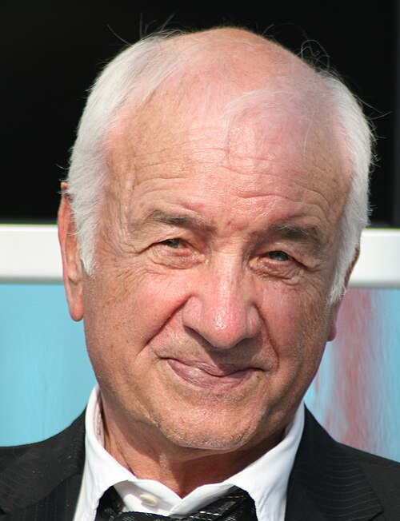

[Armin_mueller-stahl.jpg](https://commons.wikimedia.org/wiki/File:Armin_mueller-stahl.jpg) · CC BY-SA 3.0

Ergänzung · Datierung laut Quelle: 1970

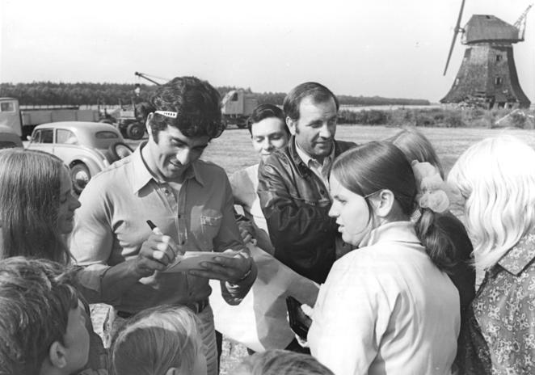

[Bundesarchiv Bild 183-J0701-0011-001, Rostock, Gojko Mitic, Armin Müller-Stahl.jpg](https://commons.wikimedia.org/wiki/File:Bundesarchiv_Bild_183-J0701-0011-001,_Rostock,_Gojko_Mitic,_Armin_M%C3%BCller-Stahl.jpg) · CC BY-SA 3.0 de

Anzeigeausschnitt der unveränderten Datei: x=348, y=97, Breite=86, Höhe=108 Pixel.

## Olivia Colman

Bisheriges Foto:

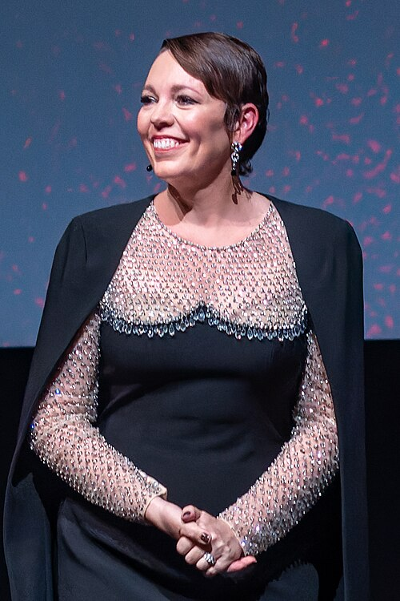

[Olivia_Colman_2022_(cropped_).jpg](https://commons.wikimedia.org/wiki/File:Olivia_Colman_2022_(cropped_).jpg) · CC BY 2.0

Ergänzung · Datierung laut Quelle: 2014

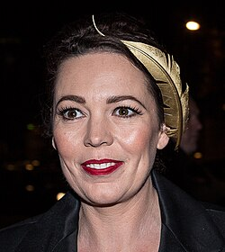

[Olivia Colman at Moet BIFA 2014 (cropped) (cropped).jpg](https://commons.wikimedia.org/wiki/File:Olivia_Colman_at_Moet_BIFA_2014_(cropped)_(cropped).jpg) · CC BY 2.0

## Emily Blunt

Bisheriges Foto:

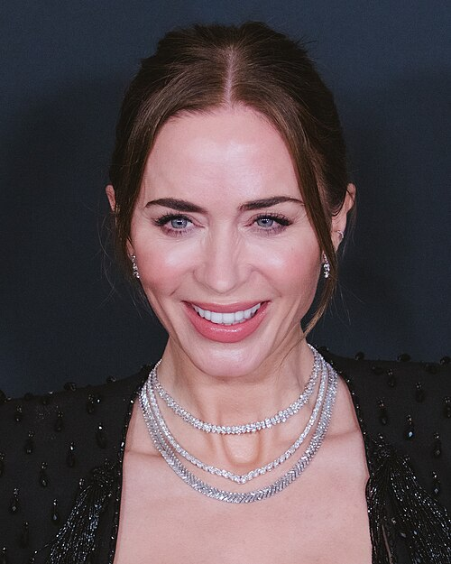

[Emily_Blunt_at_WWD_Style_Awards_2026-02.jpg](https://commons.wikimedia.org/wiki/File:Emily_Blunt_at_WWD_Style_Awards_2026-02.jpg) · CC BY 4.0

Ergänzung · Datierung laut Quelle: 2018

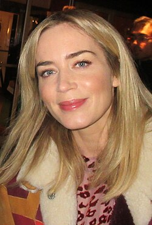

[Emily Blunt (32056670378) (cropped).jpg](https://commons.wikimedia.org/wiki/File:Emily_Blunt_(32056670378)_(cropped).jpg) · CC BY-SA 2.0

## Rachel Weisz

Bisheriges Foto:

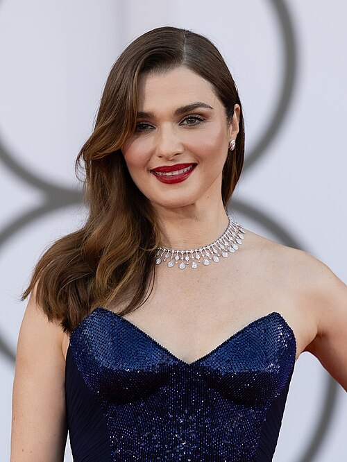

[Rachel_Weisz-62940_(cropped).jpg](https://commons.wikimedia.org/wiki/File:Rachel_Weisz-62940_(cropped).jpg) · CC BY-SA 4.0

Ergänzung · Datierung laut Quelle: 2008

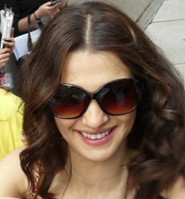

[Rachel Weisz Tiff '08 (cropped).jpg](https://commons.wikimedia.org/wiki/File:Rachel_Weisz_Tiff_%2708_(cropped).jpg) · CC BY-SA 2.0

## Tilda Swinton

Bisheriges Foto:

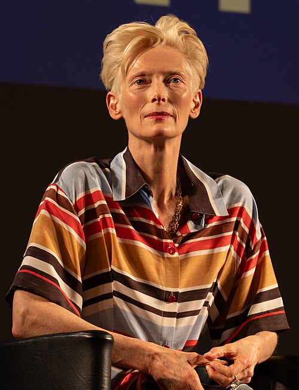

[Tilda_Swinton_at_Cannes_Film_Festival_02_(cropped).jpg](https://commons.wikimedia.org/wiki/File:Tilda_Swinton_at_Cannes_Film_Festival_02_(cropped).jpg) · CC BY-SA 4.0

Ergänzung · Datierung laut Quelle: 2005

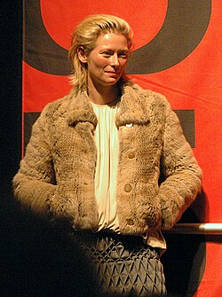

[Tilda Swinton 2.jpg](https://commons.wikimedia.org/wiki/File:Tilda_Swinton_2.jpg) · CC BY-SA 2.0

## Saoirse Ronan

Bisheriges Foto:

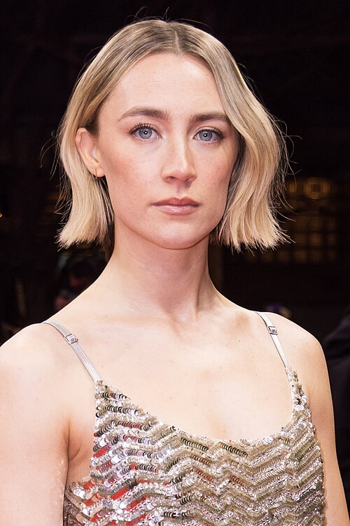

[MKr349648_Saoirse_Ronan_(The_Outrun,_Berlinale_2024).jpg](https://commons.wikimedia.org/wiki/File:MKr349648_Saoirse_Ronan_(The_Outrun,_Berlinale_2024).jpg) · CC BY-SA 4.0

Ergänzung · Datierung laut Quelle: 2016

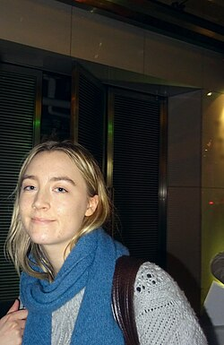

[Saoirse Ronan (26837106491) (cropped).jpg](https://commons.wikimedia.org/wiki/File:Saoirse_Ronan_(26837106491)_(cropped).jpg) · CC BY-SA 2.0

## Kirsten Dunst

Bisheriges Foto:

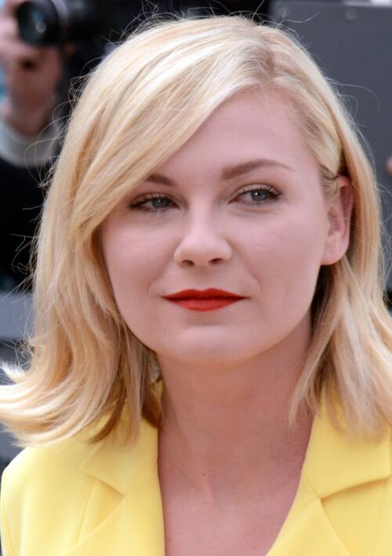

[Kirsten_Dunst_Cannes_2016.jpg](https://commons.wikimedia.org/wiki/File:Kirsten_Dunst_Cannes_2016.jpg) · CC BY-SA 3.0

Ergänzung · Datierung laut Quelle: 2017

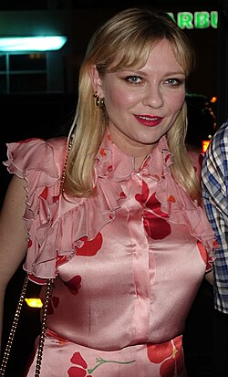

[Kirsten Dunst (2017 crop).jpg](https://commons.wikimedia.org/wiki/File:Kirsten_Dunst_(2017_crop).jpg) · CC BY-SA 2.0

## Helena Bonham Carter

Bisheriges Foto:

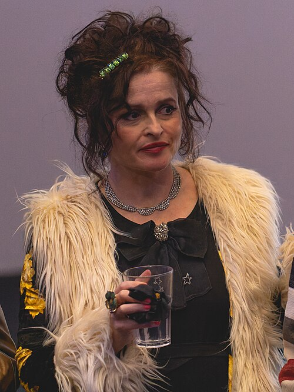

[MerchantIvoryCurzMayfair201124_(16_of_28)_(54154554145)_(cropped).jpg](https://commons.wikimedia.org/wiki/File:MerchantIvoryCurzMayfair201124_(16_of_28)_(54154554145)_(cropped).jpg) · CC BY 2.0

Ergänzung · Datierung laut Quelle: 2009

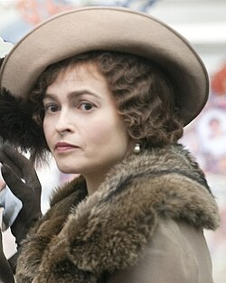

[Helena Bonham Carter filming (cropped).jpg](https://commons.wikimedia.org/wiki/File:Helena_Bonham_Carter_filming_(cropped).jpg) · CC BY 2.0

## Jennifer Aniston

Bisheriges Foto:

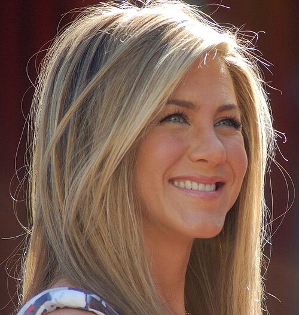

[JenniferAnistonHWoFFeb2012.jpg](https://commons.wikimedia.org/wiki/File:JenniferAnistonHWoFFeb2012.jpg) · CC BY-SA 3.0

Ergänzung · Datierung laut Quelle: 2010

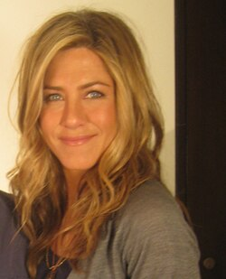

[Jennifer Aniston (cropped).jpg](https://commons.wikimedia.org/wiki/File:Jennifer_Aniston_(cropped).jpg) · CC BY-SA 2.0

## Julie Andrews

Bisheriges Foto:

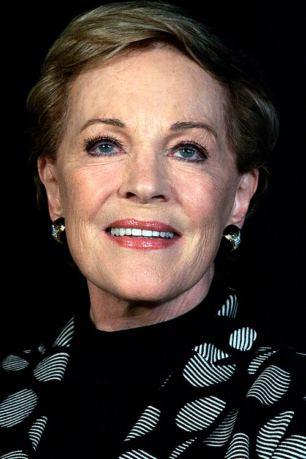

[Julie_Andrews_Park_Hyatt,_Sydney,_Australia_2013.jpg](https://commons.wikimedia.org/wiki/File:Julie_Andrews_Park_Hyatt,_Sydney,_Australia_2013.jpg) · CC BY-SA 2.0

Ergänzung · Datierung laut Quelle: 1965

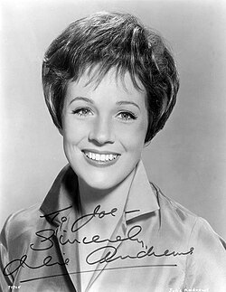

[Julie Andrews - portrait.jpg](https://commons.wikimedia.org/wiki/File:Julie_Andrews_-_portrait.jpg) · Public domain

Anzeigeausschnitt der unveränderten Datei: x=35, y=3, Breite=185, Höhe=209 Pixel.

## Isabelle Huppert

Bisheriges Foto:

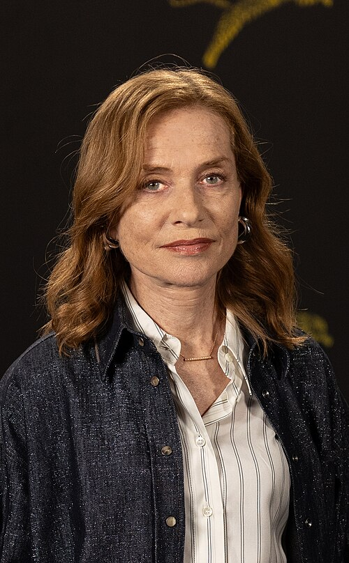

[Isabelle_Huppert_79th_Locarno_Film_Festival_-_Photocall-8_(cropped).jpg](https://commons.wikimedia.org/wiki/File:Isabelle_Huppert_79th_Locarno_Film_Festival_-_Photocall-8_(cropped).jpg) · CC BY-SA 4.0

Ergänzung · Datierung laut Quelle: 2000

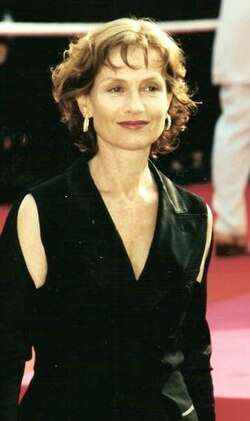

[Isabelle Huppert Cannes 2.jpg](https://commons.wikimedia.org/wiki/File:Isabelle_Huppert_Cannes_2.jpg) · CC BY-SA 3.0

Anzeigeausschnitt der unveränderten Datei: x=62, y=0, Breite=126, Höhe=173 Pixel.

## Hildegard Knef

Bisheriges Foto:

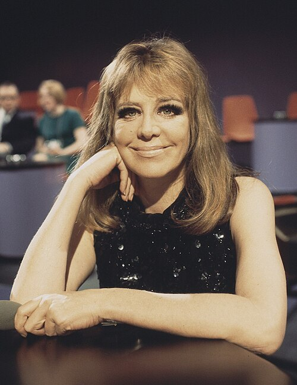

[Hildegard_Knef_254-8439.jpg](https://commons.wikimedia.org/wiki/File:Hildegard_Knef_254-8439.jpg) · CC0

Ergänzung · Datierung laut Quelle: 1951

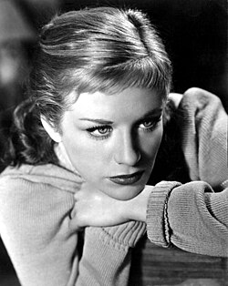

[Hildegard Knef - 1951.jpg](https://commons.wikimedia.org/wiki/File:Hildegard_Knef_-_1951.jpg) · Public domain

## Iris Berben

Bisheriges Foto:

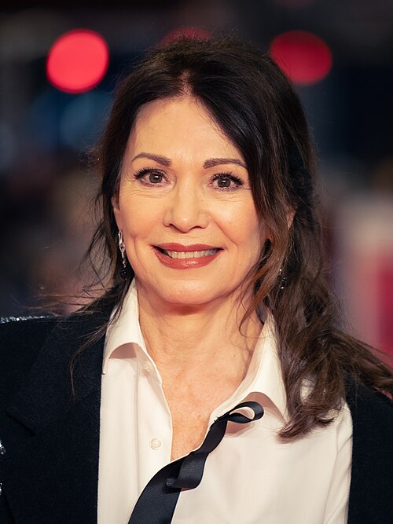

[Iris_Berben-63700.jpg](https://commons.wikimedia.org/wiki/File:Iris_Berben-63700.jpg) · CC BY-SA 4.0

Ergänzung · Datierung laut Quelle: 2000

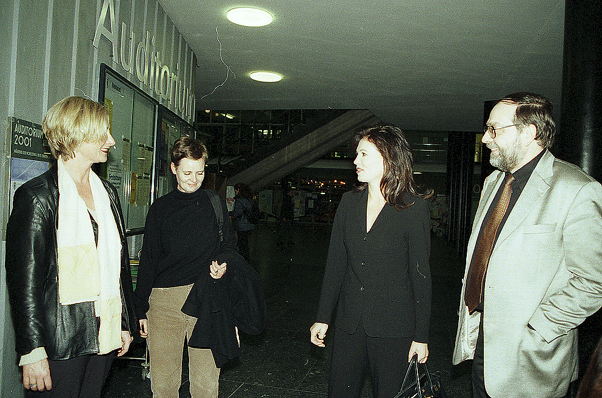

[Freiburg im Breisgau- Buchlesung von Iris Berben in der Universität - LABW - Staatsarchiv Freiburg W 140 Nr. 11669.jpeg](https://commons.wikimedia.org/wiki/File:Freiburg_im_Breisgau-_Buchlesung_von_Iris_Berben_in_der_Universit%C3%A4t_-_LABW_-_Staatsarchiv_Freiburg_W_140_Nr._11669.jpeg) · CC BY 4.0

Anzeigeausschnitt der unveränderten Datei: x=555, y=185, Breite=172, Höhe=235 Pixel.

## Michael Douglas

Bisheriges Foto:

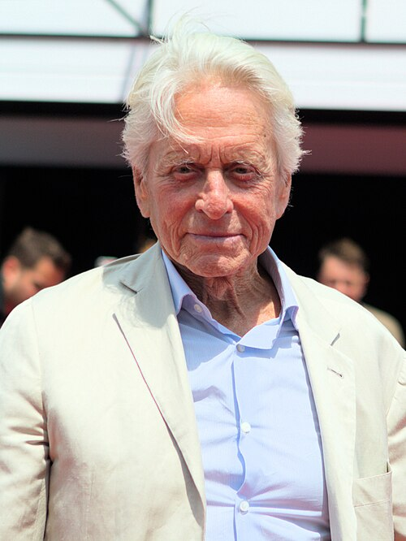

[59th_Karlovy_Vary_International_Film_Festival,_Michael_Douglas_09(cropped).jpg](https://commons.wikimedia.org/wiki/File:59th_Karlovy_Vary_International_Film_Festival,_Michael_Douglas_09(cropped).jpg) · CC BY-SA 4.0

Ergänzung · Datierung laut Quelle: 1987

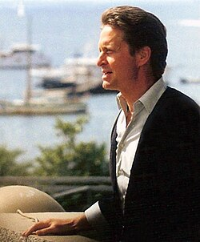

[Michael Douglas Cannes.jpg](https://commons.wikimedia.org/wiki/File:Michael_Douglas_Cannes.jpg) · CC BY-SA 3.0

## Richard Gere

Bisheriges Foto:

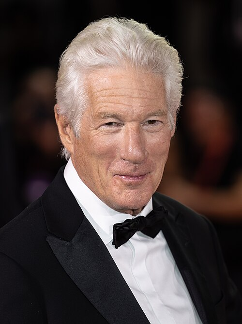

[Richard_Gere-69101.jpg](https://commons.wikimedia.org/wiki/File:Richard_Gere-69101.jpg) · CC BY-SA 4.0

Ergänzung · Datierung laut Quelle: 2007

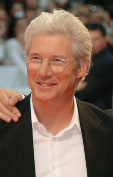

[Richard Gere 64th Venice Film Festival-01 (cropped).jpg](https://commons.wikimedia.org/wiki/File:Richard_Gere_64th_Venice_Film_Festival-01_(cropped).jpg) · CC BY-SA 2.0

## John Travolta

Bisheriges Foto:

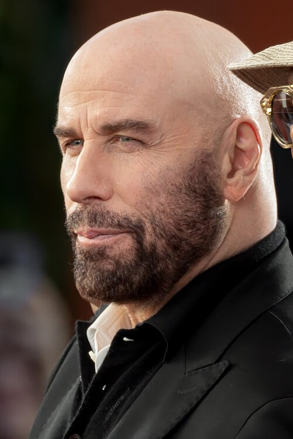

[John_Travolta_in_2024_(cropped).jpg](https://commons.wikimedia.org/wiki/File:John_Travolta_in_2024_(cropped).jpg) · CC BY-SA 2.0

Ergänzung · Datierung laut Quelle: 1997

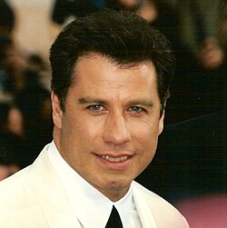

[John Travolta 1997 (cropped).jpg](https://commons.wikimedia.org/wiki/File:John_Travolta_1997_(cropped).jpg) · CC BY-SA 3.0

## Kurt Russell

Bisheriges Foto:

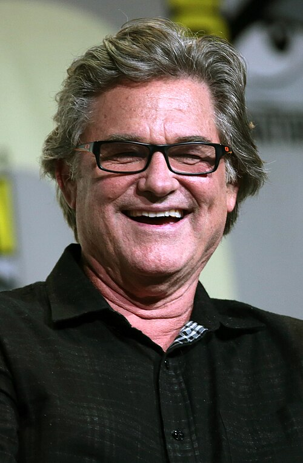

[Kurt_Russell_by_Gage_Skidmore_2.jpg](https://commons.wikimedia.org/wiki/File:Kurt_Russell_by_Gage_Skidmore_2.jpg) · CC BY-SA 3.0

Ergänzung · Datierung laut Quelle: 1976

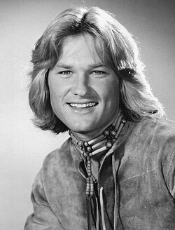

[Kurt Russell - The Quest 1976 (cropped).jpg](https://commons.wikimedia.org/wiki/File:Kurt_Russell_-_The_Quest_1976_(cropped).jpg) · Public domain

## Danny DeVito

Bisheriges Foto:

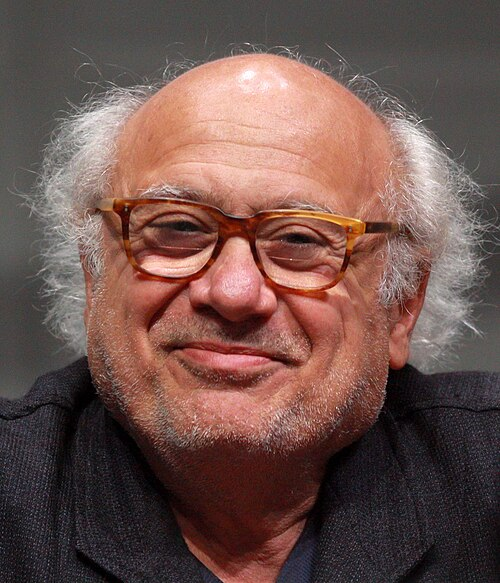

[Danny_DeVito_cropped_and_edited_for_brightness.jpg](https://commons.wikimedia.org/wiki/File:Danny_DeVito_cropped_and_edited_for_brightness.jpg) · CC BY-SA 3.0

Ergänzung · Datierung laut Quelle: frühe 1980er-Jahre

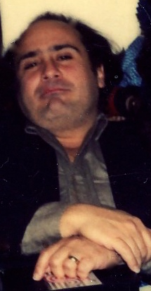

[Danny DeVito early 1980s.jpg](https://commons.wikimedia.org/wiki/File:Danny_DeVito_early_1980s.jpg) · CC0

Fotografin nennt den Aufnahmezeitraum ausdrücklich in der Beschreibung; das Metadatum 2007 gehört zum späteren Upload.

## Bill Murray

Bisheriges Foto:

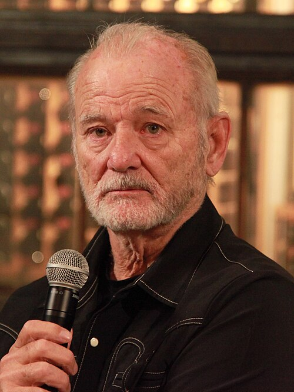

[Bill_Murray_at_the_2025_Sundance_Film_Festival_2_(cropped).jpg](https://commons.wikimedia.org/wiki/File:Bill_Murray_at_the_2025_Sundance_Film_Festival_2_(cropped).jpg) · CC BY-SA 4.0

Ergänzung · Datierung laut Quelle: 1989

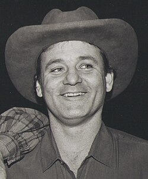

[Bill Murray 1989 (cropped).jpg](https://commons.wikimedia.org/wiki/File:Bill_Murray_1989_(cropped).jpg) · CC BY-SA 4.0

## Eddie Murphy

Bisheriges Foto:

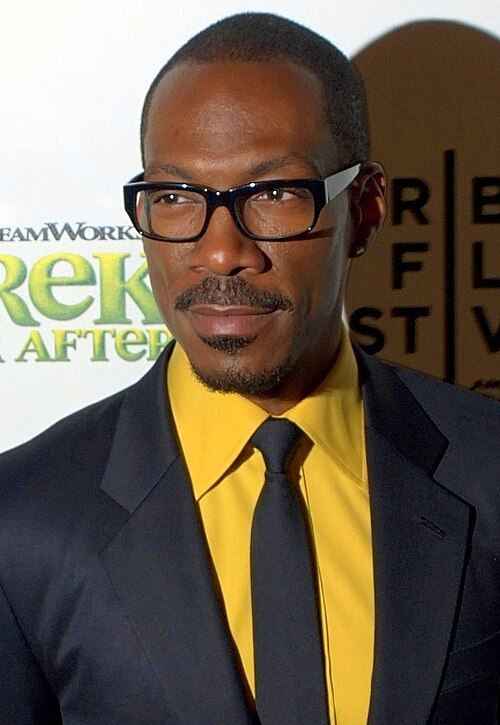

[Eddie_Murphy_by_David_Shankbone.jpg](https://commons.wikimedia.org/wiki/File:Eddie_Murphy_by_David_Shankbone.jpg) · Public domain

Ergänzung · Datierung laut Quelle: 1984

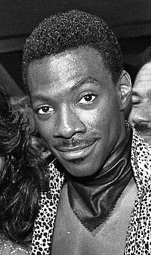

[Eddie-murphy-1984.jpg](https://commons.wikimedia.org/wiki/File:Eddie-murphy-1984.jpg) · CC BY 4.0

## Adam Sandler

Bisheriges Foto:

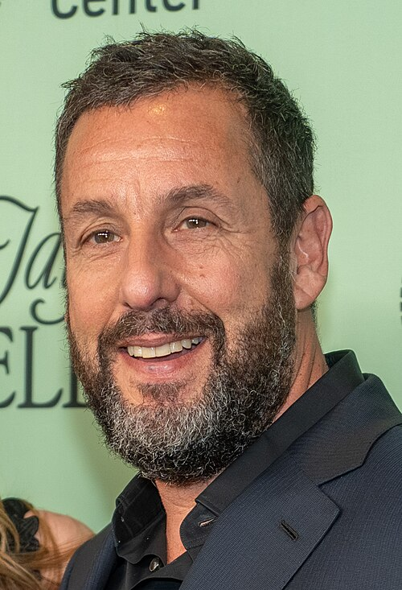

[Jackie_Sandler_Adam_Sandler_Jay_Kelly-36_(3x4).jpg](https://commons.wikimedia.org/wiki/File:Jackie_Sandler_Adam_Sandler_Jay_Kelly-36_(3x4).jpg) · CC BY-SA 4.0

Ergänzung · Datierung laut Quelle: 2005

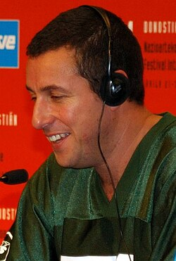

[Adam Sandler (cropped).jpg](https://commons.wikimedia.org/wiki/File:Adam_Sandler_(cropped).jpg) · CC BY-SA 2.0

## Brendan Fraser

Bisheriges Foto:

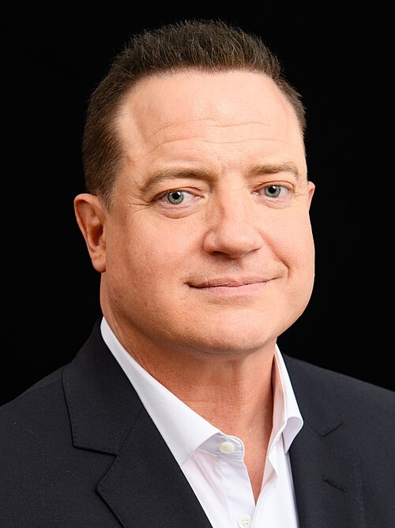

[Brendan_Fraser_MFF_2025.jpg](https://commons.wikimedia.org/wiki/File:Brendan_Fraser_MFF_2025.jpg) · CC BY 4.0

Ergänzung · Datierung laut Quelle: 2007

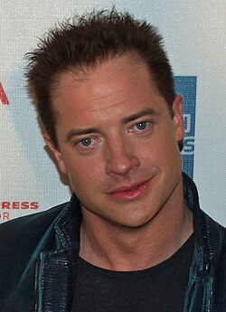

[Brendan Fraser by David Shankbone (cropped).jpg](https://commons.wikimedia.org/wiki/File:Brendan_Fraser_by_David_Shankbone_(cropped).jpg) · CC BY-SA 3.0

## Jake Gyllenhaal

Bisheriges Foto:

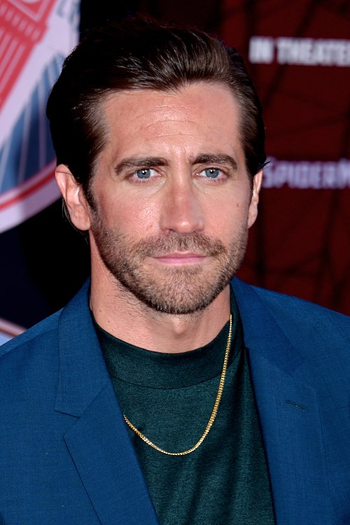

[Jake_Gyllenhaal_2019_by_Glenn_Francis.jpg](https://commons.wikimedia.org/wiki/File:Jake_Gyllenhaal_2019_by_Glenn_Francis.jpg) · CC BY-SA 4.0

Ergänzung · Datierung laut Quelle: 2015

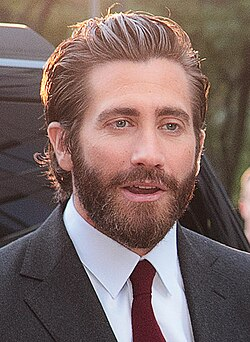

[Jake Gyllenhaal (22373266462) (cropped 2).jpg](https://commons.wikimedia.org/wiki/File:Jake_Gyllenhaal_(22373266462)_(cropped_2).jpg) · CC BY-SA 2.0

## Willem Dafoe

Bisheriges Foto:

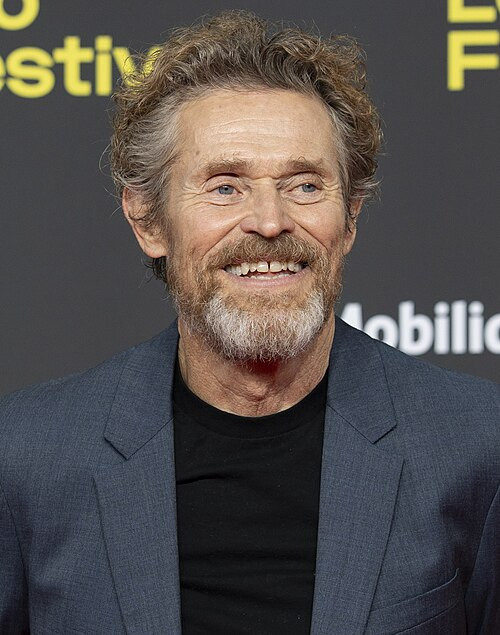

[Willem_Dafoe_at_78th_Locarno_Film_Festival_(cropped).jpg](https://commons.wikimedia.org/wiki/File:Willem_Dafoe_at_78th_Locarno_Film_Festival_(cropped).jpg) · CC BY-SA 4.0

Ergänzung · Datierung laut Quelle: 2006

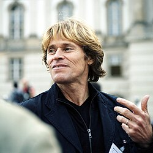

[Willem Dafoe 2006.jpg](https://commons.wikimedia.org/wiki/File:Willem_Dafoe_2006.jpg) · CC BY 2.0

## John Malkovich

Bisheriges Foto:

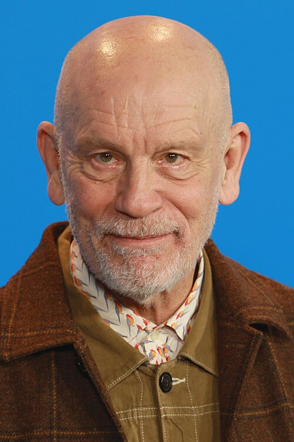

[John_Malkovich,_Berlinale_2023_(cropped).jpg](https://commons.wikimedia.org/wiki/File:John_Malkovich,_Berlinale_2023_(cropped).jpg) · CC BY-SA 3.0

Ergänzung · Datierung laut Quelle: 2005

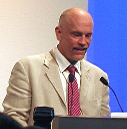

[John Malkovich.jpg](https://commons.wikimedia.org/wiki/File:John_Malkovich.jpg) · CC BY-SA 3.0

Anzeigeausschnitt der unveränderten Datei: x=87, y=8, Breite=132, Höhe=165 Pixel.

## Ralph Fiennes

Bisheriges Foto:

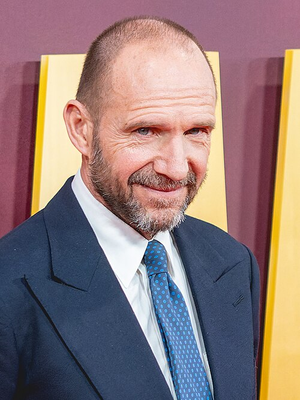

[ConclaveBFILFF101024_(16_of_44)_(54062064271)_(cropped).jpg](https://commons.wikimedia.org/wiki/File:ConclaveBFILFF101024_(16_of_44)_(54062064271)_(cropped).jpg) · CC BY 2.0

Ergänzung · Datierung laut Quelle: nicht genau datiert

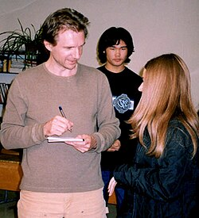

[2003-10-06 ralph fiennes in Bishkek.jpg](https://commons.wikimedia.org/wiki/File:2003-10-06_ralph_fiennes_in_Bishkek.jpg) · CC BY-SA 3.0

Anzeigeausschnitt der unveränderten Datei: x=37, y=8, Breite=111, Höhe=143 Pixel.

## Colin Firth

Bisheriges Foto:

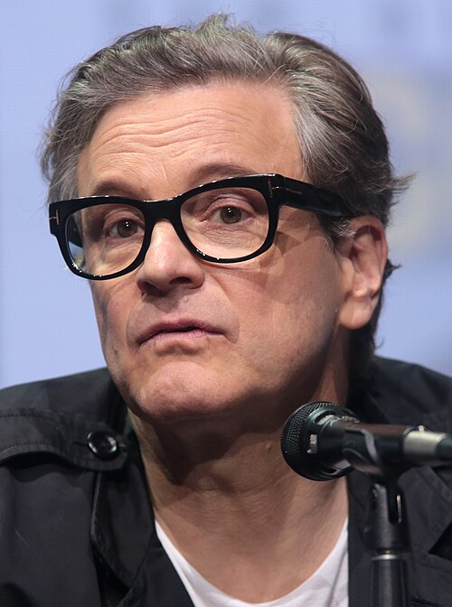

[Colin_Firth_(36124162705)_(cropped).jpg](https://commons.wikimedia.org/wiki/File:Colin_Firth_(36124162705)_(cropped).jpg) · CC BY-SA 2.0

Ergänzung · Datierung laut Quelle: 2005

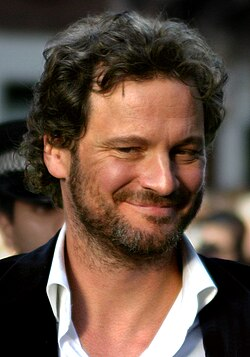

[Colin Firth 2005.jpg](https://commons.wikimedia.org/wiki/File:Colin_Firth_2005.jpg) · CC BY 3.0

## Liam Neeson

Bisheriges Foto:

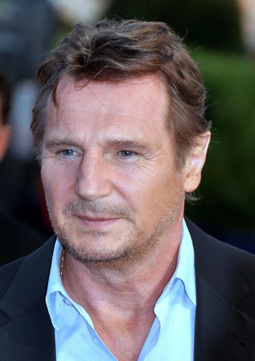

[Liam_Neeson_Deauville_2012_2.jpg](https://commons.wikimedia.org/wiki/File:Liam_Neeson_Deauville_2012_2.jpg) · CC BY-SA 3.0

Ergänzung · Datierung laut Quelle: 2008

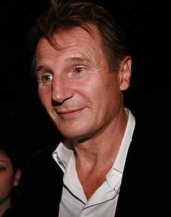

[Liam Neeson at 2008 TIFF (cropped) (HQ).jpg](https://commons.wikimedia.org/wiki/File:Liam_Neeson_at_2008_TIFF_(cropped)_(HQ).jpg) · CC BY 2.0

## Ewan McGregor

Bisheriges Foto:

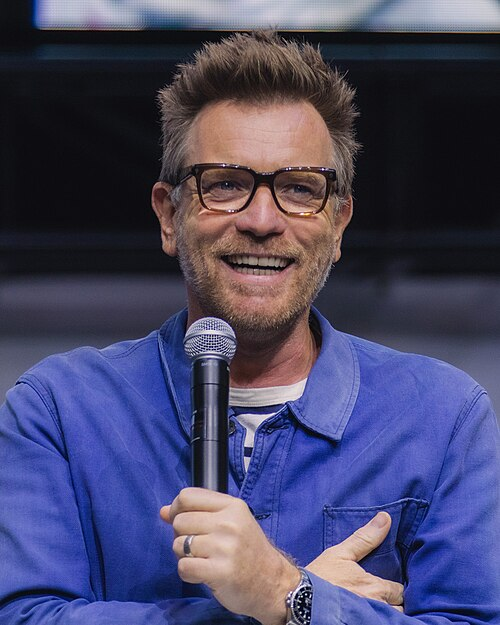

[Ewan_McGregor_-_Los_Angeles_Comic_Con_2024.jpg](https://commons.wikimedia.org/wiki/File:Ewan_McGregor_-_Los_Angeles_Comic_Con_2024.jpg) · CC BY 4.0

Ergänzung · Datierung laut Quelle: 2003

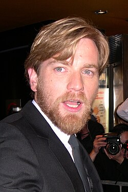

[Ewan McGregor Premiere Down to love in Sydney 2003 (cropped).JPG](https://commons.wikimedia.org/wiki/File:Ewan_McGregor_Premiere_Down_to_love_in_Sydney_2003_(cropped).JPG) · Public domain

Dateititel und Beschreibung nennen die Filmpremiere von Down with Love 2003 in Sydney; das Metadatum 2007 ist der Originalupload.

## Cillian Murphy

Bisheriges Foto:

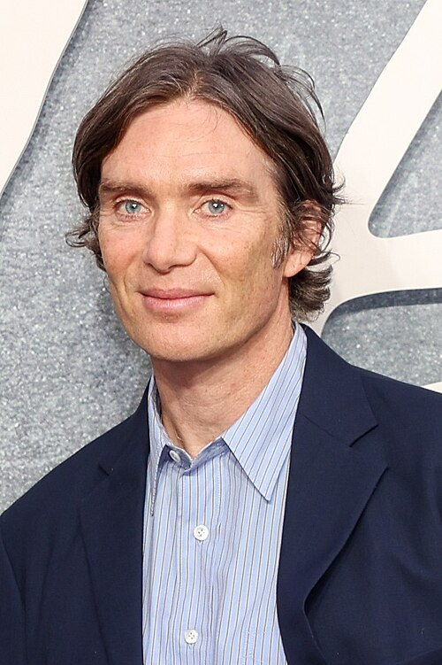

[Cillian_Murphy_at_the_London_premier_of_Steve_in_September_2025_(cropped).jpg](https://commons.wikimedia.org/wiki/File:Cillian_Murphy_at_the_London_premier_of_Steve_in_September_2025_(cropped).jpg) · CC BY-SA 4.0

Ergänzung · Datierung laut Quelle: 2010

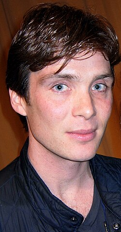

[Cillian Murphy 2010.jpg](https://commons.wikimedia.org/wiki/File:Cillian_Murphy_2010.jpg) · CC BY-SA 3.0

## Donald Sutherland

Bisheriges Foto:

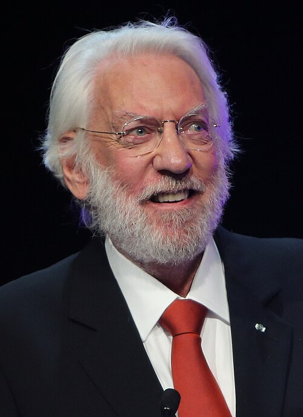

[Donald_Sutherland_(cropped).JPG](https://commons.wikimedia.org/wiki/File:Donald_Sutherland_(cropped).JPG) · CC BY-SA 3.0

Ergänzung · Datierung laut Quelle: 1981

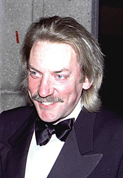

[Donald Sutherland (1095412255) (cropped).jpg](https://commons.wikimedia.org/wiki/File:Donald_Sutherland_(1095412255)_(cropped).jpg) · CC BY 2.0

## Jean Reno

Bisheriges Foto:

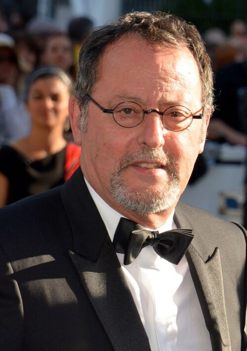

[Jean_Reno_Cannes_2016.jpg](https://commons.wikimedia.org/wiki/File:Jean_Reno_Cannes_2016.jpg) · CC BY-SA 3.0

Ergänzung · Datierung laut Quelle: 2010

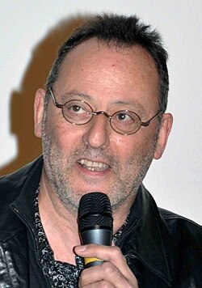

[Jean Reno 2010.jpg](https://commons.wikimedia.org/wiki/File:Jean_Reno_2010.jpg) · CC BY-SA 3.0

## Vincent Cassel

Bisheriges Foto:

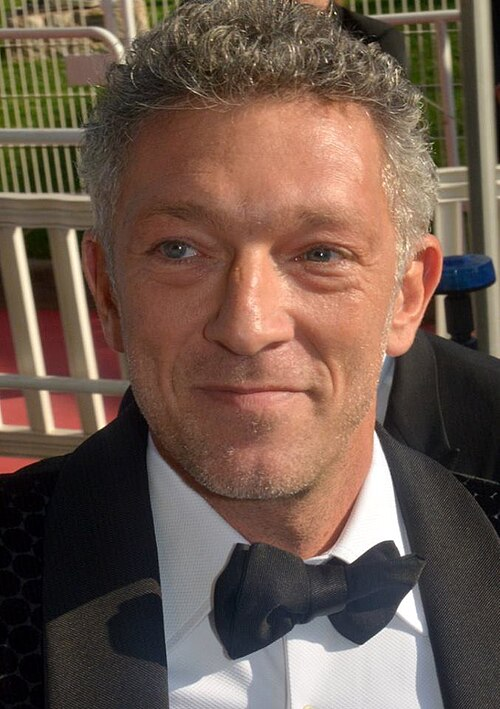

[Vincent_Cassel_Cannes_2018.jpg](https://commons.wikimedia.org/wiki/File:Vincent_Cassel_Cannes_2018.jpg) · CC BY-SA 4.0

Ergänzung · Datierung laut Quelle: 2006

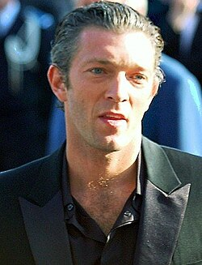

[Vincent Cassel Cannes.jpg](https://commons.wikimedia.org/wiki/File:Vincent_Cassel_Cannes.jpg) · CC BY-SA 3.0

## Mads Mikkelsen

Bisheriges Foto:

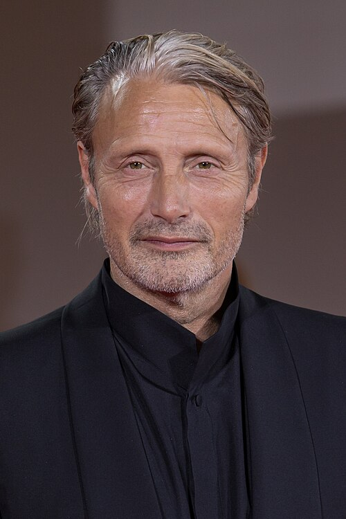

[Mads_Mikkelsen_at_82nd_Venice_International_Film_Festival_(cropped2).jpg](https://commons.wikimedia.org/wiki/File:Mads_Mikkelsen_at_82nd_Venice_International_Film_Festival_(cropped2).jpg) · CC BY-SA 4.0

Ergänzung · Datierung laut Quelle: 2009

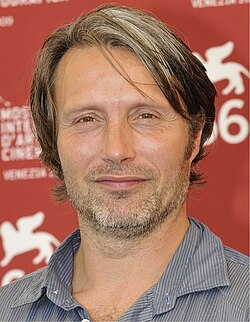

[Mads Mikkelsen cropped 2009.jpg](https://commons.wikimedia.org/wiki/File:Mads_Mikkelsen_cropped_2009.jpg) · CC BY-SA 2.0

## Song Kang-ho

Bisheriges Foto:

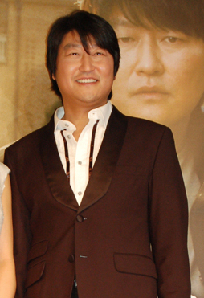

[Song Kang-Ho (cropped).jpg](https://commons.wikimedia.org/wiki/File:Song_Kang-Ho_(cropped).jpg) · CC BY-SA 3.0

Ergänzung · Datierung laut Quelle: 2013

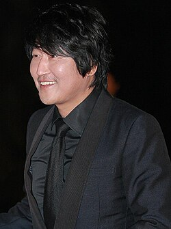

[Song Kang-Ho in 2013 (cropped).jpg](https://commons.wikimedia.org/wiki/File:Song_Kang-Ho_in_2013_(cropped).jpg) · CC BY 2.0 kr

Dateititel und Beschreibung nennen die Blue Dragon Film Awards 2013; das Metadatum 2014 gehört zum späteren Upload.

## Donnie Yen

Bisheriges Foto:

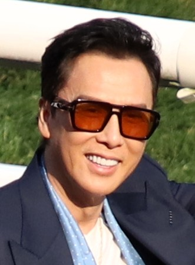

[Donnie_Yen_20250323.jpg](https://commons.wikimedia.org/wiki/File:Donnie_Yen_20250323.jpg) · CC0

Ergänzung · Datierung laut Quelle: 2014

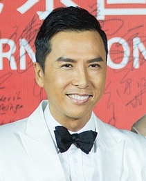

[Donnie Yen (2014).jpg](https://commons.wikimedia.org/wiki/File:Donnie_Yen_(2014).jpg) · CC BY 2.5

## Dev Patel

Bisheriges Foto:

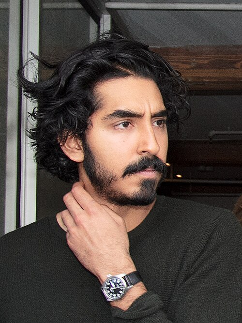

[Dev_Patel_(29870651654).jpg](https://commons.wikimedia.org/wiki/File:Dev_Patel_(29870651654).jpg) · CC BY-SA 2.0

Ergänzung · Datierung laut Quelle: 2024

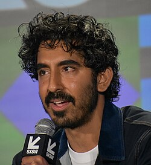

[SXSW 2024 - Dev Patel 2 (cropped).jpg](https://commons.wikimedia.org/wiki/File:SXSW_2024_-_Dev_Patel_2_(cropped).jpg) · CC BY-SA 4.0

## Sacha Baron Cohen

Bisheriges Foto:

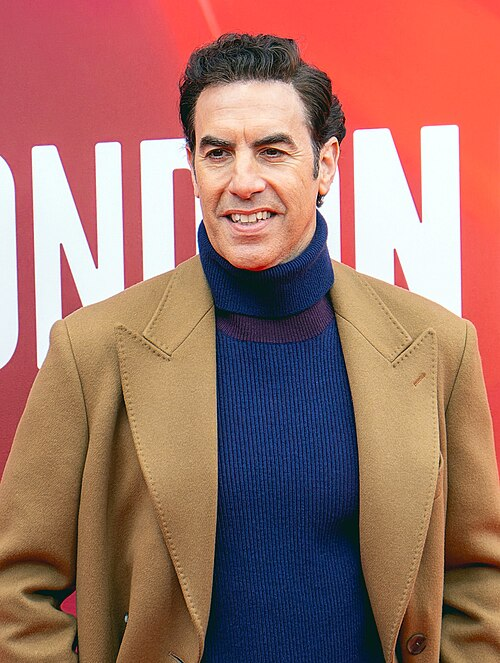

[Sacha_Baron_Cohen_(2024)_(3x4_cropped).jpg](https://commons.wikimedia.org/wiki/File:Sacha_Baron_Cohen_(2024)_(3x4_cropped).jpg) · CC BY 2.0

Ergänzung · Datierung laut Quelle: 2011

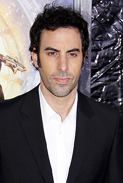

[Sacha Baron Cohen, 2011.jpg](https://commons.wikimedia.org/wiki/File:Sacha_Baron_Cohen,_2011.jpg) · CC BY-SA 2.0

## Shirley MacLaine

Bisheriges Foto:

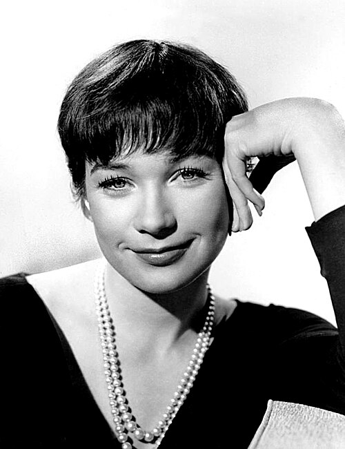

[Shirley_MacLaine_-_1960.jpg](https://commons.wikimedia.org/wiki/File:Shirley_MacLaine_-_1960.jpg) · Public domain

Ergänzung · Datierung laut Quelle: 1974

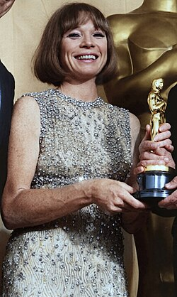

[Shirley MacLaine-46th Academy Awards.jpg](https://commons.wikimedia.org/wiki/File:Shirley_MacLaine-46th_Academy_Awards.jpg) · Public domain

Anzeigeausschnitt der unveränderten Datei: x=40, y=0, Breite=130, Höhe=178 Pixel.

## Julie Christie

Bisheriges Foto:

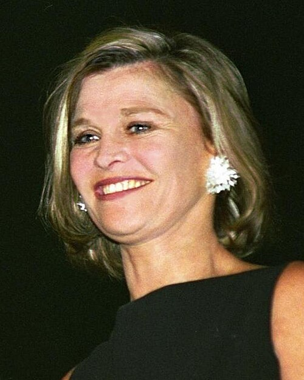

[Julie_Christie_(1997)_(2).jpg](https://commons.wikimedia.org/wiki/File:Julie_Christie_(1997)_(2).jpg) · CC BY 2.0

Ergänzung · Datierung laut Quelle: ca. 1964/1965

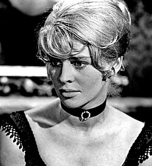

[Julie Christie - 1965 (cropped).jpg](https://commons.wikimedia.org/wiki/File:Julie_Christie_-_1965_(cropped).jpg) · Public domain

Commons-Metadatum nennt 1964, der Dateititel 1965; die abweichende Datierung bleibt sichtbar.

## Vanessa Redgrave

Bisheriges Foto:

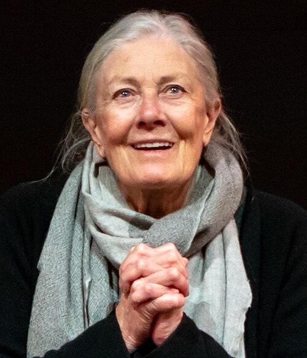

[VanRedgrveRoseKng090219-9_(46997099482)_(cropped).jpg](https://commons.wikimedia.org/wiki/File:VanRedgrveRoseKng090219-9_(46997099482)_(cropped).jpg) · CC BY 2.0

Ergänzung · Datierung laut Quelle: 1969

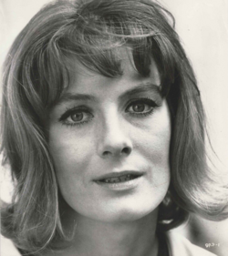

[Vanessa Redgrave - Vintage Portrait (cropped).png](https://commons.wikimedia.org/wiki/File:Vanessa_Redgrave_-_Vintage_Portrait_(cropped).png) · Public domain

## Glenn Close

Bisheriges Foto:

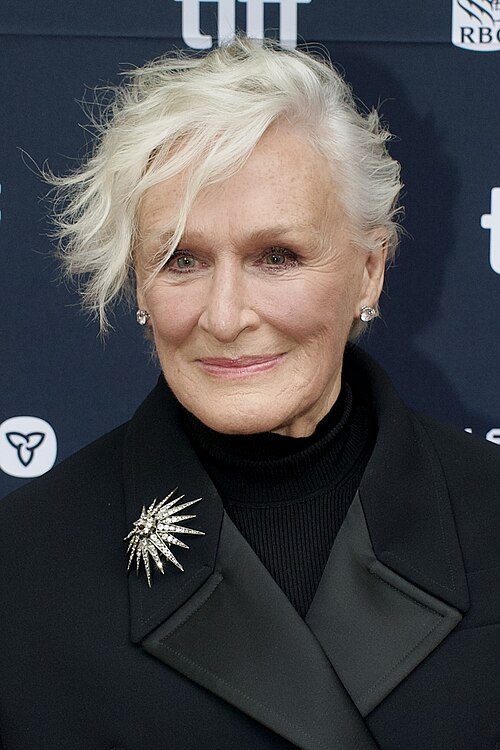

[Glenn_Close_TIFF_2025_(cropped).jpg](https://commons.wikimedia.org/wiki/File:Glenn_Close_TIFF_2025_(cropped).jpg) · CC BY 4.0

Ergänzung · Datierung laut Quelle: 1992

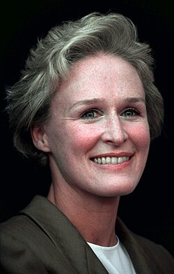

[Glenn Close 1992 Venice Film Festival (cropped).jpg](https://commons.wikimedia.org/wiki/File:Glenn_Close_1992_Venice_Film_Festival_(cropped).jpg) · CC BY-SA 3.0

## Geena Davis

Bisheriges Foto:

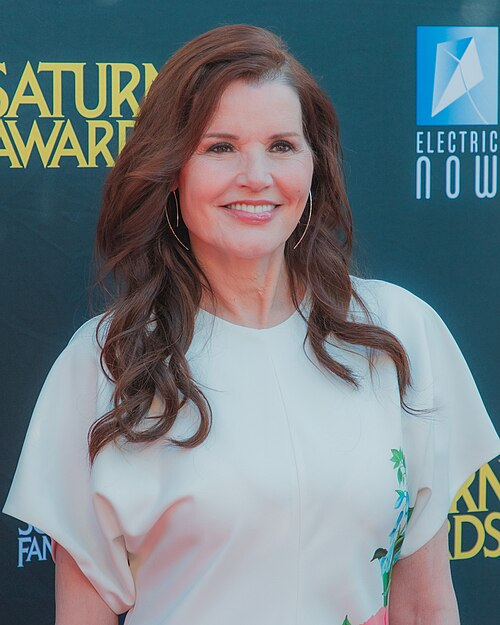

[Geena_Davis_at_53rd_Saturn_Awards_2026-01.jpg](https://commons.wikimedia.org/wiki/File:Geena_Davis_at_53rd_Saturn_Awards_2026-01.jpg) · CC BY 4.0

Ergänzung · Datierung laut Quelle: 1990

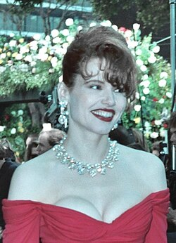

[Geena Davis (2105873627) (cropped).jpg](https://commons.wikimedia.org/wiki/File:Geena_Davis_(2105873627)_(cropped).jpg) · CC BY 2.0

## Meg Ryan

Bisheriges Foto:

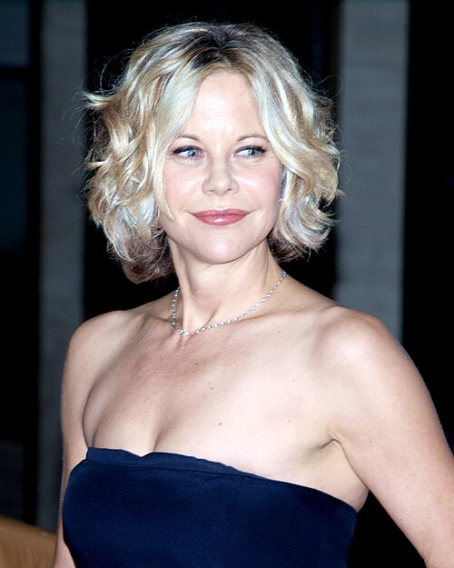

[Meg_Ryan_2_Met_Opera_2010_Shankbone.jpg](https://commons.wikimedia.org/wiki/File:Meg_Ryan_2_Met_Opera_2010_Shankbone.jpg) · CC BY 3.0

Ergänzung · Datierung laut Quelle: 1983

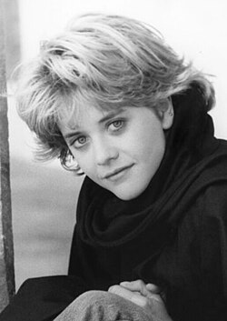

[Meg Ryan - As the World Turns (1983) (Cropped).jpg](https://commons.wikimedia.org/wiki/File:Meg_Ryan_-_As_the_World_Turns_(1983)_(Cropped).jpg) · Public domain

## Andie MacDowell

Bisheriges Foto:

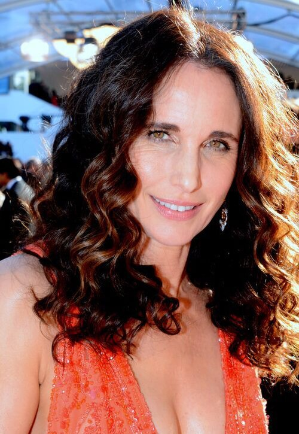

[Andie_MacDowell_Cannes_2015_2_(cropped).jpg](https://commons.wikimedia.org/wiki/File:Andie_MacDowell_Cannes_2015_2_(cropped).jpg) · CC BY-SA 3.0

Ergänzung · Datierung laut Quelle: 2001

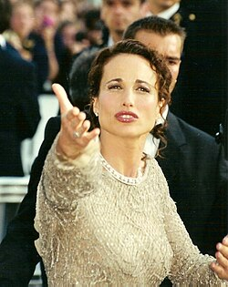

[Andie MacDowell 2001.jpg](https://commons.wikimedia.org/wiki/File:Andie_MacDowell_2001.jpg) · CC BY-SA 3.0

## Renée Zellweger

Bisheriges Foto:

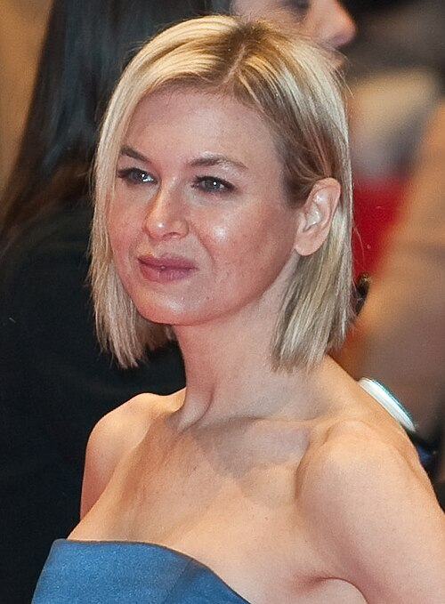

[Renée_Zellweger_Berlinale_2010_(cropped).jpg](https://commons.wikimedia.org/wiki/File:Ren%C3%A9e_Zellweger_Berlinale_2010_(cropped).jpg) · CC BY 3.0

Ergänzung · Datierung laut Quelle: 2006

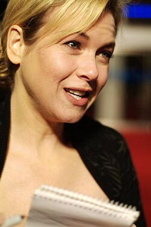

[Renée Zellweger 2006.jpg](https://commons.wikimedia.org/wiki/File:Ren%C3%A9e_Zellweger_2006.jpg) · CC BY 2.0

## Naomi Watts

Bisheriges Foto:

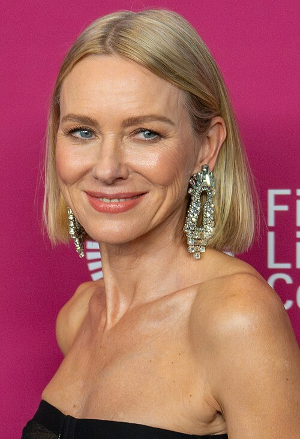

[Naomi_Watts_at_the_2024_New_York_Film_Festival_2_(cropped).jpg](https://commons.wikimedia.org/wiki/File:Naomi_Watts_at_the_2024_New_York_Film_Festival_2_(cropped).jpg) · CC BY-SA 4.0

Ergänzung · Datierung laut Quelle: 2009

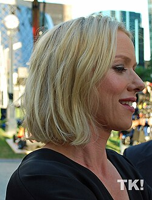

[Flickr - Tsar Kasim - Naomi Watts ^4.jpg](https://commons.wikimedia.org/wiki/File:Flickr_-_Tsar_Kasim_-_Naomi_Watts_%5E4.jpg) · CC BY-SA 2.0

## Kate Hudson

Bisheriges Foto:

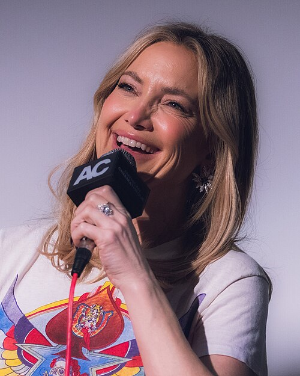

[Kate_Hudson_-_Song_Sung_Blue.jpg](https://commons.wikimedia.org/wiki/File:Kate_Hudson_-_Song_Sung_Blue.jpg) · CC BY 4.0

Ergänzung · Datierung laut Quelle: 2016

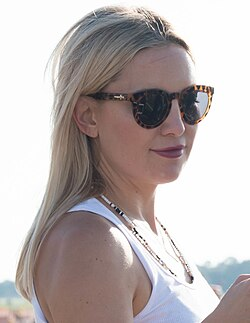

[2999741 Kate Hudson during her visit to Keesler Air Force Base September 2016 (cropped).jpg](https://commons.wikimedia.org/wiki/File:2999741_Kate_Hudson_during_her_visit_to_Keesler_Air_Force_Base_September_2016_(cropped).jpg) · Public domain

## Rachel McAdams

Bisheriges Foto:

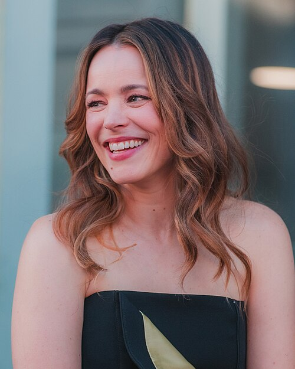

[Rachel_McAdams_-_Walk_of_Fame.jpg](https://commons.wikimedia.org/wiki/File:Rachel_McAdams_-_Walk_of_Fame.jpg) · CC BY 4.0

Ergänzung · Datierung laut Quelle: 2008

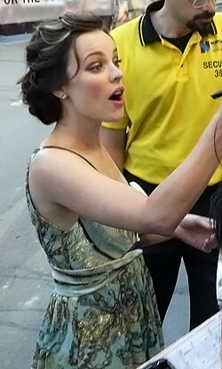

[Actress Rachel McAdams arrives at "The Lucky Ones" premiere during the 2008 Toronto International Film Festival held at the Roy Thomson Hall on September 10, 2008 in Toronto, Canada -f (cropped).jpg](https://commons.wikimedia.org/wiki/File:Actress_Rachel_McAdams_arrives_at_%22The_Lucky_Ones%22_premiere_during_the_2008_Toronto_International_Film_Festival_held_at_the_Roy_Thomson_Hall_on_September_10,_2008_in_Toronto,_Canada_-f_(cropped).jpg) · CC BY-SA 2.0

Anzeigeausschnitt der unveränderten Datei: x=15, y=0, Breite=140, Höhe=190 Pixel.

## Keira Knightley

Bisheriges Foto:

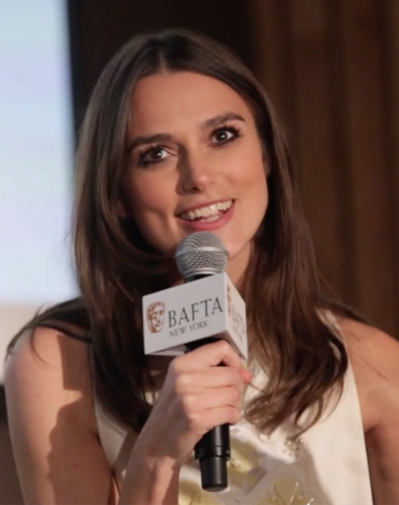

[Knightley_Bafta_2015_07.png](https://commons.wikimedia.org/wiki/File:Knightley_Bafta_2015_07.png) · CC BY-SA 3.0

Ergänzung · Datierung laut Quelle: 2014

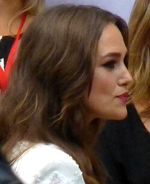

[Keira Knightley Imitation Game 05 TIFF 2014 (cropped).jpg](https://commons.wikimedia.org/wiki/File:Keira_Knightley_Imitation_Game_05_TIFF_2014_(cropped).jpg) · CC BY-SA 2.0

## Felicity Jones

Bisheriges Foto:

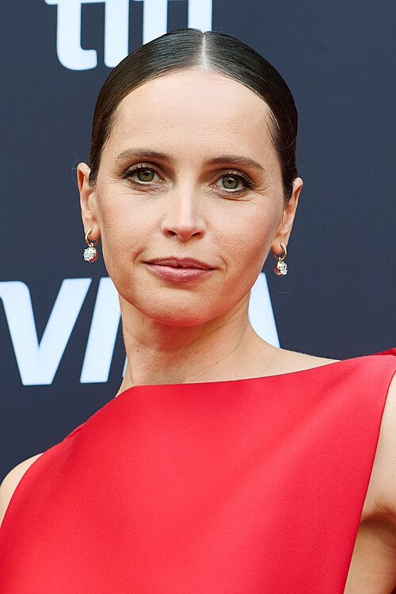

[Felicity_Jones_at_TIFF_2025_01_(cropped).jpg](https://commons.wikimedia.org/wiki/File:Felicity_Jones_at_TIFF_2025_01_(cropped).jpg) · CC BY-SA 4.0

Ergänzung · Datierung laut Quelle: 2016

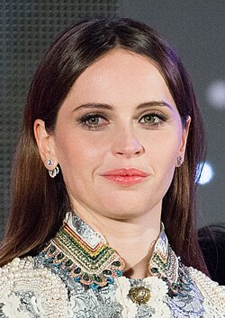

[Felicity Jones in 2016 (cropped).jpg](https://commons.wikimedia.org/wiki/File:Felicity_Jones_in_2016_(cropped).jpg) · CC BY 2.0

## Emily Watson

Bisheriges Foto:

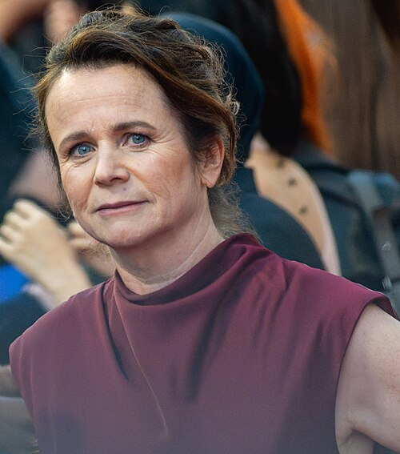

[Emily_Watson.jpg](https://commons.wikimedia.org/wiki/File:Emily_Watson.jpg) · CC BY 4.0

Ergänzung · Datierung laut Quelle: 2016

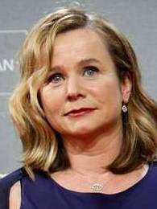

[Emily Watson (25831419375) cropped (cropped).jpg](https://commons.wikimedia.org/wiki/File:Emily_Watson_(25831419375)_cropped_(cropped).jpg) · CC BY-SA 2.5

Beschreibung nennt das Festival in San Sebastián 2016; das Metadatum 2017 gehört zum späteren Upload.

## Imelda Staunton

Bisheriges Foto:

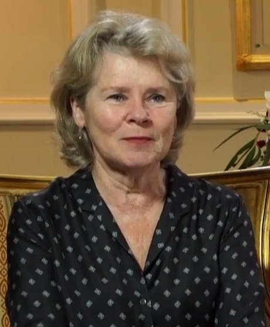

[Imelda_Staunton,_October_2019.jpg](https://commons.wikimedia.org/wiki/File:Imelda_Staunton,_October_2019.jpg) · CC BY 3.0

Ergänzung · Datierung laut Quelle: 2011

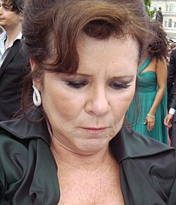

[Imelda Staunton cropped 2011.jpg](https://commons.wikimedia.org/wiki/File:Imelda_Staunton_cropped_2011.jpg) · CC BY-SA 3.0

## Toni Collette

Bisheriges Foto:

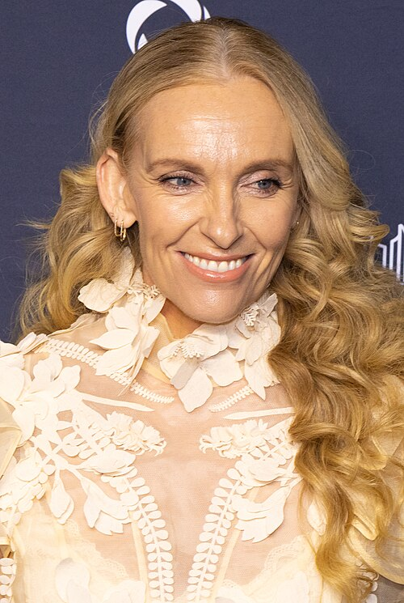

[Toni_Collette_at_the_2025_Toronto_International_Film_Festival_(cropped).jpg](https://commons.wikimedia.org/wiki/File:Toni_Collette_at_the_2025_Toronto_International_Film_Festival_(cropped).jpg) · CC BY 4.0

Ergänzung · Datierung laut Quelle: 2012

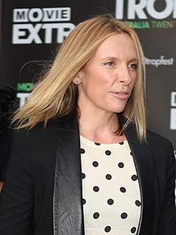

[Toni Collette (6902406229) (cropped).jpg](https://commons.wikimedia.org/wiki/File:Toni_Collette_(6902406229)_(cropped).jpg) · CC BY-SA 2.0

## Laura Dern

Bisheriges Foto:

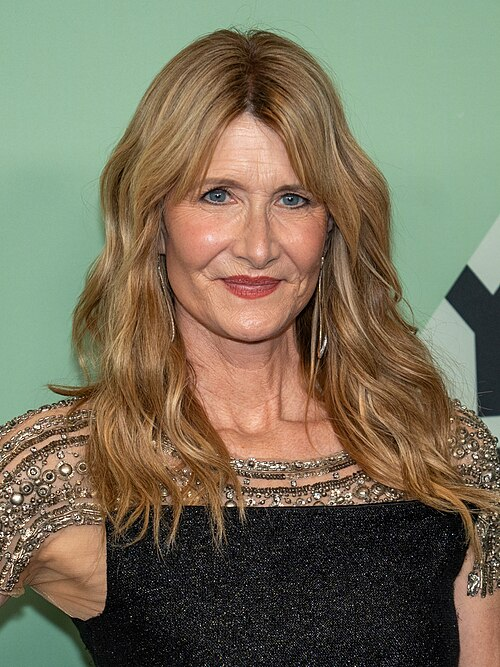

[Laura_Dern_Is_This_Thing_On-21_(cropped).jpg](https://commons.wikimedia.org/wiki/File:Laura_Dern_Is_This_Thing_On-21_(cropped).jpg) · CC BY-SA 4.0

Ergänzung · Datierung laut Quelle: 2010

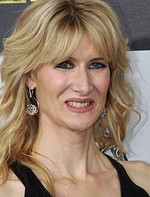

[Laura Dern at the 2010 Independent Spirit Awards cropped.jpg](https://commons.wikimedia.org/wiki/File:Laura_Dern_at_the_2010_Independent_Spirit_Awards_cropped.jpg) · CC BY-SA 3.0

Beschreibung nennt die Independent Spirit Awards am 5. März 2010; das Metadatum 2011 gehört zum späteren Upload.

## Lupita Nyong'o

Bisheriges Foto:

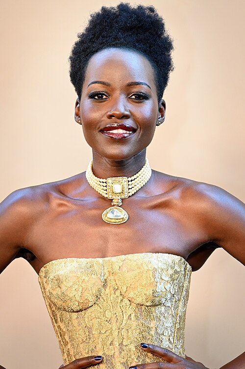

[LupitaNyongo-byPhilipRomano3.jpg](https://commons.wikimedia.org/wiki/File:LupitaNyongo-byPhilipRomano3.jpg) · CC BY-SA 4.0

Ergänzung · Datierung laut Quelle: 2016

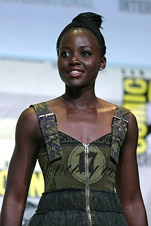

[Lupita Nyong'o (28528378672) (cropped 2).jpg](https://commons.wikimedia.org/wiki/File:Lupita_Nyong%27o_(28528378672)_(cropped_2).jpg) · CC BY-SA 2.0

## Kerry Washington

Bisheriges Foto:

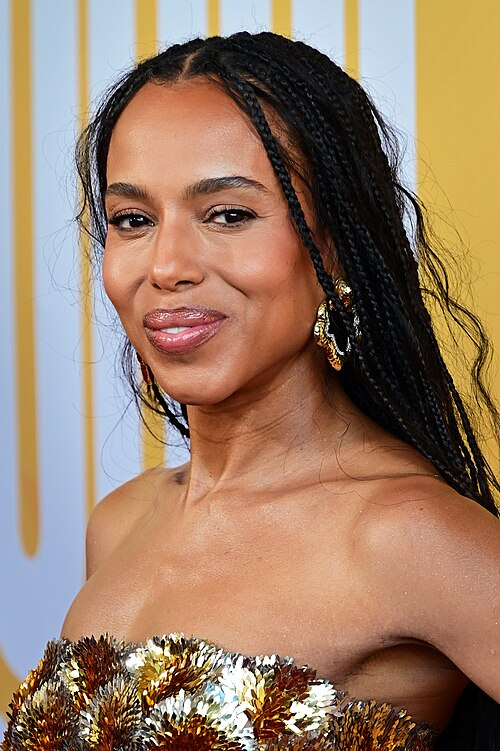

[KerryWashington-byPhilipRomano.jpg](https://commons.wikimedia.org/wiki/File:KerryWashington-byPhilipRomano.jpg) · CC BY-SA 4.0

Ergänzung · Datierung laut Quelle: 2013

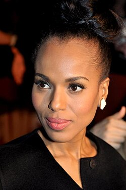

[Kerry Washington Django avp.jpg](https://commons.wikimedia.org/wiki/File:Kerry_Washington_Django_avp.jpg) · CC BY-SA 3.0

## Octavia Spencer

Bisheriges Foto:

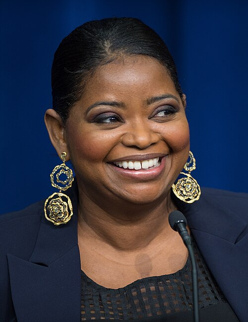

["Hidden_Figures"_Screening_at_the_White_House_(NHQ201612150008)_(cropped).jpg](https://commons.wikimedia.org/wiki/File:%22Hidden_Figures%22_Screening_at_the_White_House_(NHQ201612150008)_(cropped).jpg) · Public domain

Ergänzung · Datierung laut Quelle: nicht genau datiert

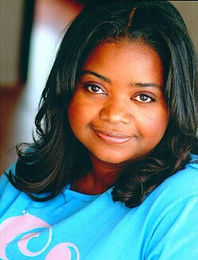

[Octavia Spencer.jpg](https://commons.wikimedia.org/wiki/File:Octavia_Spencer.jpg) · CC BY 3.0

Commons nennt Unknown date. Für dieses zusätzliche Porträt wird kein bestimmtes Aufnahmejahr behauptet.

## Queen Latifah

Bisheriges Foto:

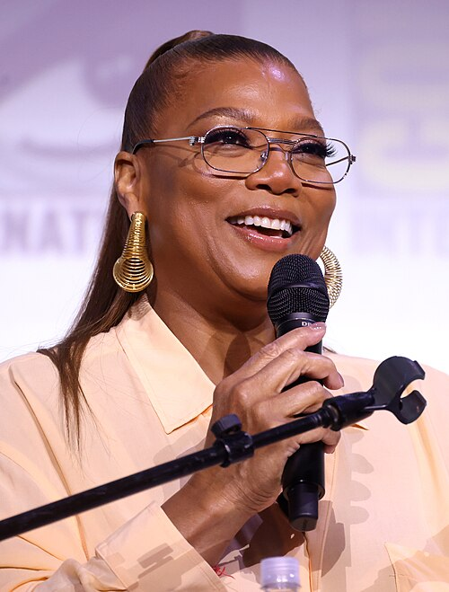

[Queen_Latifah_by_Gage_Skidmore.jpg](https://commons.wikimedia.org/wiki/File:Queen_Latifah_by_Gage_Skidmore.jpg) · CC BY-SA 3.0

Ergänzung · Datierung laut Quelle: 2010

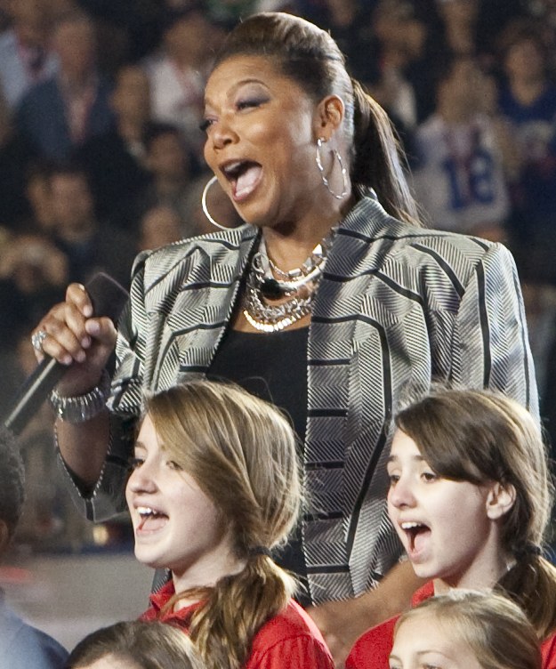

[Super Bowl 44 Queen Latifah God Bless America (4344821074) (cropped).jpg](https://commons.wikimedia.org/wiki/File:Super_Bowl_44_Queen_Latifah_God_Bless_America_(4344821074)_(cropped).jpg) · CC BY 2.0

Anzeigeausschnitt der unveränderten Datei: x=210, y=10, Breite=235, Höhe=340 Pixel.

## Zhang Ziyi

Bisheriges Foto:

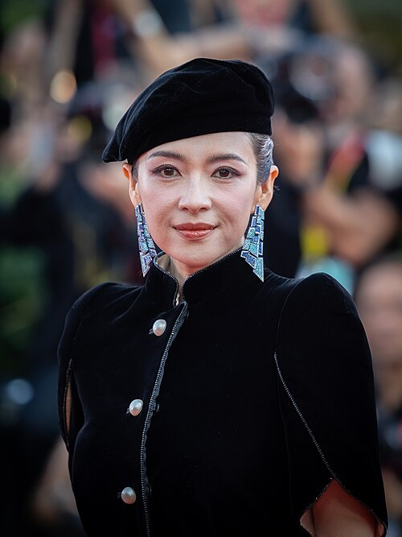

[Zhang_Ziyi-63357.jpg](https://commons.wikimedia.org/wiki/File:Zhang_Ziyi-63357.jpg) · CC BY-SA 4.0

Ergänzung · Datierung laut Quelle: 2014

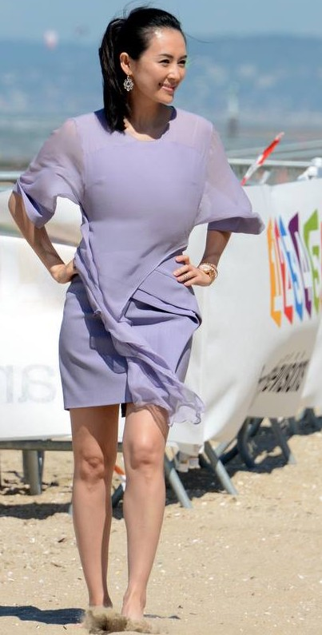

[Zhang Ziyi Cabourg 2014.jpg](https://commons.wikimedia.org/wiki/File:Zhang_Ziyi_Cabourg_2014.jpg) · CC BY-SA 3.0

Anzeigeausschnitt der unveränderten Datei: x=115, y=0, Breite=170, Höhe=230 Pixel.

## Marion Cotillard

Bisheriges Foto:

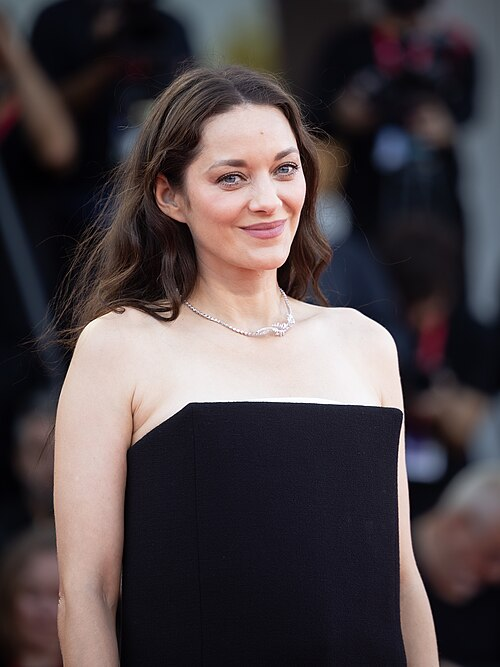

[Marion_Cotillard-1061.jpg](https://commons.wikimedia.org/wiki/File:Marion_Cotillard-1061.jpg) · CC BY-SA 4.0

Ergänzung · Datierung laut Quelle: 2009

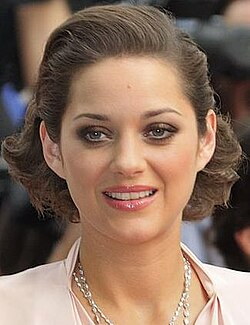

[Marion Cotillard (July 2009) 1 cropped.jpg](https://commons.wikimedia.org/wiki/File:Marion_Cotillard_(July_2009)_1_cropped.jpg) · CC BY-SA 2.0

## Léa Seydoux

Bisheriges Foto:

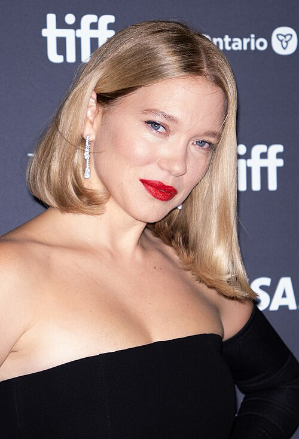

[Léa_Seydoux_-_ALPHAGANG_-_TIFF_2026.jpg](https://commons.wikimedia.org/wiki/File:L%C3%A9a_Seydoux_-_ALPHAGANG_-_TIFF_2026.jpg) · CC BY-SA 4.0

Ergänzung · Datierung laut Quelle: 2014

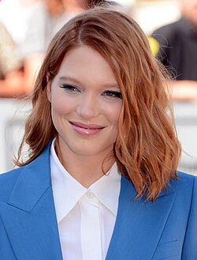

[Léa Seydoux Cannes 2014 (cropped).jpg](https://commons.wikimedia.org/wiki/File:L%C3%A9a_Seydoux_Cannes_2014_(cropped).jpg) · CC BY-SA 3.0

## Juliette Binoche

Bisheriges Foto:

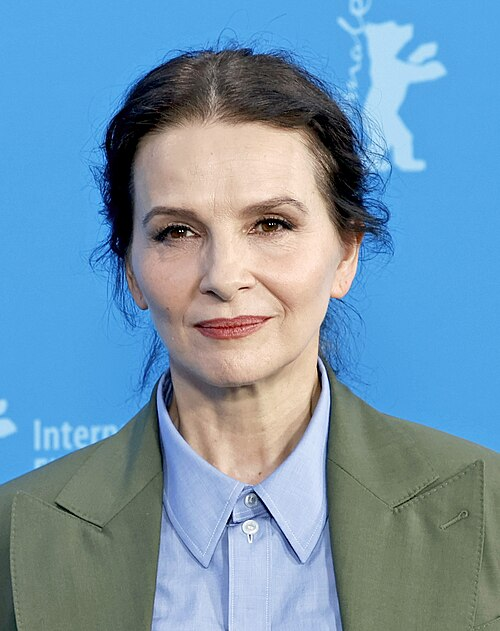

[Juliette_Binoche_at_Berlinale_2026-2.jpg](https://commons.wikimedia.org/wiki/File:Juliette_Binoche_at_Berlinale_2026-2.jpg) · CC BY-SA 3.0

Ergänzung · Datierung laut Quelle: 2000

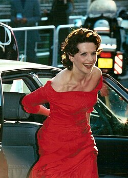

[Juliette Binoche 2000.jpg](https://commons.wikimedia.org/wiki/File:Juliette_Binoche_2000.jpg) · CC BY-SA 3.0

Anzeigeausschnitt der unveränderten Datei: x=110, y=43, Breite=93, Höhe=144 Pixel.

## Robert Redford

Bisheriges Foto:

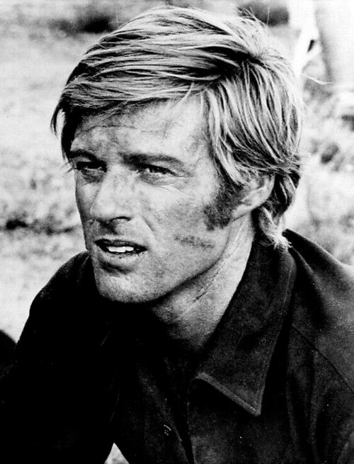

[Tell_Them_Willie_Boy_Is_Here_–_Robert_Redford_photo.jpg](https://commons.wikimedia.org/wiki/File:Tell_Them_Willie_Boy_Is_Here_%E2%80%93_Robert_Redford_photo.jpg) · Public domain

Ergänzung · Datierung laut Quelle: 1973

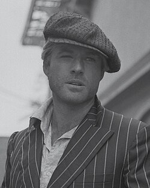

[Robert Redford 1973-1 (cropped).jpg](https://commons.wikimedia.org/wiki/File:Robert_Redford_1973-1_(cropped).jpg) · CC BY 4.0

## Paul Newman

Bisheriges Foto:

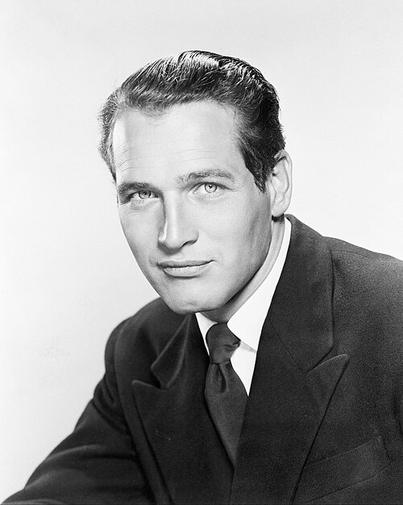

[Paul_Newman_-_1958.jpg](https://commons.wikimedia.org/wiki/File:Paul_Newman_-_1958.jpg) · Public domain

Ergänzung · Datierung laut Quelle: 1963

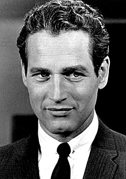

[Paul Newman - 1963.jpg](https://commons.wikimedia.org/wiki/File:Paul_Newman_-_1963.jpg) · Public domain

## Humphrey Bogart

Bisheriges Foto:

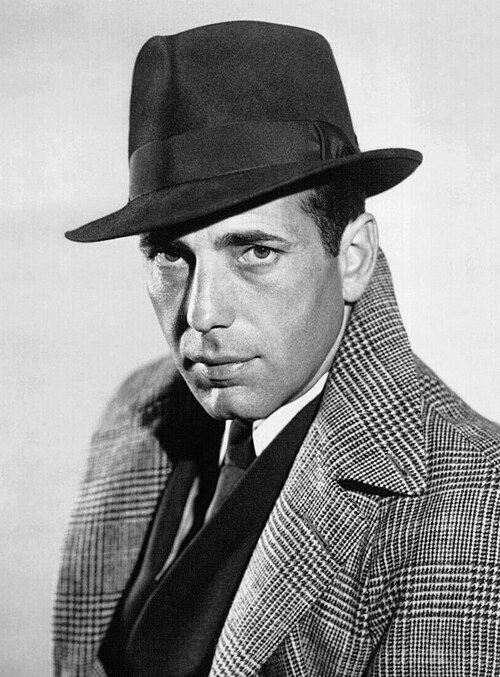

[Humphrey_Bogart_by_Elmer_Fryer_(cropped).jpg](https://commons.wikimedia.org/wiki/File:Humphrey_Bogart_by_Elmer_Fryer_(cropped).jpg) · Public domain

Ergänzung · Datierung laut Quelle: 1940

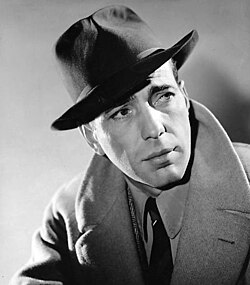

[Humphrey Bogart 1940 (cropped).jpg](https://commons.wikimedia.org/wiki/File:Humphrey_Bogart_1940_(cropped).jpg) · Public domain

## James Stewart

Bisheriges Foto:

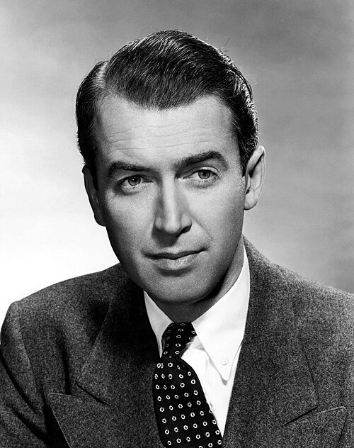

[Annex_-_Stewart,_James_(Call_Northside_777)_01.jpg](https://commons.wikimedia.org/wiki/File:Annex_-_Stewart,_James_(Call_Northside_777)_01.jpg) · Public domain

Ergänzung · Datierung laut Quelle: 1959

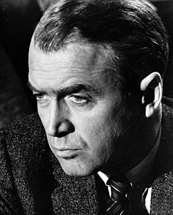

[James Stewart - 1959.jpg](https://commons.wikimedia.org/wiki/File:James_Stewart_-_1959.jpg) · Public domain

## Cary Grant

Bisheriges Foto:

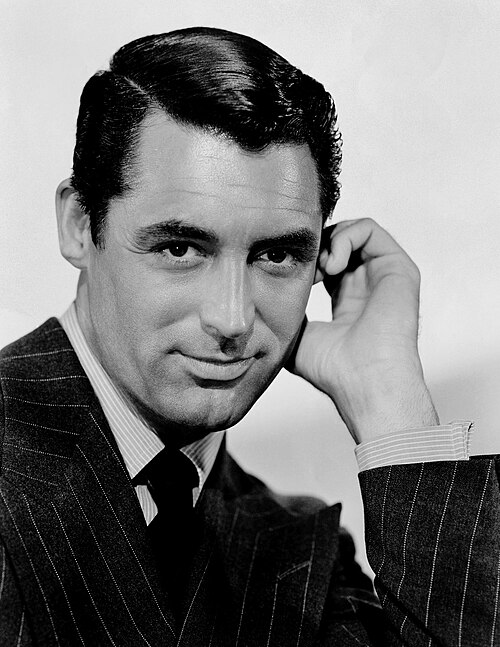

[Grant,_Cary_(Suspicion)_01_Crisco_edit.jpg](https://commons.wikimedia.org/wiki/File:Grant,_Cary_(Suspicion)_01_Crisco_edit.jpg) · Public domain

Ergänzung · Datierung laut Quelle: 1958

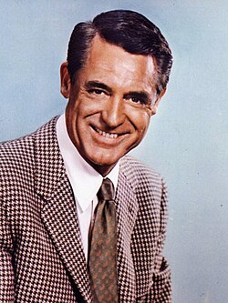

[Cary Grant (1958) (cropped).jpg](https://commons.wikimedia.org/wiki/File:Cary_Grant_(1958)_(cropped).jpg) · Public domain

## Gregory Peck

Bisheriges Foto:

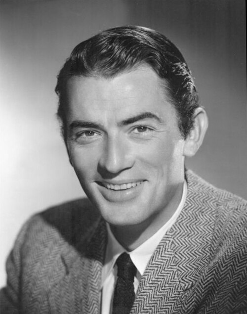

[Gregory_Peck_1948.jpg](https://commons.wikimedia.org/wiki/File:Gregory_Peck_1948.jpg) · Public domain

Ergänzung · Datierung laut Quelle: 1956

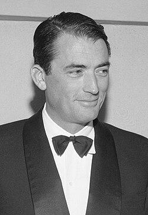

[Gregory Peck 1956 crop.jpg](https://commons.wikimedia.org/wiki/File:Gregory_Peck_1956_crop.jpg) · CC BY 4.0

## Marlon Brando

Bisheriges Foto:

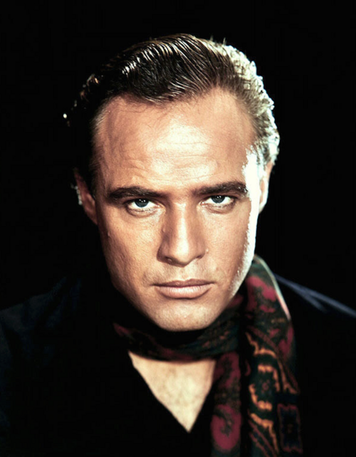

[Marlon_Brando_publicity_for_One-Eyed_Jacks.png](https://commons.wikimedia.org/wiki/File:Marlon_Brando_publicity_for_One-Eyed_Jacks.png) · Public domain

Ergänzung · Datierung laut Quelle: 1967

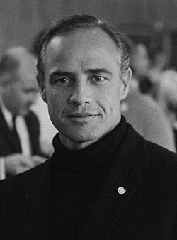

[Marlon-Brando-in-Finland-1967 (cropped).jpg](https://commons.wikimedia.org/wiki/File:Marlon-Brando-in-Finland-1967_(cropped).jpg) · CC BY 4.0

## James Dean

Bisheriges Foto:

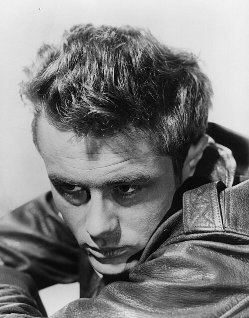

[James Dean ca 1955.jpg](https://commons.wikimedia.org/wiki/File:James_Dean_ca_1955.jpg) · Public domain

Ergänzung · Datierung laut Quelle: 1953

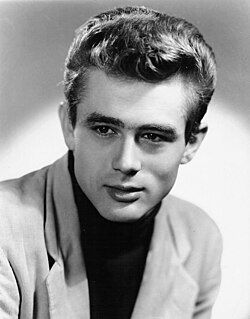

[James Dean - publicity - early.JPG](https://commons.wikimedia.org/wiki/File:James_Dean_-_publicity_-_early.JPG) · Public domain

## Steve McQueen

Bisheriges Foto:

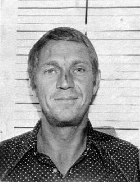

[Steve McQueen crop.jpg](https://commons.wikimedia.org/wiki/File:Steve_McQueen_crop.jpg) · Public domain

Ergänzung · Datierung laut Quelle: 1968

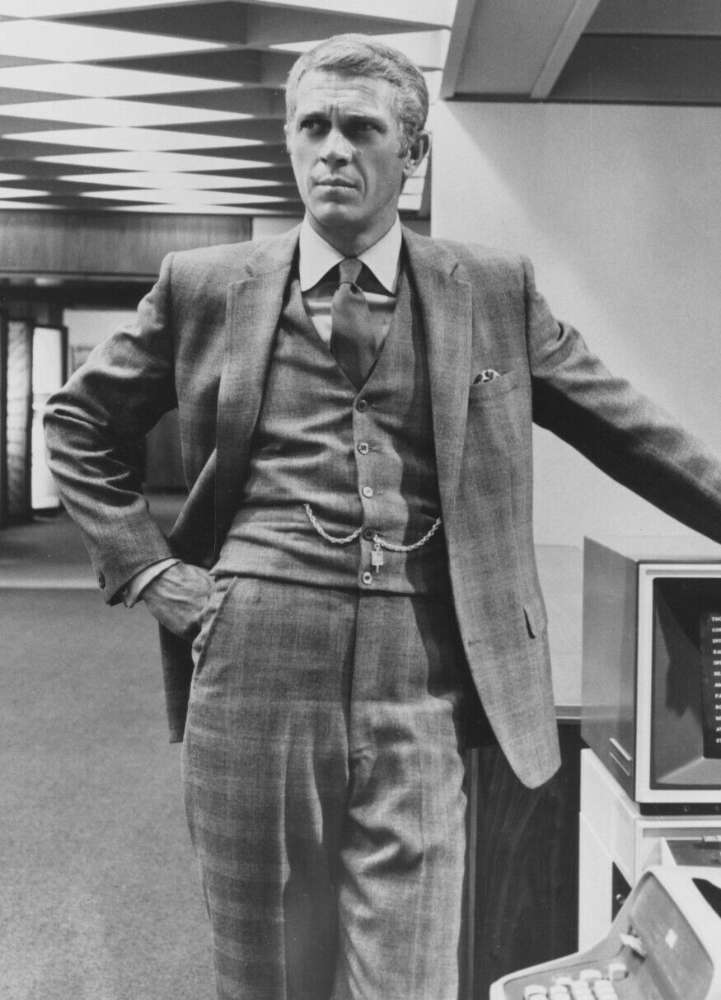

[Steve-McQueen-1968 (cropped).jpg](https://commons.wikimedia.org/wiki/File:Steve-McQueen-1968_(cropped).jpg) · Public domain

Anzeigeausschnitt der unveränderten Datei: x=270, y=25, Breite=320, Höhe=420 Pixel.

## Sidney Poitier

Bisheriges Foto:

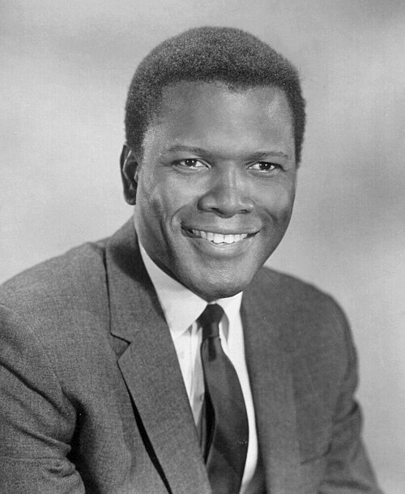

[Sidney_Poitier_1968.jpg](https://commons.wikimedia.org/wiki/File:Sidney_Poitier_1968.jpg) · Public domain

Ergänzung · Datierung laut Quelle: 1967

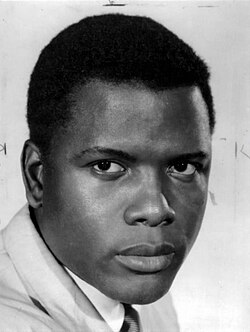

[Sidney Poitier 1967 CBS portrait.jpg](https://commons.wikimedia.org/wiki/File:Sidney_Poitier_1967_CBS_portrait.jpg) · Public domain

## Alain Delon

Bisheriges Foto:

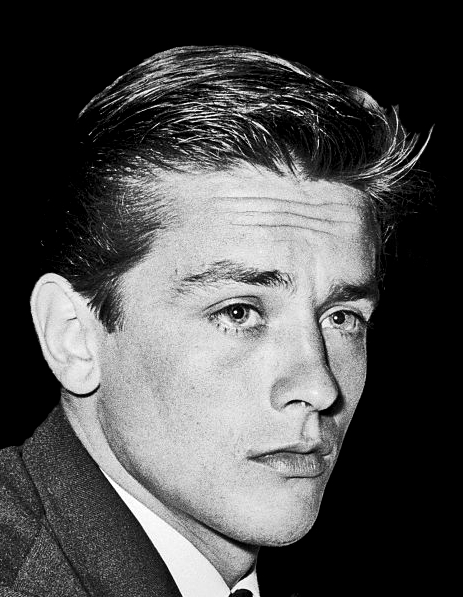

[Alain_Delon_1961.jpg](https://commons.wikimedia.org/wiki/File:Alain_Delon_1961.jpg) · Public domain

Ergänzung · Datierung laut Quelle: 1974

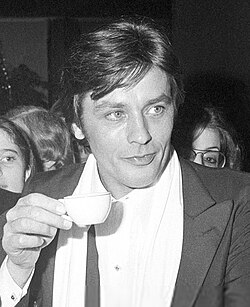

[Alain Delon 1974.jpg](https://commons.wikimedia.org/wiki/File:Alain_Delon_1974.jpg) · Public domain

## Jean-Paul Belmondo

Bisheriges Foto:

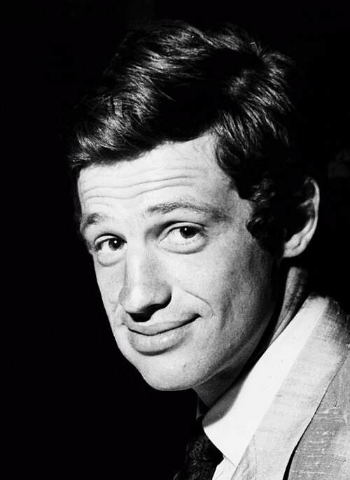

[Belmondo_1960.jpg](https://commons.wikimedia.org/wiki/File:Belmondo_1960.jpg) · Public domain

Ergänzung · Datierung laut Quelle: 1971

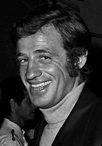

[Jean-Paul Belmondo, 1971 (Pizzi).jpg](https://commons.wikimedia.org/wiki/File:Jean-Paul_Belmondo,_1971_(Pizzi).jpg) · Public domain

## Monica Bellucci

Bisheriges Foto:

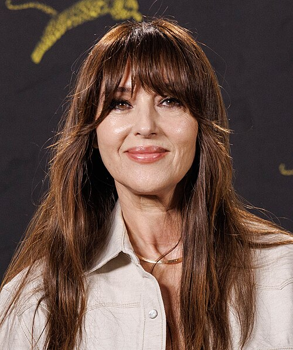

[Monica_Bellucci_at_"Ketticè"_photocall_during_the_79th_Locarno_Film_Festival_2_(cropped).jpg](https://commons.wikimedia.org/wiki/File:Monica_Bellucci_at_%22Kettic%C3%A8%22_photocall_during_the_79th_Locarno_Film_Festival_2_(cropped).jpg) · CC BY-SA 4.0

Ergänzung · Datierung laut Quelle: 2002

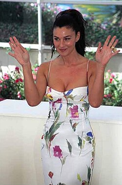

[Monica Bellucci (cannesPhotoCall)-.jpg](https://commons.wikimedia.org/wiki/File:Monica_Bellucci_(cannesPhotoCall)-.jpg) · CC BY-SA 2.5

Anzeigeausschnitt der unveränderten Datei: x=87, y=10, Breite=115, Höhe=170 Pixel.

## Catherine Deneuve

Bisheriges Foto:

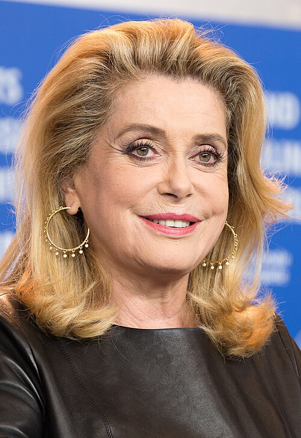

[Catherine_Deneuve_Berlinale_2017.jpg](https://commons.wikimedia.org/wiki/File:Catherine_Deneuve_Berlinale_2017.jpg) · CC BY-SA 3.0

Ergänzung · Datierung laut Quelle: 1966

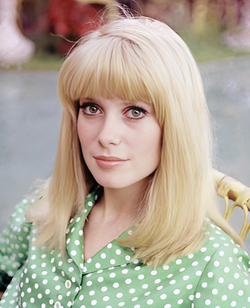

[Catherine Deneuve (1966) (cropped).png](https://commons.wikimedia.org/wiki/File:Catherine_Deneuve_(1966)_(cropped).png) · Public domain

## Isabelle Adjani

Bisheriges Foto:

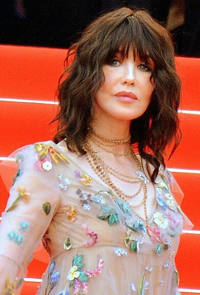

[Isabelle_Adjani_Cannes_2018.jpg](https://commons.wikimedia.org/wiki/File:Isabelle_Adjani_Cannes_2018.jpg) · CC BY-SA 4.0

Ergänzung · Datierung laut Quelle: 2009

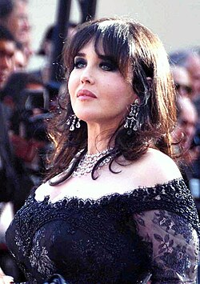

[Isabelle Adjani Cannes 2009.JPG](https://commons.wikimedia.org/wiki/File:Isabelle_Adjani_Cannes_2009.JPG) · CC BY-SA 3.0

## Liv Ullmann

Bisheriges Foto:

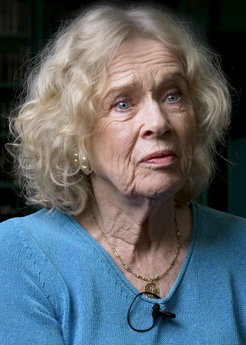

[Liv_Ullmann_2024_(cropped).png](https://commons.wikimedia.org/wiki/File:Liv_Ullmann_2024_(cropped).png) · CC BY 3.0

Ergänzung · Datierung laut Quelle: 1975

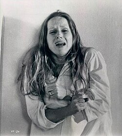

[Liv Ullmann - Face to Face (1975).jpg](https://commons.wikimedia.org/wiki/File:Liv_Ullmann_-_Face_to_Face_(1975).jpg) · Public domain

## Sissy Spacek

Bisheriges Foto:

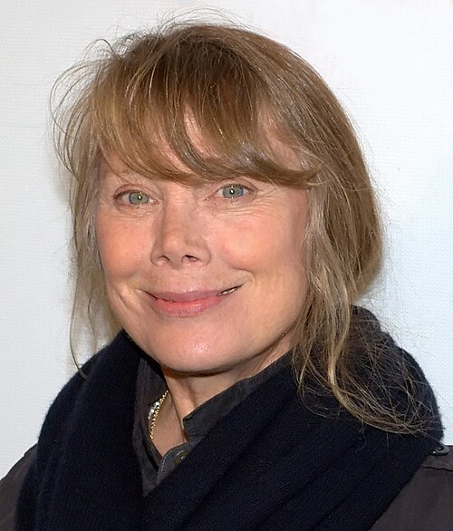

[Sissy_Spacek_by_David_Shankbone_(cropped).jpg](https://commons.wikimedia.org/wiki/File:Sissy_Spacek_by_David_Shankbone_(cropped).jpg) · CC BY 2.0

Ergänzung · Datierung laut Quelle: 2005

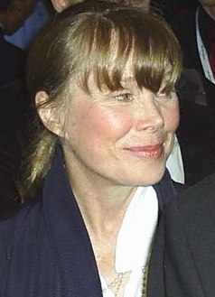

[Sissy Spacek (2005).jpg](https://commons.wikimedia.org/wiki/File:Sissy_Spacek_(2005).jpg) · CC BY 2.0

## Emma Watson

Bisheriges Foto:

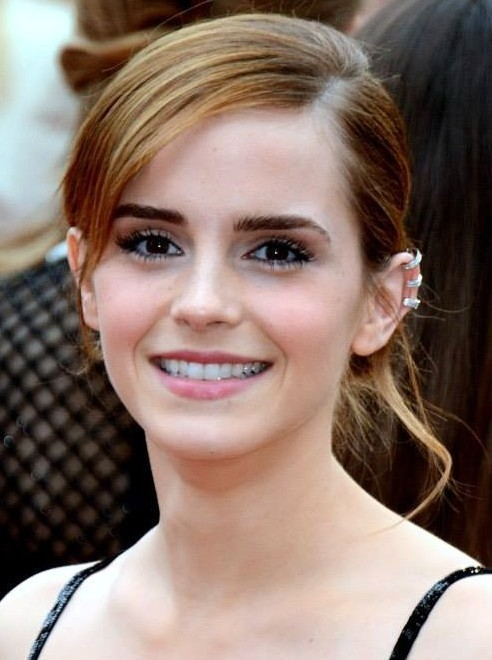

[Emma_Watson_2013.jpg](https://commons.wikimedia.org/wiki/File:Emma_Watson_2013.jpg) · CC BY-SA 3.0

Ergänzung · Datierung laut Quelle: 2017

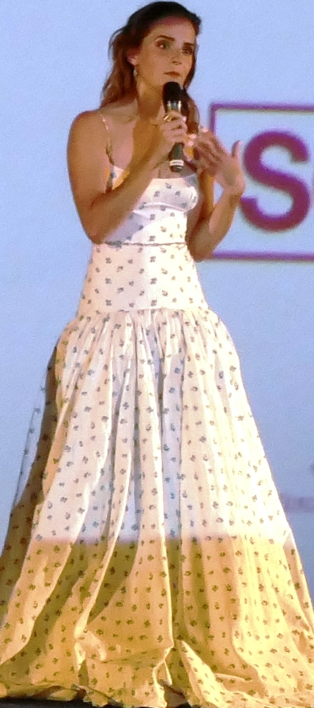

[Emma Watson 2017 (cropped).jpg](https://commons.wikimedia.org/wiki/File:Emma_Watson_2017_(cropped).jpg) · CC BY-SA 4.0

Anzeigeausschnitt der unveränderten Datei: x=120, y=0, Breite=230, Höhe=290 Pixel.

## Emma Roberts

Bisheriges Foto:

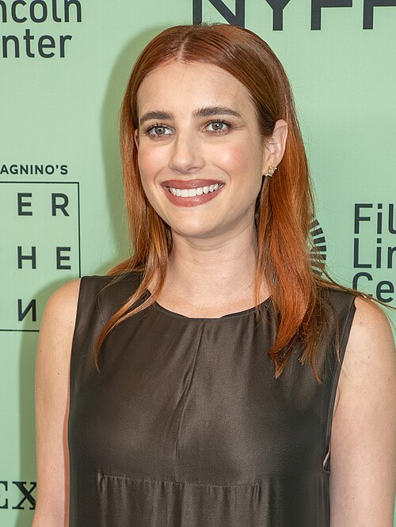

[Emma Roberts After The Hunt-06 (cropped).jpg](https://commons.wikimedia.org/wiki/File:Emma_Roberts_After_The_Hunt-06_(cropped).jpg) · CC BY-SA 4.0

Ergänzung · Datierung laut Quelle: 2016

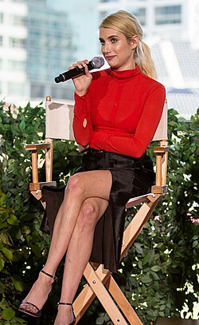

[Emma Roberts at 2016 San Diego Comic-Con (cropped).jpg](https://commons.wikimedia.org/wiki/File:Emma_Roberts_at_2016_San_Diego_Comic-Con_(cropped).jpg) · CC BY-SA 2.0

Anzeigeausschnitt der unveränderten Datei: x=80, y=15, Breite=120, Höhe=170 Pixel.

## Kristen Stewart

Bisheriges Foto:

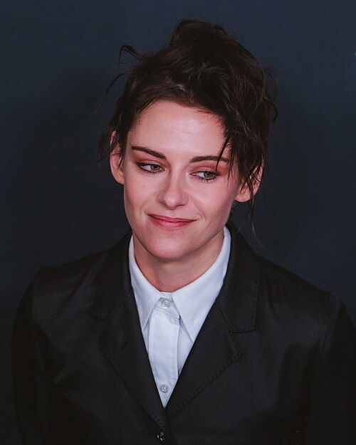

[Kristen_Stewart_at_WWD_Style_Awards_2026.jpg](https://commons.wikimedia.org/wiki/File:Kristen_Stewart_at_WWD_Style_Awards_2026.jpg) · CC BY 4.0

Ergänzung · Datierung laut Quelle: 2016

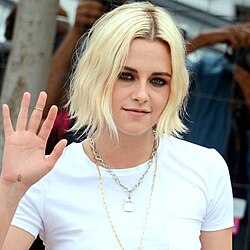

[Kristen Stewart Cannes 2016 2 (cropped).jpg](https://commons.wikimedia.org/wiki/File:Kristen_Stewart_Cannes_2016_2_(cropped).jpg) · CC BY-SA 3.0

## Jennifer Connelly

Bisheriges Foto:

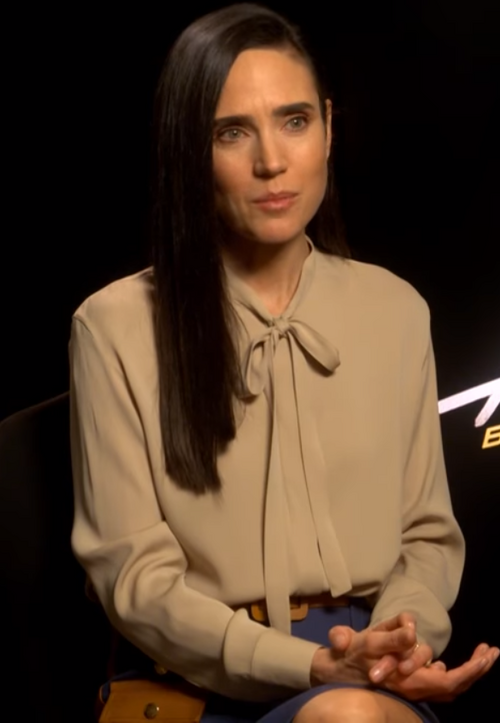

[Jennifer_Connelly_2019_2.png](https://commons.wikimedia.org/wiki/File:Jennifer_Connelly_2019_2.png) · CC BY 3.0

Ergänzung · Datierung laut Quelle: 2005

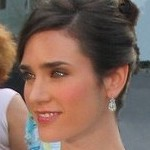

[Jennifer Connelly 2005 (square).jpg](https://commons.wikimedia.org/wiki/File:Jennifer_Connelly_2005_(square).jpg) · CC BY-SA 2.0

## Michelle Williams

Bisheriges Foto:

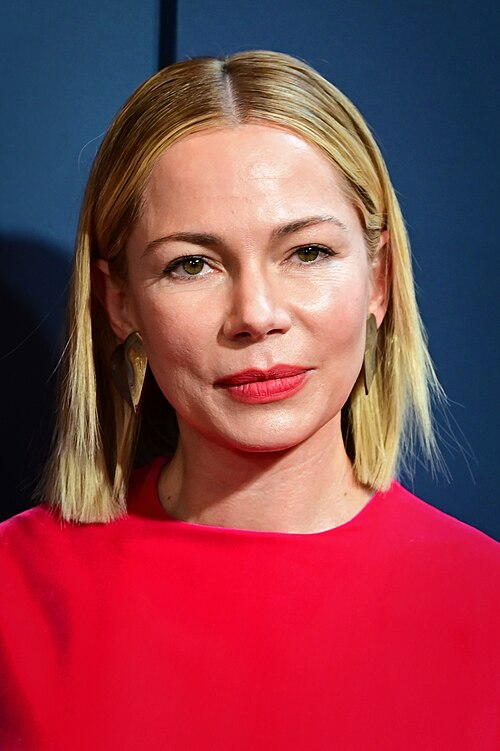

[MichelleWilliams-byPhilipRomano.jpg](https://commons.wikimedia.org/wiki/File:MichelleWilliams-byPhilipRomano.jpg) · CC BY-SA 4.0

Ergänzung · Datierung laut Quelle: 2012

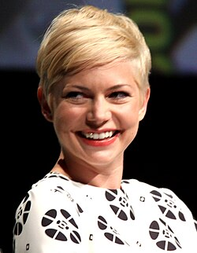

[Michelle Williams (7587118214) (cropped).jpg](https://commons.wikimedia.org/wiki/File:Michelle_Williams_(7587118214)_(cropped).jpg) · CC BY-SA 2.0

## Alicia Vikander

Bisheriges Foto:

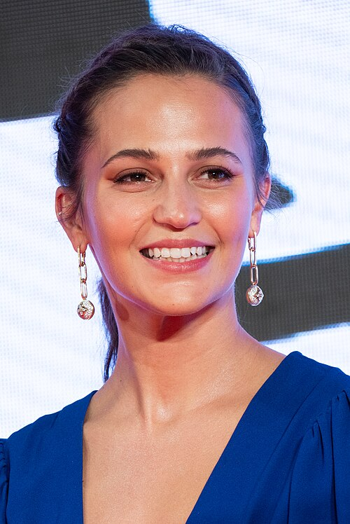

[Alicia_Vikander_-_Tokyo_International_Film_Festival_2019_(49013506278)_(cropped).jpg](https://commons.wikimedia.org/wiki/File:Alicia_Vikander_-_Tokyo_International_Film_Festival_2019_(49013506278)_(cropped).jpg) · CC BY 2.0

Ergänzung · Datierung laut Quelle: 2016

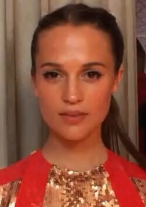

[Alicia Vikander Met Gala 2016 (cropped).jpg](https://commons.wikimedia.org/wiki/File:Alicia_Vikander_Met_Gala_2016_(cropped).jpg) · CC BY-SA 3.0

## Rooney Mara

Bisheriges Foto:

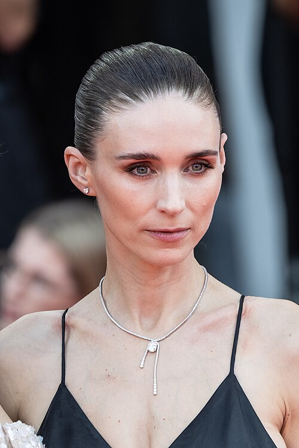

[Kate_and_Rooney_Mara-9186_(cropped).jpg](https://commons.wikimedia.org/wiki/File:Kate_and_Rooney_Mara-9186_(cropped).jpg) · CC BY-SA 4.0

Ergänzung · Datierung laut Quelle: 2016

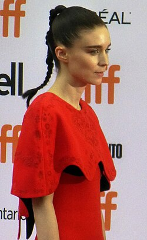

[Rooney Mara (29797944345) (cropped).jpg](https://commons.wikimedia.org/wiki/File:Rooney_Mara_(29797944345)_(cropped).jpg) · CC BY-SA 2.0

## Julie Delpy

Bisheriges Foto:

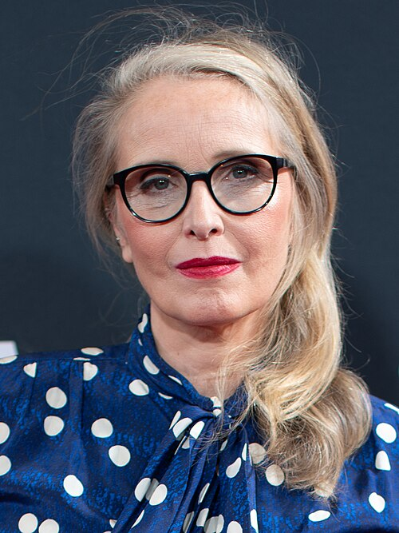

[Julie_Delpy_at_the_2024_Toronto_International_Film_Festival_(cropped).jpg](https://commons.wikimedia.org/wiki/File:Julie_Delpy_at_the_2024_Toronto_International_Film_Festival_(cropped).jpg) · CC BY-SA 4.0

Ergänzung · Datierung laut Quelle: 1991

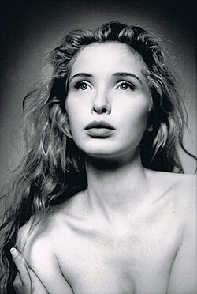

[Julie Delpy 1991 -a.jpg](https://commons.wikimedia.org/wiki/File:Julie_Delpy_1991_-a.jpg) · CC BY-SA 3.0
